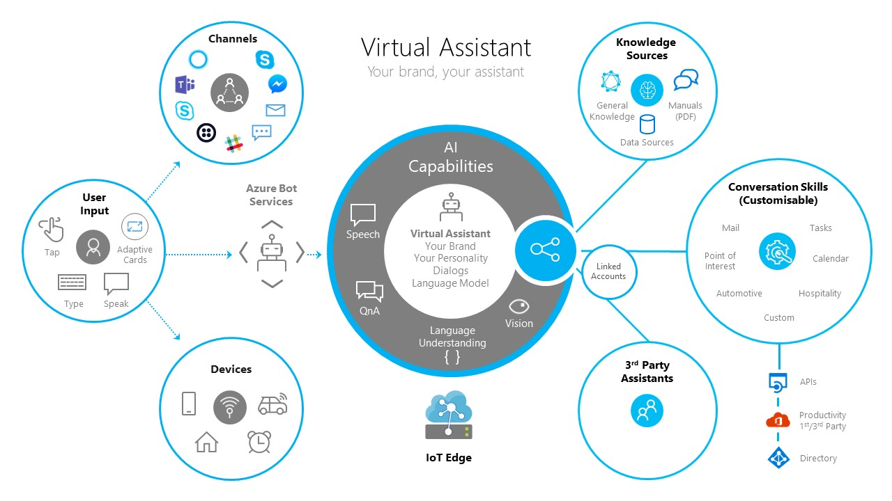
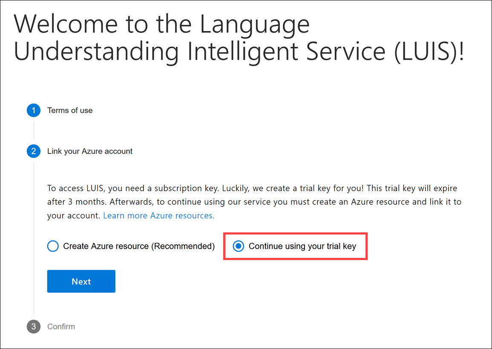

# Data & AI Tech Immersion Workshop – Product Review Guide and Lab Instructions

## AI, Experience 1 - Quickly build comprehensive Bot solutions with the Virtual Assistant solution accelerator

- [Data &amp; AI Tech Immersion Workshop – Product Review Guide and Lab Instructions](#data-amp-ai-tech-immersion-workshop-%e2%80%93-product-review-guide-and-lab-instructions)
  - [AI, Experience 1 - Quickly build comprehensive Bot solutions with the Virtual Assistant solution accelerator](#ai-experience-1---quickly-build-comprehensive-bot-solutions-with-the-virtual-assistant-solution-accelerator)
  - [Technology overview](#technology-overview)
  - [Scenario overview](#scenario-overview)
  - [Task 1: Sign in to LUIS to retrieve the Authoring Key](#task-1-sign-in-to-luis-to-retrieve-the-authoring-key)
  - [Task 2: Deployment](#task-2-deployment)
  - [Task 4: Load and explore the Virtual Assistant Skills starter solution](#task-4-load-and-explore-the-virtual-assistant-skills-starter-solution)
  - [Task 5: Open your new bot in the Bot Framework Emulator](#task-5-open-your-new-bot-in-the-bot-framework-emulator)
  - [Task 6: Open LUIS to view the generated apps](#task-6-open-luis-to-view-the-generated-apps)
  - [Task 7: View your bot services in action with Application Insights](#task-7-view-your-bot-services-in-action-with-application-insights)
  - [Wrap-up](#wrap-up)
  - [Additional resources and more information](#additional-resources-and-more-information)

## Technology overview

## Scenario overview

Contoso Auto is interested in building bots to help automate certain tasks in a way that feels similar to dealing with a real person. The motivation for this is to add self-service capabilities in their automobiles that will help drivers and passengers interact with their vehicles in a more natural way, through voice-driven commands and simple visual feedback and prompts, without needing to involve a live person. They would like to build a proof of concept that will support their users through speech actions, such as controlling the vehicle's climate settings and radio. As a stretch goal, they would like to take this capability further by automatically monitoring car sensor data and alerting the driver when there is a potential problem with the vehicle, offering an incentive such as a gift card when the driver selects a recommended service and makes an appointment with a service center.

In this experience, you will use the Automotive Skill to quickly deploy a conversational bot trained to understand vehicle-based commands. This Skill is part of the Virtual Assistant accelerator and extends the base Virtual Assistant with an automotive industry-focused solution. Virtual Assistant, built on top of [Azure Bot Service](https://aka.ms/azurebotservice) and [Bot Framework](https://botframework.com/), provides complete control of the user experience through open-sourcing the code on GitHub. The name, voice and personality can be changed to suit the organization's needs. The Virtual Assistant solution simplifies creation of your own assistant enabling you to get started in minutes and then extended using our end to end development tooling. Skills are fully customizable and consist of language models for multiple languages, dialogs and code.



By following the tasks below, you will explore and run the Automotive skill bot locally to experience the natural language-driven conversations with the bot, powered by the LUIS Cognitive Service, with the conversation control flow managed by the bot. You will end off by evaluating how LUIS is trained to understand a user's intent based on what they typed in, and read some ideas of how this project can be expanded to meet Contoso Auto's stretch goals.

## Task 1: Sign in to LUIS to retrieve the Authoring Key

The bot you will be creating uses [Microsoft's LUIS](https://azure.microsoft.com/services/cognitive-services/language-understanding-intelligent-service/), which is a natural language understanding service, to process and interpret user language to a set of actions or goals. One of the goals of building a bot is to have it interact with users in as human a way as possible. Understanding casual text or voice commands is an increasingly natural way to interact with bots and other virtual assistants. Before we can begin, we must first sign in to the LUIS website and obtain an authoring key that allows the service to be called by your bot.

1. If you will be running your bot services in the United States, navigate to [www.luis.ai](https://www.luis.ai/) and sign in with the Azure Active Directory account you are using for this experience. If you are outside of the US, sign in to the LUIS site for your [region](https://docs.microsoft.com/en-us/azure/cognitive-services/luis/luis-reference-regions).

2. If it is your first time signing in, you may see a "Permission requested" dialog. If so, select **Accept**.

   

   > If after signing in and accepting requested permissions, you see a loading screen that seems stuck for more than 10 seconds, try refreshing the page.

3. Again, if this is your first time signing in, you will be prompted to select your **Country/Region**. Select the appropriate option from the list, check the service agreement checkbox, then select **Continue**.

   

4. If you are presented with a step to link your Azure account, select **Continue using your trial key**, then select **Next**.

    

5. If you do not currently have any LUIS apps, you will see a page explaining what LUIS is and how it works. Within this page, select **Create a LUIS app now**.

   

6. At this point, you will see a page called "My Apps". You do not need to create a new app. The Bot Framework SDK will do this for you. Click on your name in the top right-hand corner, then select **Settings**.

   

7. Copy the **Primary Key** found underneath the **Starter_Key** authoring resource, and save it to Notepad or a similar text application for later steps.

   

## Task 2: Deployment

The Virtual Assistant Automotive Skill bot requires the following Azure dependencies for end to end operation:

- Azure Web App (hosts the bot when published)
- Azure Web App Bot (Bot Service)
- Azure Storage Account (stores all chat transcripts)
- Azure Application Insights (captures bot and related services telemetry)
- Azure Cosmos DB (maintains the state of all conversations)
- Azure Cognitive Services - Language Understanding (LUIS)

In this task, you will deploy all of these Azure dependencies as well as configure and train [LUIS](https://docs.microsoft.com/en-us/azure/cognitive-services/luis/what-is-luis) with thousands of text entries. We supply a script to do this for you.

1. On the bottom-left corner of your Windows desktop, locate the search box next to the Start Menu. Type **cmd**, then either press Enter or select the Command Prompt desktop app in the search results.

   

2. The first thing you need to do is to log in to the Azure CLI with your provided account credentials. To do that, copy and paste the command below into the command prompt, then hit `Enter`. This will open a web browser window where you will sign in with the provided Azure Active Directory credentials for this experience.

   `az login`

3. After logging in, you may be shown that you have more than one Azure subscription associated with your account.

   

4. **If there are more than one Azure subscriptions displayed** after logging in, copy and paste the command below into the command prompt **Replacing YOUR_SUBSCRIPTION_ID** with the Azure Subscription ID provided to your for this experience, then hit `Enter`:

   `az account set --subscription YOUR_SUBSCRIPTION_ID`

5. Copy and paste the command below into the command prompt, then hit `Enter`. This will change directories to the Virtual Assistant automotive bot project folder:

   `cd C:\lab-files\ai\1\automotiveskill`

6. Copy and paste the command below into the command prompt, then hit `Enter`. This will deploy the Azure services for your skill and create LUIS applications for your bot:

   `pwsh -ExecutionPolicy Bypass -File Deployment\Scripts\deploy.ps1`

7. Supply the following values when prompted:

   - **Bot Name:** Enter your unique **Azure Resource Group name** provided to you for this lab. Example: `ti-YOUR_UNIQUE_IDENTIFIER`. It should exactly match your Azure Resource Group name, be all lower case, contain no spaces and no special characters except for dashes (-) and underscores (\_).
   - **Azure resource group location:** Enter `westus`.
   - **Password for MSA app registration:** Enter `Abc!1234567890`.
   - **LUIS Authoring Region:** Enter `westus`.
   - **LUIS Authoring Key:** Paste the LUIS Authoring Key you copied at the end of Task 1 above.

   

8. This script will take around 10 minutes to run. **Important:** Keep the window open.

## Task 4: Load and explore the Virtual Assistant Skills starter solution

To accelerate Contoso Auto's development efforts, they have decided to use Microsoft's Skills solution, a part of the base [Virtual Assistant Solution](https://docs.microsoft.com/azure/bot-service/bot-builder-virtual-assistant-introduction?view=azure-bot-service-4.0) accelerator. One of the projects included in the Visual Studio solution is the Automotive Skill. This skill demonstrates a set of capabilities to help enable Automotive scenarios. At the moment, this skill focuses on vehicle settings, specifically climate Control, safety, and basic audio controls.

Vehicle Control is a complicated problem. Although there are only a limited set of car inputs for climate control there are a large number of ways that a human can describe a given setting. For example, "I'm feeling chilly", "My feet are cold", and "It's cold here in the back" all relate to a decrease in temperature but to different parts of the car and perhaps even different fan settings. If you were to program the bot to try and account for all of these variations in user requests, you would have a very long set of conditional logic in your code, and likely miss some common phrases in the process.

This is where having a trained natural language machine learning model comes in handy. Microsoft's [Language Understanding (LUIS)](https://docs.microsoft.com/en-us/azure/cognitive-services/luis/what-is-luis) API service allows you to train this type of machine learning model (LUIS models) through configuration, with **no programming or data scientists** required. This results in allowing end users to use conversational, natural language text to issue commands whose overall meaning are predicted by LUIS and whose relevant and detailed information is used by the bot to perform actions related to the requests.

The LUIS model begins with categories of user intentions called [intents](https://docs.microsoft.com/en-us/azure/cognitive-services/luis/luis-concept-intent). Each intent needs examples of user [utterances](https://docs.microsoft.com/en-us/azure/cognitive-services/luis/luis-concept-utterance) (something a user should say). Each utterance can provide a variety of data that needs to be extracted with [entities](https://docs.microsoft.com/en-us/azure/cognitive-services/luis/luis-concept-entity-types).

Here are some examples of user utterances the LUIS models for the Automotive skill are trained to understand:

| Example user utterance                      | Intent                       | Entities              |
| ------------------------------------------- | ---------------------------- | --------------------- |
| "Why is it so **hot** in here?"             | VEHICLE_SETTINGS_DECLARATIVE | VALUE                 |
| "Set **temperature** to **67** **degrees**" | VEHICLE_SETTINGS_CHANGE      | SETTING, AMOUNT, UNIT |
| "It's way too **loud** in here."            | VEHICLE_SETTINGS_DECLARATIVE | VALUE                 |

LUIS models help understand the intent and entities, then matches potential settings and actions to the available vehicle settings to then suggest a course of action. At this time, changes to vehicle settings are supported through the VEHICLE_SETTINGS_CHANGE and VEHICLE_SETTINGS_DECLARATIVE intents. The former enables commands such as "change the temperature to 27 degrees" whereas the latter intent enables scenarios such as "I'm feeling cold" which require additional processing steps.

As you will see, most of this work is already done for you! Additional work that would need to be done to integrate this bot into a vehicle includes customizing the bot's activities to integrate with the telematics solution of an OEM for a given vehicle.

For now, let's explore how this bot is created and how LUIS is trained with the sets of utterances, intents, and entities as described.

1.  Open Windows Explorer and navigate to `C:\lab-files\ai\1`. Double-click on **AutomotiveSkill.csproj** to open the solution in Visual Studio. If you are prompted by Visual Studio to log in, log in with your Azure Active Directory credentials you are using for this lab.

    

2.  You will see the projects listed within the Solution Explorer in Visual Studio. Expand the **AutomotiveSkill** project. Next, expand **Resources**, then **LU**, and then **en-us**, which is the language folder for English. Next, double-click on **General.lu**.

    

    Here is just a small snippet of the **general.lu** file:

    ```lua
    ## SelectItem
    - 1
    - 2
    - 3
    - 5
    - choose for no. four
    - choose last
    - choose last one
    - choose no. six
    - choose no.2
    - choose the {DirectionalReference=bottom left}
    - choose the first choice
    - choose the fourth one
    - choose the {DirectionalReference=upper left} choice
    - choose the {DirectionalReference=upper right} one
    - choose {DirectionalReference=top right}
    - choose {DirectionalReference=top right} one
    - four
    - i like {DirectionalReference=left} one
    - i like second
    - i like second one
    - i like the {DirectionalReference=bottom} one
    ```

    This file contains general commands used to train LUIS. These commands are common across all skills, so you will find this same file or similar ones for each skill. Therefore, when you publish a skill, not only will the skills load LUIS models that are unique to that skill, they will also load the general ones.

    [.lu files](https://github.com/Microsoft/botbuilder-tools/blob/master/packages/Ludown/docs/lu-file-format.md) contain simple text-based definitions for LUIS, broken down by Intents (the action the user wants to perform) and Entities (detailed information that is relevant in the utterance). In the code snippet above, **SelectItem** is the intent, and each item below it are example utterances that capture ways users can express this intent. Entities in .lu files are denoted using `{<entityName>=<labeled value>}` notation. Taking from our sample code once again, you can find the `bottom left` entity within the following utterance: `choose the {DirectionalReference=bottom left}`.

    When you ran the script earlier, one of the actions it took was to convert all of the .lu files into JSON files by using the [LUDown](https://github.com/Microsoft/botbuilder-tools/tree/master/packages/Ludown) tool. The converted JSON files were then uploaded to LUIS to train the natural language model. You can find the generated JSON files within this same folder as `.luis` files. You may not see these yet, depending on whether the script is finished running. Scripting LUIS training in this way is a faster and more repeatable alternative to [manually configuring LUIS](https://docs.microsoft.com/en-us/azure/cognitive-services/luis/luis-how-to-add-intents) through the web interface.

3.  Within the same `Resources\LU\en` folder, double-click on **Settings.Dispatch.lu**.

4.  This .lu file contains LUIS intents and entities specific to the Automotive skill. If you scroll through the list, you will see the `VEHICLE_SETTINGS_CHANGE` and `VEHICLE_SETTINGS_DECLARATIVE` intents that were illustrated above in the example user utterances table.

    ```lua
    ## VEHICLE_SETTINGS_CHANGE
    - {AMOUNT=4} {UNIT=degrees} {VALUE=higher} please
    - {VALUE=activate alert brake steer} for {SETTING=automatic brake} mechanisms
    - {VALUE=activate} {SETTING=back cross traffic alert}
    - {VALUE=activate} my {SETTING=defroster} mode
    - {VALUE=activate} my {SETTING=switch lane alert} mechanism
    - {VALUE=activate} the {SETTING=forward collision response}
    - {VALUE=activate} the {SETTING=side blind spot alert}
    - {VALUE=activate} the {SETTING=side blind spot warning}
    - adjust {SETTING=air blower} 2 the {AMOUNT=minimum}
    - adjust {SETTING=air fans} to {SETTING=speed} {AMOUNT=1}
    - adjust {SETTING=driver alerts} to {VALUE=impact warning seat}
    - adjust {SETTING=forward collision alert spacing} control to {VALUE=on}
    - adjust it to {VALUE=loud}
    - adjust {SETTING=media volume}
    - adjust my {SETTING=brake assist} back {VALUE=on} please
    ...
    ...
    ## VEHICLE_SETTINGS_DECLARATIVE
    - {SETTING=body} are a bit too {VALUE=toasty}
    - i am a little {VALUE=cool} in {SETTING=right side}
    - i am {VALUE=cold} in here
    - i am {VALUE=frozen} in {SETTING=left front}
    - i am too {VALUE=frosty} in the {SETTING=driver side}
    - i am {VALUE=warm}
    - i feel a bit {VALUE=cold} on the {SETTING=right}
    - i feel a bit {VALUE=shivering}
    - i feel a little bit {VALUE=warm}
    - i feel a little {VALUE=burning up} in here
    - i feel as {VALUE=frosty} as an oven in this {SETTING=right}
    - i feel {VALUE=balmy} in here
    - i feel like my {SETTING=co-driver} is gotten kind of {VALUE=cold}
    - i feel like my {SETTING=front left} s getting {VALUE=shivering}
    ...
    ...
    ```

    You will also find these top-level intents in the main `Settings.lu` file. In addition, there are two supporting LUIS models, `Settings.Name.lu` and `Settings.Value.lu`. These are used for disambiguation scenarios to clarify setting names and values where the initial utterance doesn't provide clear information.

5.  Now explore the rest of the `Deployment` folder located within the **AutomotiveSkill** project.

    

    This `Scripts` sub-folder contains the `deploy.ps1` deployment script you executed in the previous task. It also contains scripts used to generate deployment scripts to publish your bot to Azure, and a script to update your published models if you add or update any of the .lu files. The `Resources` sub-folder contains the Azure Resource Management (ARM) templates used by the script to deploy the required Azure resources for this skill.

6.  Next, expand the `Dialogs` folder located within the **AutomotiveSkill** project.

    

    When you create bots using the Bot Framework, you can use dialogs to model a conversation and manage [conversation flow](https://docs.microsoft.com/en-us/azure/bot-service/bot-service-design-conversation-flow?view=azure-bot-service-3.0). A conversation can involve multiple dialogs. In the case of the Automotive skill, the conversation may start within the `MainDialog` dialog, then use the `AutomotiveSkillDialog` to handle and display inputs and prompts relating to actions the user would like to take. When the user decides to change a vehicle setting, the `VehicleSettingsDialog` will be used. You may feel free to explore these dialogs to understand how the conversation flow is managed.

7.  Expand the `Data` folder located within the **AutomotiveSkill** project.

    

    Available vehicle settings are defined within the `available_settings.yaml` supporting metadata file.

    To add an new setting along with appropriate setting values, it's easily expressed in YAML. The example below shows a new Volume control setting with the ability to Set, Increase, Decrease, and Mute the volume.

```yaml
canonicalName: Volume
values:
  - canonicalName: Set
    requiresAmount: true
  - canonicalName: Decrease
    changesSignOfAmount: true
  - canonicalName: Increase
    antonym: Decrease
  - canonicalName: Mute
allowsAmount: true
amounts:
  - unit: ''
```

For key settings, you may wish to prompt for confirmation, such as safety settings. This can be specified through a `requiresConfirmation` property as shown below.

```yaml
canonicalName: Lane Change Alert
values:
  - canonicalName: Off
    requiresConfirmation: true
  - canonicalName: On
```

8.  Expand the `Responses` folder located within the **AutomotiveSkill** project.

    

    Speech & Text responses are stored in the responses files, which offer the ability to provide a variety of responses and set the input hint on each Activity. For example, you can see potential responses within this snippet from the `VehicleSettings\.VehicleSettingsResponses.json` file:

```javascript
"VehicleSettingsSettingValueSelection": {
  "replies": [
    {
      "text": "Here are the possible values for {settingName}. Which one?",
      "speak": "Here are the possible values for {settingName}. Which one?"
    }
  ],
  "inputHint": "expectingInput"
},
"VehicleSettingsSettingChangeConfirmation": {
  "replies": [
    {
      "text": "So, you want to change {settingName} to {value}. Is that correct?",
      // Do not add a comma to the speech output, so it sounds more continuous and natural.
      "speak": "So you want to change {settingName} to {value}. Is that correct?"
    }
  ],
  "inputHint": "expectingInput"
},
```

## Task 5: Open your new bot in the Bot Framework Emulator

Bots developed using the Bot Framework can be tested locally, using the Bot Framework Emulator. This emulator can be used with local bots, or be used to test remote, or hosted, bots. Being able to test in this way saves the time needed to deploy your bot and test it using other channels, such as through a web chat dialog, Facebook, Skype, Slack, etc.

Bots usually consume lots of different services, such as [LUIS.ai](https://luis.ai). When you are developing a bot, there is no uniform place to store the metadata about the services that are in use. This prevents us from building tooling that looks at a bot as a whole.

To address this problem, the Bot Builder v4 SDK used in this solution stores these keys and environment settings as recommended (appsettings.json, web.config, .env, etc.) for each of its supported languages and platforms (C#, JS, Python, and Java).

In this task, you will open the Bot Framework Emulator and start testing out your bot! First, we need to make sure the script is finished running. This must be completed before continuing with this experience.

1.  Switch back to your Command Prompt (console) window to make sure the script has successfully finished. Sometimes you will not see a completion message, but instead, a message stating "Publishing to Azure..." in green. If you see this message (as shown in the screenshot below), you can safely continue with the lab.

    

2.  Now we are ready to test the bot. Before testing, you must copy the Application ID from the **appsettings.json** file in the **AutomotiveSkills** project. To do this, switch back to the solution in Visual Studio and expand the **AutomotiveSkill** project in the Solution Explorer. **Double-click** on the **appsettings.json** file to open it. The Application ID is for the Azure Application the deployment script created for authentication and authorization between the published bot and its required Azure services.

3.  Locate and copy the `microsoftAppId` value located at the top of the file. Also, make note of the `microsoftAppPassword` if you entered a different one than instructed in the deployment steps above.

    

4.  Next, you must **Debug** the **AutomotiveSkills** project. To do this, **right-click** the **AutomotiveSkills** project in the Solution Explorer, then select **Debug** in the context menu, then **Start new instance**.

    

5.  After a few moments, a new web browser window will open, displaying web page with the message, "Your Enterprise Bot is ready!". **Leave this window open** and continue to the next task.

    

6.  Open the Bot Framework Emulator by clicking on the search box next to the Start Menu on the bottom-left corner of your Windows desktop. Type **Bot Framework Emulator**, then select the Bot Framework Emulator desktop app in the search results.

    

7.  Within the Bot Framework Emulator window, click on **Open Bot**.

    

8.  In the "Open a bot" dialog, enter the following values into the form fields, then click **Connect**:

    - **Bot URL or .bot file location**: Enter the URL for the running bot web app: `http://localhost:3980/api/messages`.
    - **Microsoft App ID**: Paste the `microsoftAppId` value from your `appsettings.json` file.
    - **Microsoft App password**: Enter `Abc!1234567890`, or the password specified in `appsettings.json` if you used a different password.

    

9.  Now you should see a Live Chat window with the following features:

    1. **Bot service path:** This should display the path to your locally running bot (http://localhost:3980/api/messages).
    2. **Welcome message:** The bot is configured to show a welcome message when the user first connects to it. This is controlled by the dialogs within the project that you explored. This area is where your chat history is displayed as well.
    3. **Send message box:** Use this textbox to type in and send all of your messages to the bot.

    

10. Type `help` and hit Enter. The bot will respond with a message and a list of suggested actions. Notice that the Log pane to the right lists both user input and bot response activities. You can click on any of the hyperlinks within the Log to view the activity details in the Inspector above. If you click on an item in the chat window, such as the `help` message you typed, you can inspect the data that was sent to the bot as well as the response. For now, click on the `put the air on my feet`, or type it in if you don't see it as a suggested action.

    

11. The bot sent the `put the air on my feet` text to LUIS so that it could derive your intent and desired action. If you click on the LUIS trace message in the chat window, you should see the following in the Inspector pane:

```javascript
{
"recognizerResult": {
  "alteredText": null,
  "entities": {
    "$instance": {
      "SETTING": [
        {
          "endIndex": 11,
          "score": 0.996788144,
          "startIndex": 8,
          "text": "air",
          "type": "SETTING"
        }
      ],
      "VALUE": [
        {
          "endIndex": 22,
          "score": 0.5489724,
          "startIndex": 18,
          "text": "feet",
          "type": "VALUE"
        }
      ]
    },
    "SETTING": [
      "air"
    ],
    "VALUE": [
      "feet"
    ]
  },
  "intents": {
    "VEHICLE_SETTINGS_CHANGE": {
      "score": 0.9998417
    }
  },
  "text": "put the air on my feet"
}
}
```

To explain, the utterance is your text (located on the bottom): `put the air on my feet`. LUIS detected the intent as `VEHICLE_SETTINGS_CHANGE` (you should remember that one from earlier) with a score, or "confidence" level of 99%. It detected two entities, a `SETTING` of "air" with a value of "feet". The "air" setting also had a high score of 99%, but the setting value of "feet" scored about 55%.

The result is that the bot must clarify the user's intent by prompting for more information. To do this, the bot asks which of the two matching settings would you like to select? Since you did not explicitly say to turn the air on in the back of the car or the front of the car, you need to tell it which option you like. The bot displays a [card](https://docs.microsoft.com/en-us/azure/bot-service/dotnet/bot-builder-dotnet-add-rich-card-attachments?view=azure-bot-service-3.0) for you to choose from. Type either `1` or `2` for your selection, then press Send (or hit Enter).


1.  If you input a valid response, the bot will simply reply with `Ok.` to confirm the action.

2.  Now type a command that the bot would not understand, such as "make me a coffee". The bot will respond with, "Sorry, I don't know what setting you're talking about."

    

    So how did this happen? Remember, the Dialogs within the bot's code controls the conversation flow. It first gets help from LUIS to decide what the user is trying to do. In this case the `ProcessSetting` method within the `VehicleSettingsDialog.cs` file is called and the LUIS result is evaluated to get the top (highest rated) intent.

    ```csharp
    var luisResult = state.VehicleSettingsLuisResult;
    var topIntent = luisResult?.TopIntent().intent;
    ```

    Next, the `topIntent`'s value is evaluated in a `switch` statement to perform actions based on the value. In this case, it is determined that the intent type is `VEHICLE_SETTINGS_DECLARATIVE`. Next, some post-processing of the entities is performed as well as removing entities that don't make sense (like "coffee"). After this processing and cleanup is done, there are no matching setting names, so we call `SendActivityAsync` with the `VehicleSettingsResponses.VehicleSettingsMissingSettingName` response.

```csharp
switch (topIntent.Value)
{
    case Luis.VehicleSettings.Intent.VEHICLE_SETTINGS_CHANGE:
    case Luis.VehicleSettings.Intent.VEHICLE_SETTINGS_DECLARATIVE:

        // Perform post-processing on the entities, if it's declarative we indicate for special processing (opposite of the condition they've expressed)
        settingFilter.PostProcessSettingName(state, topIntent.Value == Luis.VehicleSettings.Intent.VEHICLE_SETTINGS_DECLARATIVE ? true : false);

        // Perform content logic and remove entities that don't make sense
        settingFilter.ApplyContentLogic(state);

        var settingNames = state.GetUniqueSettingNames();
        if (!settingNames.Any())
        {
            // missing setting name
            await sc.Context.SendActivityAsync(ResponseManager.GetResponse(VehicleSettingsResponses.VehicleSettingsMissingSettingName));
            return await sc.EndDialogAsync();
        }

    // ...
    // REMOVED FOR BREVITY
    // ...
}
```

Remember reading about the Speech & Text response files at the end of the previous Task? That's what the `VehicleSettingsResponses.VehicleSettingsMissingSettingName` value was referring to. You can find the `VehicleSettingsMissingSettingName` response within the `VehicleSettingsResponses.json` file:

```javascript
"VehicleSettingsMissingSettingName": {
  "replies": [
    {
      "text": "Sorry, I don't know what setting you're talking about.",
      "speak": "Sorry, I don't know what setting you're talking about."
    }
  ],
  "inputHint": "ignoringInput"
},
```

3.  Now that you are starting to understand what is going on, **try out the following commands** to see how the bot responds:

    - Set temperature to 68 degrees
    - It's feeling cold in the back
    - The passenger is freezing
    - temperature
    - Turn off the ac
    - Increase the volume
    - adjust the equalizer
    - The volume is too low
    - Turn lane assist off
    - Set park assist to alert

## Task 6: Open LUIS to view the generated apps

If you recall, the bot deployment script created Azure services, generated a .bot file, and converted the .lu files to JSON files were uploaded to LUIS. Let's take this new knowledge about how LUIS works and how the files are used to train it, and browse to the LUIS portal to explore the generated apps.

1.  Navigate to the LUIS portal ([www.luis.ai](https://www.luis.ai/)) and sign in if needed. You should see four new apps listed underneath **My Apps**, each of which start with the name of your bot.

    

2.  Open the app that ends with **General**. Select the **Build** tab, then select **Intents** under App Assets on the left-hand menu. Notice that each named intent has a number of labeled utterances. Remember, utterances are used to train LUIS on different ways a user may express their intent. Generally speaking, the more utterances you have, the more variety of ways LUIS can understand how people may type or speak a phrase.

    

3.  Select the **Cancel** intent.

4.  You may use the navigation controls on the bottom of the list to look through the utterances for this intent. If you click on a word, you will see an option to assign an entity to that word. We'll take a look at an utterance with an entity in a bit to see what that looks like.

    

5.  Select **My apps** in the top menu. Now open the app that ends with **\_Settings**.

    

6.  As you can see, this app's intents have a much larger number of labeled utterances. Select **VEHICLE_SETTINGS_DECLARATIVE**.

    

7.  Select **View options** on the top-right side of the toolbar above the utterances, then select **Detailed view**.

    

8.  As you can see, these utterances are a bit more descriptive and contain one or more `SETTING` and/or `VALUE` entities. When you hover over an entity, you can see a sample value. You can also see the nearest intent and difference, which you can read the descriptions for by selecting the question mark icon next to the column names. Feel free to explore the other entities.

    

9.  Select **Entities** on the left-hand menu. The list of entities shows the number of times each is used within an utterance. If you click on an entity, you can browse through the list of utterances in which it is used.

    

## Task 7: View your bot services in action with Application Insights

[Azure Application Insights](https://docs.microsoft.com/en-us/azure/azure-monitor/app/app-insights-overview) is an extensible Application Performance Management (APM) service used to monitor live web applications and related services. Since the bot we deployed runs in an Azure Web App, we can watch performance metrics and logging messages in real time while using the bot.

1.  Login into the Azure portal (<https://portal.azure.com>) using the Azure credentials provided to you for this lab.

2.  Select **Resource groups** in the left-hand menu. You should see just one resource group that matches the name of the resource group provided to you for this lab. If you are not using a hosted environment, locate the resource group to which you deployed your bot. Now **select the resource group**.

    

3.  Locate the Application Insights resource and select it.

    

4.  Select **Live Metrics Stream** in the left-hand menu.

    

5.  Open the **Bot Framework Emulator** and begin entering phrases in the live chat, such as:

    - Turn off the ac
    - Increase the volume
    - adjust equalizer

6.  After entering each phrase, switch back to the **Live Metrics Stream** in your web browser and observe the real-time performance metrics of your requests and service workload. You will see statistics such as the Request Rate, Request Duration, Request Failure Rate, Dependency Call Rate, Dependency Call Duration, Dependency Call Failure Rate, Committed Memory, CPU Total, Exception Rate, and how many servers are online to handle the workload. On the right-hand side, observe logging messages as they flow into the scrollable pane in real-time.

    

7.  Select one of the messages under **Sample Telemetry**. In the screenshot below, we selected a `BotMessageReceived` event. When selected, the details box below shows information about the event. In our case, you can see the "adjust equalizer" command we typed into the Bot Framework Emulator's live chat. Above this event is another event that shows the `LuisResult`, including the intent score.

    

## Wrap-up

Thank you for participating in the Bot solutions experience! We hope that you are excited about how you can use the Virtual Assistant solution accelerator alongside our bot services to create some interesting solutions of your own. Please feel free to refer back to this experience at any time to learn more about the solution accelerator, LUIS, and other Azure services that make these capabilities shine.

To recap, you experienced:

1. How to quickly get started with [LUIS](https://www.luis.ai/) to add natural language processing to your solutions.
2. Using the deployment scripts that come with the Skills solution as part of the Virtual Assistant solution accelerator to create all of the Azure resources for you, as well as to train LUIS with thousands of text entries.
3. Exploring the Skills starter solution, learning how things are laid out, which skills are included, and where to make modifications to the Automotive Skill if needed.
4. Using the Bot Framework Emulator to test your bot locally and examine the data being sent back and forth between your bot and its related services.
5. Exploring LUIS to see how intents, entities, and utterances are stored and relate to one another.
6. Viewing live metrics in Application Insights.

## Additional resources and more information

The Virtual Assistant solution accelerator is a great starting point for adding many new skills or updating existing ones to your bot. To address some of Contoso Auto's requirements, you may consider doing the following:

Contoso Auto wants to have the bot proactively alert the driver when there is a potential problem with the vehicle, which it detects by monitoring vehicle sensor data. Right now, the Automotive skill bot is exclusively reactive (user-initiated). However, you can proactively send messages that are triggered by external events by using a combination of the Bot Framework's `ContinueConversationAsync` function to patch into a previously started conversation, and the `ProactiveStateMiddleware` to store the previous conversation. Read more about [sending proactive messages](https://microsoft.github.io/botframework-solutions/howto/virtual-assistant/proactivemessaging/).

One of the experiences in this set of labs is to train a machine learning model to detect when a driver might have to change out the vehicle's battery, based on telemetry captured and stored for a given vehicle. Using [Azure Machine Learning](https://docs.microsoft.com/en-us/azure/machine-learning/service/overview-what-is-azure-ml), you can manage and deploy that trained model either as a service hosted online, or on an edge device, such as [IoT Edge](https://docs.microsoft.com/en-us/azure/iot-edge/about-iot-edge). An edge device would be the onboard computer that hosts the Automotive bot that interfaces with the vehicle's telematics solution to read sensor data and perform other vehicle functions. Your bot would need to be configured to either work with the machine learning model that's stored locally, or connect to the hosted machine learning model online. If you are going the online route, you would likely want to have an API layer between the onboard bot and the model. [Azure Functions](https://docs.microsoft.com/en-us/azure/azure-functions/functions-overview) may be ideal for acting as the API, with [API Management]() serving as the API layer, providing a set of endpoints for multiple APIs, authentication services, rate-limiting, etc. Your function would accept the scoring request from the bot to check for any concerns about the vehicle based on telemetry data, and call out to this and other trained machine learning models for a prediction. It would then send a [proactive message](https://microsoft.github.io/botframework-solutions/howto/virtual-assistant/proactivemessaging/) to the bot. The bot could then alert the user if needed, and ask the user for an action. Such an action would be to find the nearest service center to set up an appointment. At this point, you could use the Points of Interest skill to find the nearest service center and get directions or contact information. The possibilities are nearly limitless on how you can add new capabilities to the bot.
