# Data & AI Tech Immersion Workshop – Product Review Guide and Lab Instructions

## AI, Experience 3 - Better models made easy with Automated Machine Learning

- [Data & AI Tech Immersion Workshop – Product Review Guide and Lab Instructions](#Data--AI-Tech-Immersion-Workshop-%E2%80%93-Product-Review-Guide-and-Lab-Instructions)
  - [AI, Experience 3 - Better models made easy with Automated Machine Learning](#AI-Experience-3---Better-models-made-easy-with-Automated-Machine-Learning)
  - [Technology overview](#Technology-overview)
  - [Scenario overview](#Scenario-overview)
  - [Exercise 1: Creating a model using automated machine learning](#Exercise-1-Creating-a-model-using-automated-machine-learning)
    - [Task 1: Create an automated machine learning experiment using the Portal](#Task-1-Create-an-automated-machine-learning-experiment-using-the-Portal)
    - [Task 2: Review the experiment run results](#Task-2-Review-the-experiment-run-results)
    - [Task 3: Register the Best Model](#Task-3-Register-the-Best-Model)
  - [Exercise 2: Understanding the automated ML generated model using model explainability](#Exercise-2-Understanding-the-automated-ML-generated-model-using-model-explainability)
    - [Task 1: Setup the Notebook VM environment](#Task-1-Setup-the-Notebook-VM-environment)
    - [Task 2: Upload the starter notebook](#Task-2-Upload-the-starter-notebook)
  - [Exercise 3 (Optional): Train and evaluate a model using Azure Machine Learning](#Exercise-3-Optional-Train-and-evaluate-a-model-using-Azure-Machine-Learning)
    - [Task 1: Upload and open the starter notebook](#Task-1-Upload-and-open-the-starter-notebook)
  - [Wrap-up](#Wrap-up)
  - [Additional resources and more information](#Additional-resources-and-more-information)

## Technology overview

Azure Machine Learning service provides a cloud-based environment you can use to prep data, train, test, deploy, manage, and track machine learning models.

Azure Machine Learning service fully supports open-source technologies. So you can use tens of thousands of open-source Python packages with machine learning components. Examples are PyTorch, TensorFlow, and scikit-learn. Support for rich tools makes it easy to interactively explore and prepare data and then develop and test models. Examples are [Jupyter notebooks](https://jupyter.org) or the [Azure Machine Learning for Visual Studio Code](https://marketplace.visualstudio.com/items/itemName/ms-toolsai.vscode-ai/overview) extension.

By using Azure Machine Learning service, you can start training on your local machine and then scale out to the cloud. With many available [compute targets](https://docs.microsoft.com%/en-us/azure/machine-learning/service/how-to-set-up-training-targets), like Azure Machine Learning Compute and [Azure Databricks](https://docs.microsoft.com/en-us/azure/azure-databricks/what-is-azure-databricks), and with [advanced hyperparameter tuning services](https://docs.microsoft.com/en-us/azure/machine-learning/service/how-to-tune-hyperparameters), you can build better models faster by using the power of the cloud. When you have the right model, you can easily deploy it in a container such as Docker. So it's simple to deploy to Azure Container Instances or Azure Kubernetes Service. Or you can use the container in your own deployments, either on-premises or in the cloud. For more information, see the article on [how to deploy and where](https://docs.microsoft.com/en-us/azure/machine-learning/service/how-to-deploy-and-where).

You can manage the deployed models and track multiple runs as you experiment to find the best solution. After it's deployed, your model can return predictions in [real time](https://docs.microsoft.com/en-us/azure/machine-learning/service/how-to-consume-web-service) or [asynchronously](https://docs.microsoft.com/en-us/azure/machine-learning/service/how-to-run-batch-predictions) on large quantities of data. And with advanced [machine learning pipelines](https://docs.microsoft.com/en-us/azure/machine-learning/service/concept-ml-pipelines), you can collaborate on all the steps of data preparation, model training and evaluation, and deployment.

Azure Machine Learning service also includes features that [automate model generation and tuning](https://docs.microsoft.com/en-us/azure/machine-learning/service/tutorial-auto-train-models) to help you create models with ease, efficiency, and accuracy. Automated machine learning is the process of taking training data with a defined target feature, and iterating through combinations of algorithms and feature selections to automatically select the best model for your data based on the training scores. The traditional machine learning model development process is highly resource-intensive, and requires significant domain knowledge and time investment to run and compare the results of dozens of models. Automated machine learning simplifies this process by generating models tuned from the goals and constraints you defined for your experiment, such as the time for the experiment to run or which models to blacklist.

## Scenario overview

In this experience you will learn how the automated machine learning capability in Azure Machine Learning (AML) can be used for the life cycle management of the manufactured vehicles and how AML helps in creation of better vehicle maintenance plans. To accomplish this, you will train a Linear Regression model to predict the number of days until battery failure using Automated Machine Learning in Jupyter Notebooks.

## Exercise 1: Creating a model using automated machine learning

In this exercise, you will create a model that predicts battery failure from time-series data using the visual interface to automated machine learning in an Azure Machine Learning workspace.

### Task 1: Create an automated machine learning experiment using the Portal

1. Navigate to your Azure Machine Learning workspace in the Azure Portal. Select `Overview` in the left navigation bar and then select **Launch the new Azure Machine Learning studio**. Alternatively, you can navigate directly to the new [Azure Machine Learning studio](https://ml.azure.com/). This will prompt you to select the workspace as part of the sign-in process.

   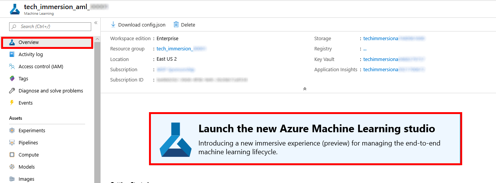

2. Select `Automated ML` in the left navigation bar.

   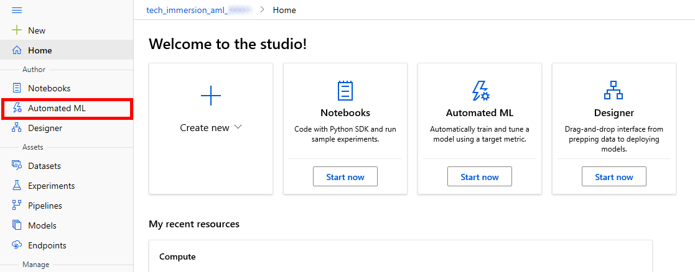

3. Select **New automated ML run** to start creating a new experiment.

   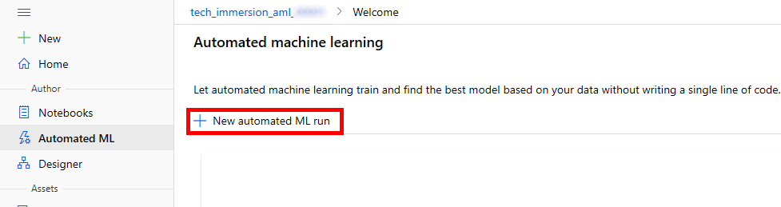

4. Select **Create dataset** and choose the **From web files** option from the drop-down.

   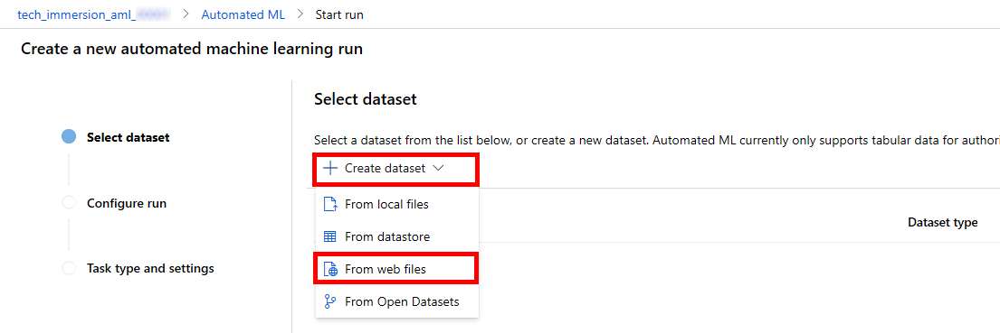

5. Fill in the training data URL in the `Web URL` field: https://quickstartsws9073123377.blob.core.windows.net/azureml-blobstore-0d1c4218-a5f9-418b-bf55-902b65277b85/training-formatted.csv and click **Next** to load a preview of the parsed training data.

   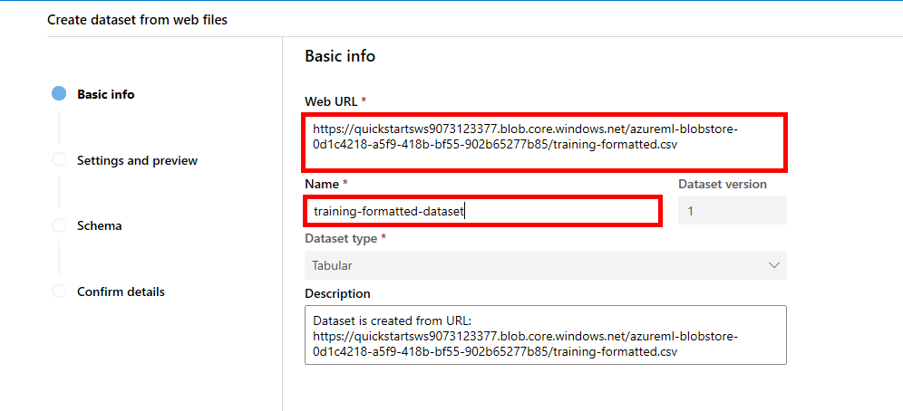

6) In the `Settings and preview` page be sure to scroll to the right to observe all of the columns in the data. 

   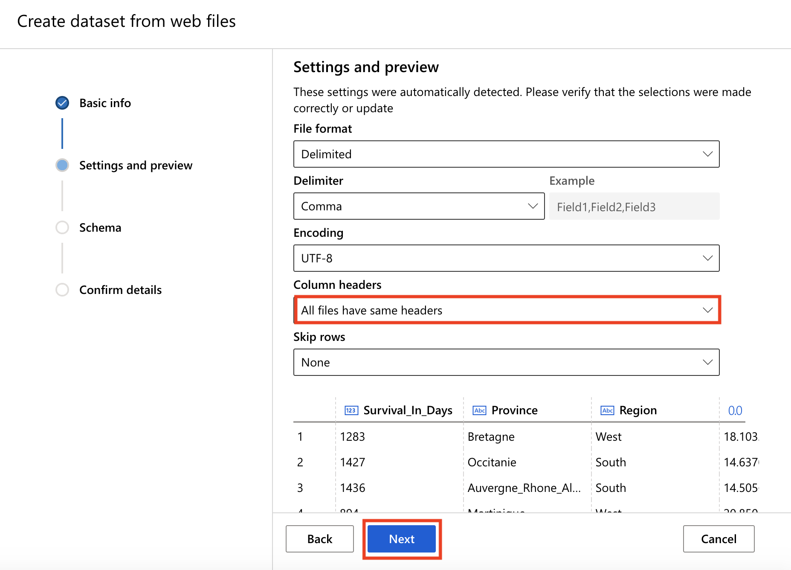

7) Move on to the **Next** page to check the schema and then confirm the dataset details by selecting **Next** and then **Create** on the confirmation page.

   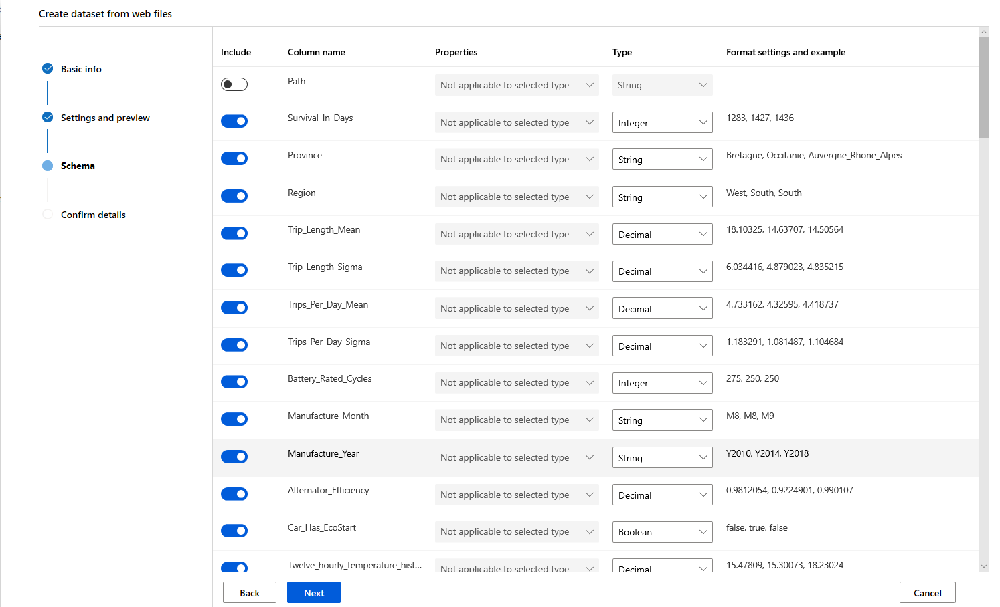
   
   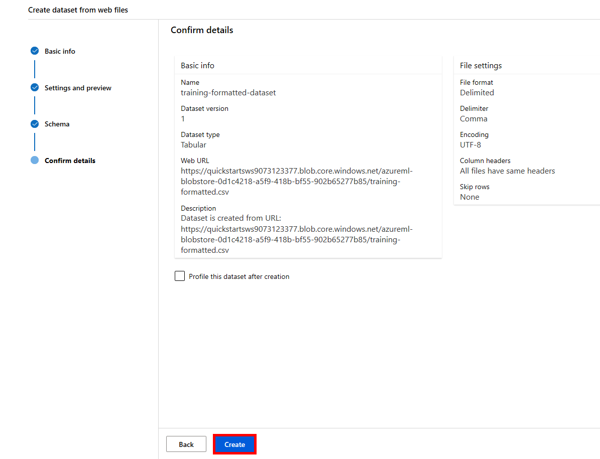

8) Now, you should be able to select the newly created dataset for your experiment. Select the `targeting-formatted-dataset` and click **Next** to move to the experiment details page.

   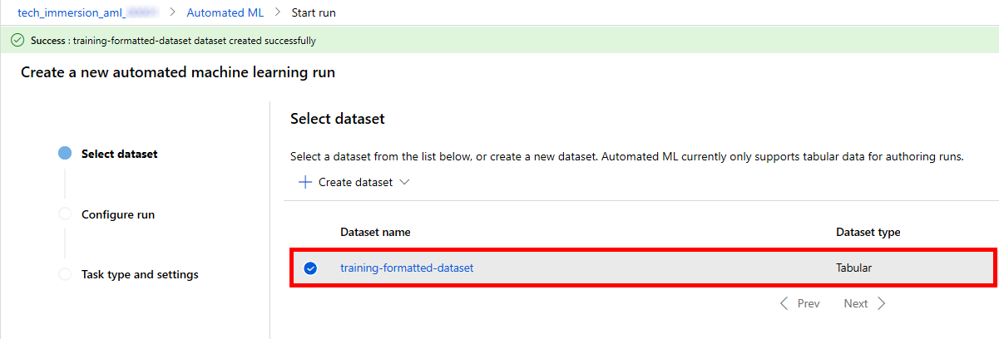

9) Next, you will configure the Auto ML Experiment Basic Settings by providing the following values for the experiment name, target column and training compute:

   - Experiment name: **automl-regression**
   - Target column: select **Survival_In_Days**
   - Select training compute target: : select **aml-compute-cpu**

   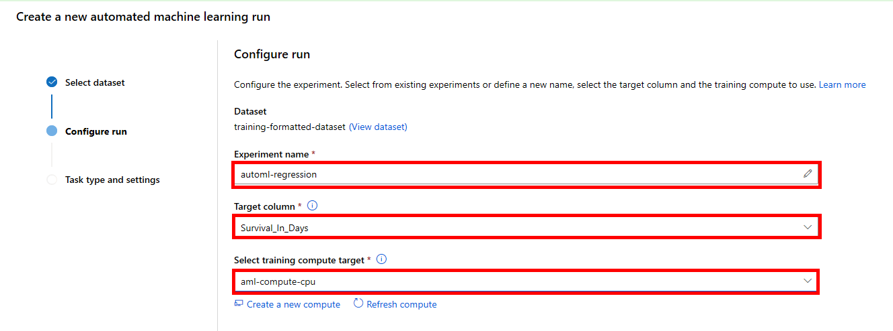

10) Move **Next** and select **Regression** in the `Task type settings` page.

    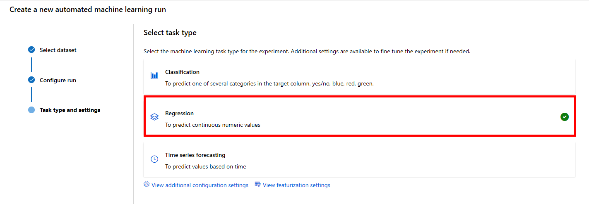

11) Click **View additional configuration settings** to open advanced settings section. Provide the following settings:

   - Primary metric: **Normalized root mean squared error**
   - Exit criterion > Metric score threashold: **0.07**
   - Validation > Validation type: **k-fold cross validation**
   - Validation > Number of Cross Validations: **5**
   - Concurency > Max concurrent iterations: **1**
    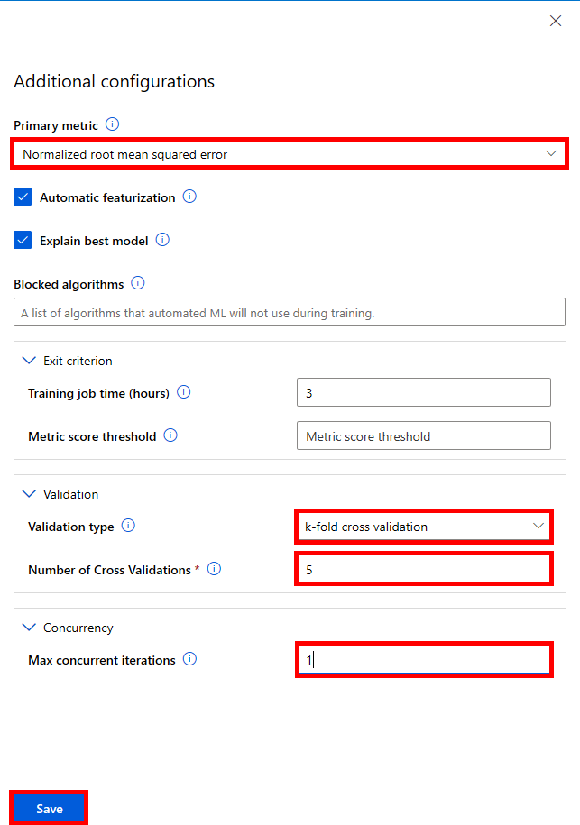

12) Select **Save** and then **Finish** to run the experiment and begin the automated machine learning process. 

    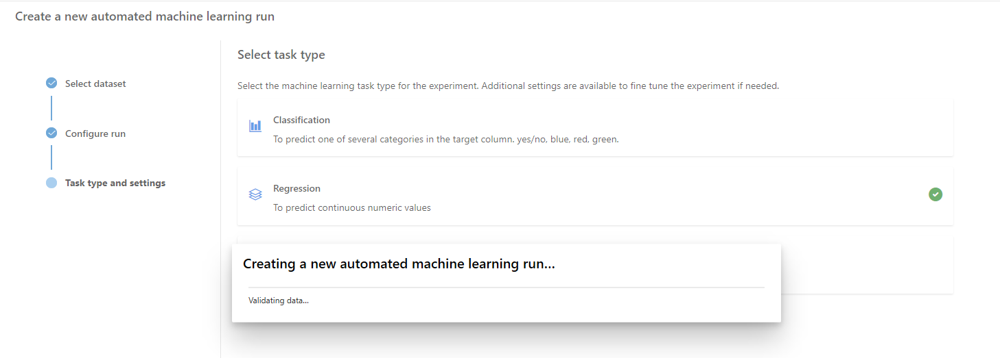

13) Wait until the Run status moves from **Preparing** to **Running** in the `Run Detail page`.

    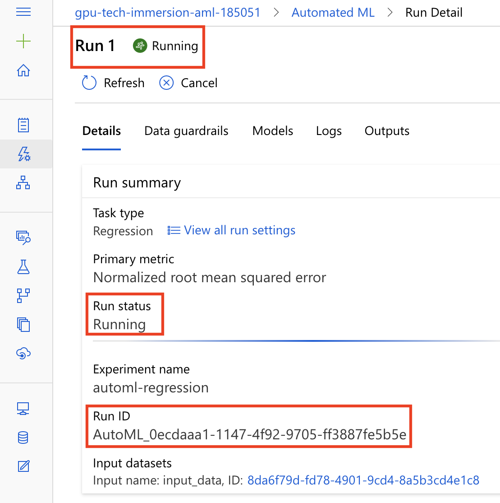

### Task 2: Review the experiment run results

1. The experiment will run for about _15 minutes_. Once it completes you should check the `Models` tab on the `Run Detail` page to observe the model performance for the primary metric for different runs.

   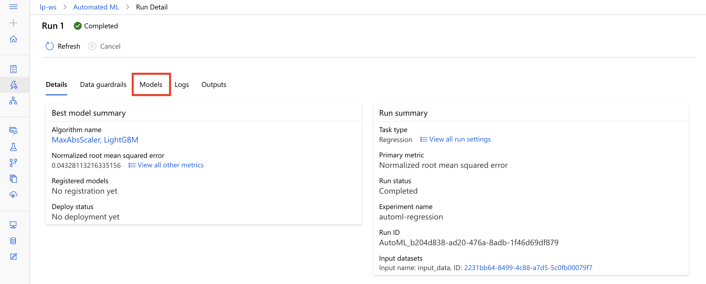

2. In the table view of different models, notice at the top the iteration with the best **normalized root mean square error** score. Note that the normalized root mean square error measures the error between the predicted value and actual value. In this case, the model with the lowest normalized root mean square error is the best model.

   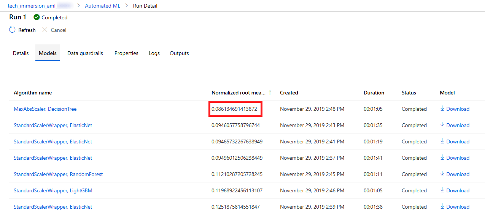

3. Select **Experiments** on the left navigation pane and select the experiment `automl-regression` to see the list of available runs.

   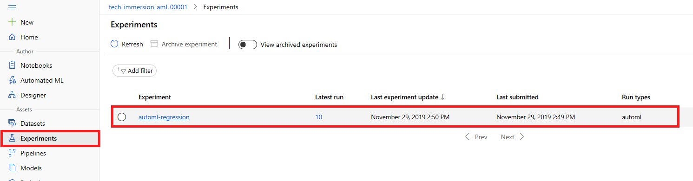

4. Select the option to **Include child runs** to be able to examine  model performance for the primary metric of different runs. By default, the left chart describes the `mean_absolute_error` value for each run. Click on the pen icon on the right corner of the mean_absolute_error chart to configure the `normalized_root_mean_square_error` metric representation.

   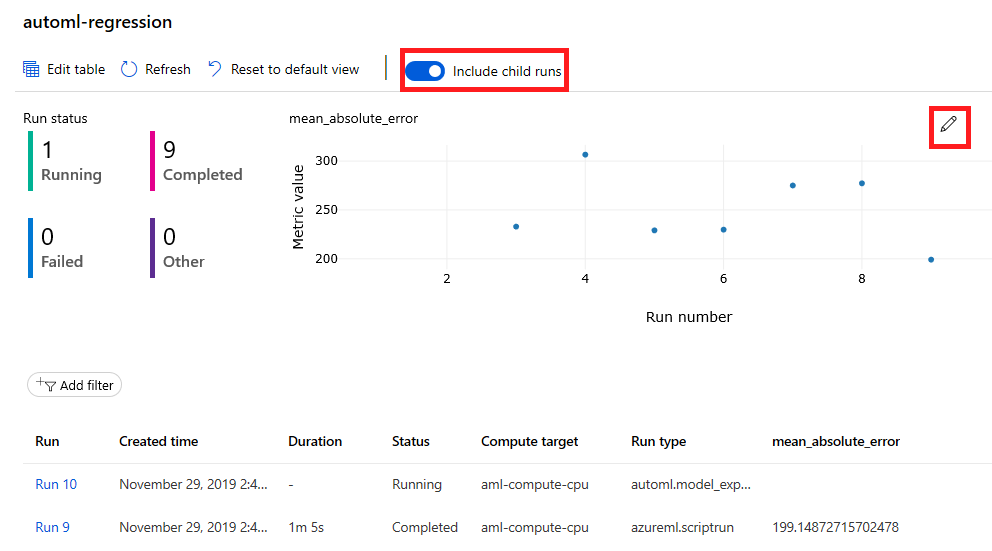

### Task 3: Register the Best Model

1. Return to the `Run Details` screen for Run 1 which you can find by scrolling down to the last row in the iterations table.

    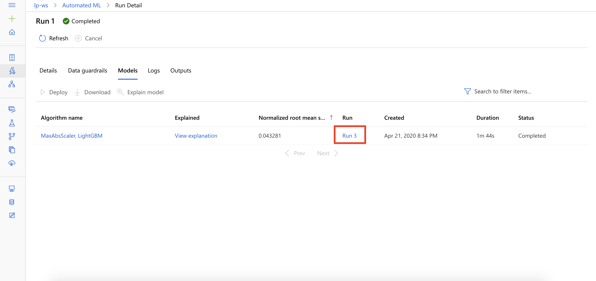

2. Select **Download best model** as shown and save the `model.pkl` file on your local disk.

   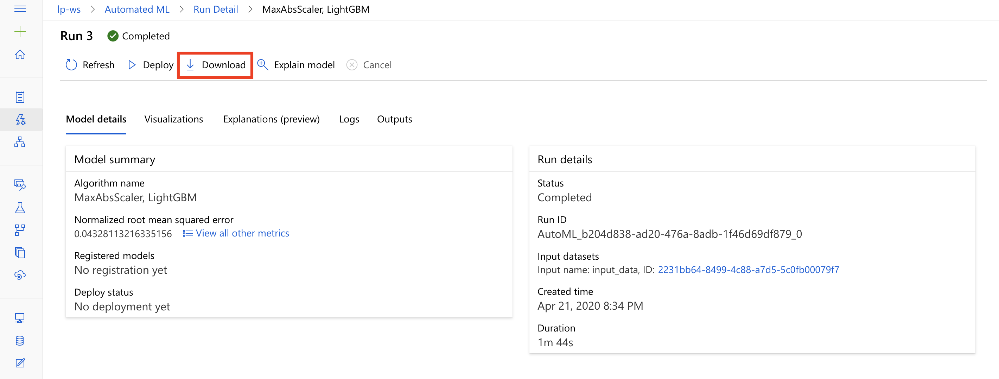

3. You need to register the best model with the Azure Machine Learning model registry so that you can retrieve it later when you want to use it for scoring. Select 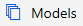 in the left navigation pane. 

4. Click the **Register Model** button at the top of the `Model list`. Enter the name of your model: `automl-regression`, browse for the downloaded model file on the previous step and then press **Register**.

   

5. Once the registration process has completed, you will be prompted with the message `Model created successfully` in the notification area at the top. Now you should be able to view this model in the **Models** list.

   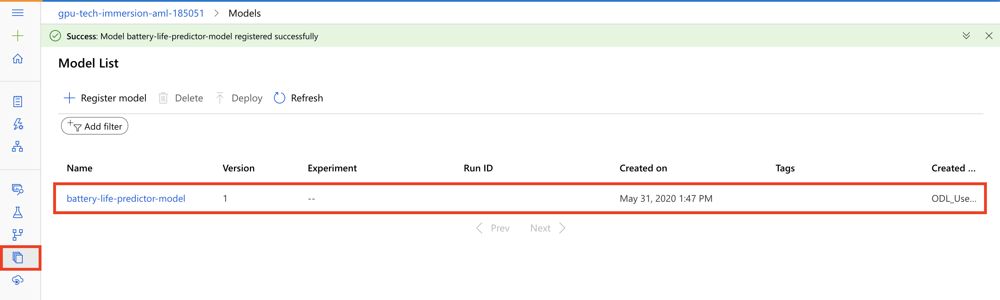

4. If you see your model in the above list, you are now ready to continue on to the next exercise.

## Exercise 2: Understanding the automated ML generated model using model explainability

### Task 1: Setup the Notebook VM environment

To complete this task, you will use an Azure Notebook VM and Azure Machine Learning.

If you have not already created the `tech-immersion` notebook VM in Azure Machine Learning studio follow these steps. If you already have this compute in your environment, continue with the **Task 2**.

1. To start, open Azure Machine Learning studio and navigate to the `tech_immersion_aml_XXXXX` workspace.

2. Navigate to the `Compute` section by selecting the option on the left navigation menu.

3. Under the `Notebook VMs` tab, click **New** to create the notebook VM. Name it `tech-immersion`, select **Standard_DS3** for VM type and press **Create**. Wait a few minutes until the notebook is fully provisioned.
4. Back to the `Notebook VMs` tab, click **Refresh** if you are not able to see `tech-immersion` yet. After the notebook VM is listed, click on the **Jupyter** link.

   

### Task 2: Upload the starter notebook

1. Download the notebook on your local disk from the following URL:

   https://github.com/solliancenet/tech-immersion-data-ai/blob/master/lab-files/ai/3

   Save `scoring-from-automl-model.ipynb` notebook file locally by right-clicking on the file name and selecting **Save link as**.

2. In the Jupyter Notebook environment configured in **Task1**, navigate to the `Files` tab and open the automatically created folder named as your username.
3. Select the **Upload** menu and browse for the notebook downloaded in step 1.

   

4. Press **Upload** to start uploading the notebook to the VM.

   

5. In the listing, select the Notebook you just uploaded (scoring-from-automl-model.ipynb) to open it.

6. Follow the instructions within the notebook to complete the experience.

## Exercise 3 (Optional): Train and evaluate a model using Azure Machine Learning

### Task 1: Upload and open the starter notebook

In this exercise, you will use compute resources provided by Azure Machine Learning to remotely train a set of models using Automated Machine Learning, evaluate performance of each model and pick the best performing model to deploy as a web service. You will perform this lab using Azure Notebooks. The model you train here is created using automated machine learning just as you did in exercise 1, except instead of using the visual interface in the Azure Portal you setup the model training using Python.

1. Download the notebook on your local disk from the following URL:

   https://github.com/solliancenet/tech-immersion-data-ai/blob/master/lab-files/ai/3

   Save `predict-battery-life-with-AML.ipynb` notebook file locally by right-clicking on the file name and selecting **Save link as**.

2. In the Jupyter Notebook environment navigate to the Files tab and open the automatically created folder named as your username.
3. Select the **Upload** menu and browse for the notebook downloaded in step 1.

   

4. Press **Upload** to start uploading the notebook to the VM.

   

5. In the listing, select the Notebook you just uploaded (predict-battery-life-with-AML.ipynb) to open it.

6. Follow the instructions within the notebook to complete the experience.

## Wrap-up

Congratulations on completing the Auto ML experience.

To recap, you experienced:

1. How to use automated machine learning from the Azure Machine Learning workspace to simplify the process of getting to a performant model.
2. Using Auto ML to train multiple models by using remote capabilities provided by compute targets.
3. Capturing and querying the telemetry of training runs using an Experiment.
4. Retrieving the best model created from an Auto ML session.
5. Registering the best model with the Model Registry, which enables versioning and makes the model file available for deployment to a web service.
6. Understanding the model using the model interpretability features of the Azure Machine Learning Python SDK.

## Additional resources and more information

To learn more about the Azure Machine Learning service, visit the [documentation](https://docs.microsoft.com/azure/machine-learning/service)
