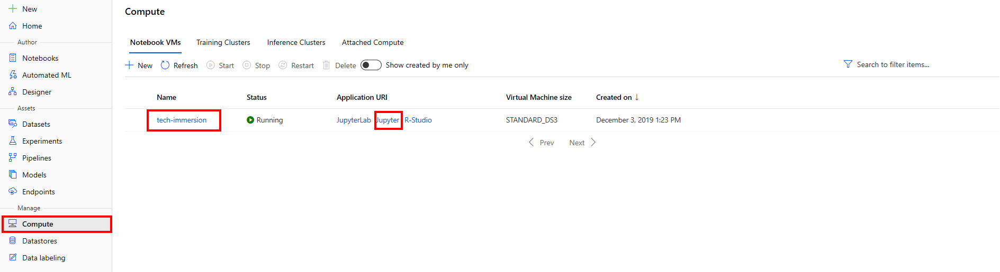

# Data & AI Tech Immersion Workshop – Product Review Guide and Lab Instructions

## AI, Experience 4 - Creating repeatable processes with Azure Machine Learning pipelines

- [Data &amp; AI Tech Immersion Workshop – Product Review Guide and Lab Instructions](#data-amp-ai-tech-immersion-workshop-%e2%80%93-product-review-guide-and-lab-instructions)
  - [AI, Experience 4 - Creating repeatable processes with Azure Machine Learning pipelines](#ai-experience-4---creating-repeatable-processes-with-azure-machine-learning-pipelines)
- [Technology overview](#technology-overview)
  - [What are machine learning pipelines?](#what-are-machine-learning-pipelines)
  - [Scenario Overview](#scenario-overview)
  - [Task 1: Setup the Notebook VM environment](#task-1-setup-the-notebook-vm-environment)
  - [Task 2: Upload the starter notebook](#task-2-upload-the-starter-notebook)
  - [Wrap-up](#wrap-up)
  - [Additional resources and more information](#additional-resources-and-more-information)

# Technology overview

## What are machine learning pipelines?

Pipelines are used to create and manage workflows that stitch together machine learning phases. Various machine learning phases including data preparation, model training, model deployment, and inferencing.

Using [Azure Machine Learning SDK for Python](https://docs.microsoft.com/en-us/python/api/azureml-pipeline-core/?view=azure-ml-py), data scientists, data engineers, and IT professionals can collaborate on the steps involved.

The following diagram shows an example pipeline:

## Scenario Overview

In this experience, you will learn how Contoso Auto can benefit from creating re-usable machine learning pipelines with Azure Machine Learning.

The goal is to build a pipeline that demonstrates the basic data science workflow of data preparation, model training, and predictions. Azure Machine Learning allows you to define distinct steps and make it possible to re-use these pipelines as well as to rerun only the steps you need as you tweak and test your workflow.

In this experience, you will be using a subset of data collected from Contoso Auto's fleet management program used by a fleet of taxis. The data is enriched with holiday and weather data. The goal is to train a regression model to predict taxi fares in New York City based on input features such as, number of passengers, trip distance, datetime, holiday information and weather information.

The machine learning pipeline in this quickstart is organized into three steps:

- **Preprocess Training and Input Data:** We want to preprocess the data to better represent the datetime features, such as hours of the day, and day of the week to capture the cyclical nature of these features.

- **Model Training:** We will use data transformations and the GradientBoostingRegressor algorithm from the scikit-learn library to train a regression model. The trained model will be saved for later making predictions.

- **Model Inference:** In this scenario, we want to support **bulk predictions**. Each time an input file is uploaded to a data store, we want to initiate bulk model predictions on the input data. However, before we do model predictions, we will re-use the preprocess data step to process input data, and then make predictions on the processed data using the trained model.

Each of these pipelines is going to have implicit data dependencies and the example will demonstrate how AML make it possible to re-use previously completed steps and run only the modified or new steps in your pipeline.

The pipelines will be run on the Azure Machine Learning compute.

## Task 1: Setup the Notebook VM environment

To complete this task, you will use an Azure Notebook VM and Azure Machine Learning.

If you have not already created the `tech-immersion` notebook VM in Azure Machine Learning studio, follow these steps. If you already have this compute in your environment, continue with **Task 2**.

1. Open your Azure Machine Learning workspace. Sign-in to the Azure Portal, navigate to your Azure Machine Learning workspace and select **Launch the new Azure Machine Learning studio**. Alternatively, you can sign in directly to the [Azure Machine Learning studio](https://ml.azure.com).

2. Navigate to the `Compute` section by selecting the option on the left navigation menu.

3. Under the `Notebook VMs` tab, select **New** to create the notebook VM. Name it `tech-immersion`, select `Standard_DS3_V2` for VM type and select **Create**. Wait a few minutes until the notebook is fully provisioned.

    > **Note**: If the `Notebook VM names should be unique within an Azure Region` notification appears, choose a different name that is unique to your environment.

4. Back to the `Notebook VMs` tab, select **Refresh** if you are not able to see `tech-immersion` yet. After the notebook VM is listed, select **Jupyter**.

   

## Task 2: Upload the starter notebook

1. Download the notebook on your local disk from the following URL:

   https://github.com/solliancenet/tech-immersion-data-ai/blob/master/lab-files/ai/4/pipelines-AML.ipynb

   Select **Raw** to view the text version of the file and then right-click in the browser and save the content locally as  `pipelines-AML.ipynb`.

2. In the Jupyter Notebook environment configured in **Task1**, navigate to the `Files` tab to view the root folder content. If you see a folder named after your user name, use that to upload notebooks.

3. Select **Upload** and browse for the notebook downloaded in step 1.

   

4. Select **Upload** to start uploading the notebook to the VM.

   

5. In the listing, select the Notebook you just uploaded (pipelines-AML.ipynb) to open it.
Please select Kernel **Python 3.6 - Azure ML** if you are prompted with a `Kernel not found` exception.

6. Follow the instructions within the notebook to complete the experience.

## Wrap-up

Congratulations on completing the Azure Machine Learning pipelines experience.

To recap, you experienced:

1. Defining the steps for a pipeline that include data preprocessing, model training and model inferencing.
2. Understanding how outputs are shared between steps in a pipeline.
3. Scheduling an inferencing pipeline to execute on a scheduled basis.

## Additional resources and more information

To learn more about the Azure Machine Learning service pipelines, visit the [documentation](https://docs.microsoft.com/en-us/azure/machine-learning/service/concept-ml-pipelines)
