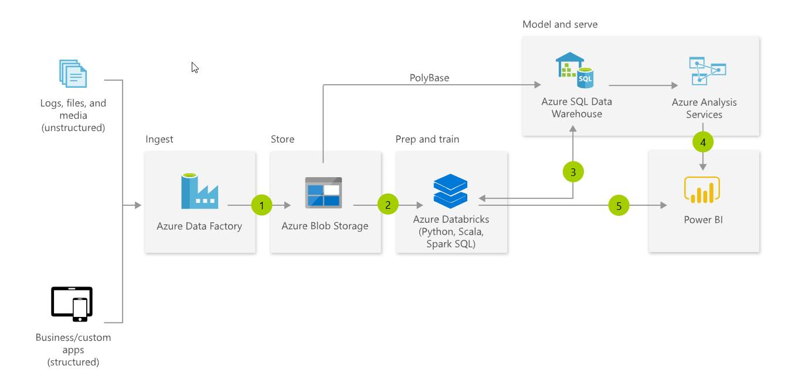
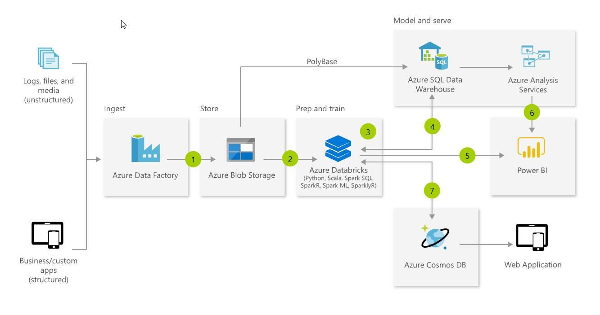

# Day 1, Experience 4 - Delivering the Modern Data Warehouse with Azure Data Factory, Azure SQL Data Warehouse, Azure Databricks, and Power BI

## Technology overview

A modern data warehouse lets you bring together all your data at any scale easily, and to get insights through analytical dashboards, operational reports, or advanced analytics for all your users.

1. Combine all your structured, unstructured and semi-structured data (logs, files, and media) using Azure Data Factory to Azure Blob Storage.
2. Leverage data in Azure Blob Storage to perform scalable analytics with Azure Databricks and achieve cleansed and transformed data.
3. Cleansed and transformed data can be moved to Azure SQL Data Warehouse to combine with existing structured data, creating one hub for all your data. Leverage native connectors between Azure Databricks and Azure SQL Data Warehouse to access and move data at scale.
4. Build operational reports and analytical dashboards on top of Azure Data Warehouse to derive insights from the data, and use Azure Analysis Services to serve thousands of end users.
5. Run ad hoc queries directly on data within Azure Databricks.

The same technologies also enable Advanced Analytics on big data, which allows customers to transform their data into actionable insights using the best-in-class machine learning tools. This architecture allows you to combine any data at any scale, and to build and deploy custom machine learning models at scale.

1. Bring together all your structured, unstructured and semi-structured data (logs, files, and media) using Azure Data Factory to Azure Blob Storage.
2. Use Azure Databricks to clean and transform the structureless datasets and combine them with structured data from operational databases or data warehouses.
3. Use scalable machine learning/deep learning techniques, to derive deeper insights from this data using Python, R or Scala, with inbuilt notebook experiences in Azure Databricks.
4. Leverage native connectors between Azure Databricks and Azure SQL Data Warehouse to access and move data at scale.
5. Power users take advantage of the inbuilt capabilities of Azure Databricks to perform root cause determination and raw data analysis.
6. Run ad hoc queries directly on data within Azure Databricks.
7. Take the insights from Azure Databricks to Cosmos DB to make them accessible through web and mobile apps.

## Scenario overview

Like many organizations, ContosoAuto generates data from numerous system, each of which has its own location and format, including structured, unstructured, and semi-structured data. They would like the ability to combine and analyze these disparate datasets in order to gain actionable insights that can help them operate their business more efficiently.

In this experience, ​​you will see how Azure Data Factory (ADF), Azure Databricks, and Azure SQL Data Warehouse (SQL DW) can be used together to build a modern data warehouse. You will start by using Azure Data Factory (ADF) to automate the movement of data in various formats gathered from various sources, including Cosmos DB, into a centralized repository, Azure Data Lake Storage Gen2 (ADLS Gen2) in this case. You will then use Azure Databricks to prepare and analyze those data, and finally write the aggregations to Azure SQL Data Warehouse (SQL DW).

As part of the process, you will also use Databricks to connect to the Cosmos DB Change Feed to stream near-real-time vehicle telemetry data directly into your SQL DW using Spark Structured Streaming.