# Data & AI Tech Immersion Workshop – Product Review Guide and Lab Instructions

## Data, Experience 3 - Unlocking new capabilities with friction-free migrations to Azure SQL Database Managed Instance

- [Data & AI Tech Immersion Workshop – Product Review Guide and Lab Instructions](#data--ai-tech-immersion-workshop-%e2%80%93-product-review-guide-and-lab-instructions)
  - [Data, Experience 3 - Unlocking new capabilities with friction-free migrations to Azure SQL Database Managed Instance](#data-experience-3---unlocking-new-capabilities-with-friction-free-migrations-to-azure-sql-database-managed-instance)
  - [Technology overview](#technology-overview)
    - [Migrate your SQL Server databases without changing your apps](#migrate-your-sql-server-databases-without-changing-your-apps)
    - [Accelerate your database migration](#accelerate-your-database-migration)
    - [Maximize ROI by migrating to the cloud](#maximize-roi-by-migrating-to-the-cloud)
  - [Scenario overview](#scenario-overview)
  - [Task 1: Perform database assessments for migration](#task-1-perform-database-assessments-for-migration)
  - [Task 2: Review how to test workloads on the target platform with DEA](#task-2-review-how-to-test-workloads-on-the-target-platform-with-dea)
    - [Capture](#capture)
    - [Replay](#replay)
    - [Analysis](#analysis)
  - [Task 3: Migrate the database to SQL MI](#task-3-migrate-the-database-to-sql-mi)
  - [Task 4: Perform migration cutover](#task-4-perform-migration-cutover)
    - [Task 5: Verify database and transaction log migration](#task-5-verify-database-and-transaction-log-migration)
  - [Task 6: Update the web application to use the new SQL MI database](#task-6-update-the-web-application-to-use-the-new-sql-mi-database)
  - [Task 7: Enable Dynamic Data Masking](#task-7-enable-dynamic-data-masking)
  - [Task 8: Add clustered columnstore index](#task-8-add-clustered-columnstore-index)
  - [Task 9: Use online secondary for read-only queries](#task-9-use-online-secondary-for-read-only-queries)
  - [Task 10: Review Advanced Data Security Vulnerability Assessment](#task-10-review-advanced-data-security-vulnerability-assessment)
  - [Task 11: SQL Data Discovery and Classification](#task-11-sql-data-discovery-and-classification)
  - [Wrap-up](#wrap-up)
  - [Additional resources and more information](#additional-resources-and-more-information)

## Technology overview

### Migrate your SQL Server databases without changing your apps

[Azure SQL Database Managed Instance](https://docs.microsoft.com/azure/sql-database/sql-database-managed-instance) (SQL MI) is a new deployment option of Azure SQL Database which enables the migration of existing on-premises SQL Server databases to the cloud with minimal or no application and database changes. With SQL MI, you get the broadest SQL Server engine compatibility and native virtual network (VNET) support. This option gives you the best of SQL Server, plus the operational and cost benefits of an intelligent, fully managed service. SQL MI is ideal for migrating a large number of existing SQL Server databases from on-premises or virtual machines to SQL Database.

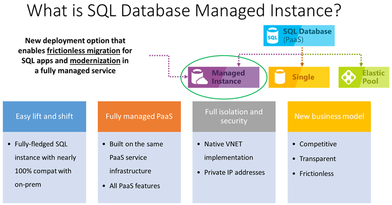

### Accelerate your database migration

Reduce the complexity of your cloud migration by using a single comprehensive service instead of multiple tools. [Azure Database Migration Service](https://docs.microsoft.com/azure/dms/dms-overview) is designed as a seamless, end-to-end solution for moving on-premises SQL Server databases to the cloud. Use the [Database Migration Guide](https://datamigration.microsoft.com/) for recommendations, step-by-step guidance, and expert tips on your specific database migration.

### Maximize ROI by migrating to the cloud

Reduce the burden of data-tier management and save time and costs by migrating workloads to the cloud. [Azure Hybrid Benefit](https://azure.microsoft.com/pricing/hybrid-benefit/) for SQL Server provides a cost-effective path for migrating hundreds or thousands of SQL Server databases with minimal effort. Use your SQL Server licenses with Software Assurance to pay a reduced rate when migrating to the cloud. Save up to 55 percent with Azure Hybrid Benefit, and up to 80 percent with [reserved capacity](https://docs.microsoft.com/azure/sql-database/sql-database-reserved-capacity). Learn how [customers have increased productivity](https://azure.microsoft.com/resources/forrester-tei-sql-database-managed-instance/) by up to 40 percent by migrating to Azure SQL Database.

## Scenario overview

ContosoAuto runs their operations and finance database, `ContosoAutoDb`, on an on-premises SQL Server 2008 R2 database. This system is vital to the company's daily activities and as SQL Server 2008 R2 is approaching end of support, they are looking at options for migrating this database into Azure. They have read about some of the advanced security and performance tuning options that are available only in Azure and would prefer to a migrate the database into a platform-as-a-service (PaaS) offering, if possible.

ContosoAuto is using the Service Broker feature of SQL Server within the `ContosoAutoDb` database. Service Broker is a feature of SQL Server used for sending and receiving guaranteed, asynchronous messages by using extensions to the Transact-SQL Data Manipulation Language (DML). This functionality is being used for several critical business processes, and they cannot afford to lose this capability when migrating their operations database to the cloud. They have also stated that, at this time, they do not have the resources to rearchitect the solution to use an alternative message broker.

In this experience, you will use the Microsoft Data Migration Assistant (DMA) to perform assessments of feature parity and compatibility against both Azure SQL Database and Azure SQL Database Managed Instance, with the goal of migrating the `ContosoAutoDb` database into an Azure PaaS offering with minimal or no changes. After completing the assessments, you will perform the database migration and then update ContosoAuto's operations web application to use the new database. Once that is complete, you will review and enable some of the database features that are only available in Azure.

## Task 1: Perform database assessments for migration

In this task, you will use the Microsoft [Data Migration Assistant](https://docs.microsoft.com/sql/dma/dma-overview?view=azuresqldb-mi-current) (DMA) to perform assessments on the `ContosoAutoDb` database. You will run two assessments, one for a migration to Azure SQL Database, and then a second for SQL MI. These assessments will provide reports about any feature parity and compatibility issues between the on-premises database and the Azure managed SQL database service options.

> DMA helps you upgrade to a modern data platform by detecting compatibility issues that can impact database functionality in your new version of SQL Server or Azure SQL Database. DMA recommends performance and reliability improvements for your target environment and allows you to move your schema, data, and uncontained objects from your source server to your target server.

1. Launch the Microsoft Data Migration Assistant from the Windows Start menu within your lab environment.

   

2. In the DMA dialog, select **+** from the left-hand menu to create a new project.

   

3. In the New project pane, set the following:

   - **Project type**: Select Assessment.
   - **Project name**: Enter ToAzureSqlDb.
   - **Assessment type**: Select Database Engine.
   - **Source server type**: Select SQL Server.
   - **Target server type**: Select Azure SQL Database.

   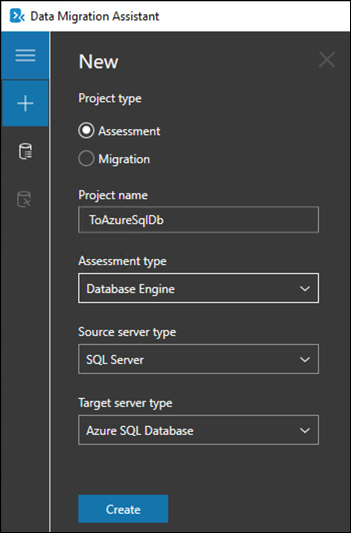

4. Select **Create**.

5. On the **Options** screen, ensure **Check database compatibility** and **Check feature parity** are both checked, and then select **Next**.

   

6. On the **Sources** screen, enter the following into the **Connect to a server** dialog that appears on the right-hand side:

   - **Server name**: Enter the IP Address name your SqlServer2008R2 VM which you can retrieve from the Environment Details sheet. (e.g., 52.151.19.148)
   - **Authentication type**: Select **SQL Server Authentication**.
   - **Username**: Enter **WorkshopUser**
   - **Password**: Enter **Password.1!!**
   - **Encrypt connection**: Check this box.
   - **Trust server certificate**: Check this box.

   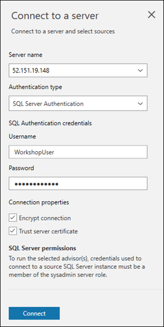

7. Select **Connect**.

8. On the **Add sources** dialog that appears next, check the box for **ContosoAutoDb** and select **Add**.

   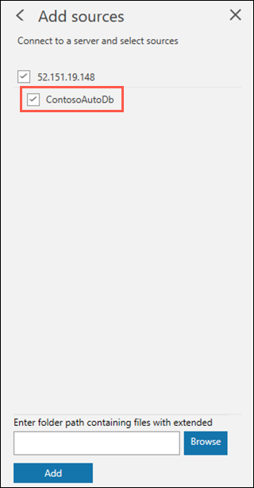

9. Select **Start Assessment**.

   

10. Review the assessment of ability to migrate to Azure SQL Database.

    

    > The DMA assessment for a migrating the `ContosoAutoDb` database to a target platform of Azure SQL Database shows two features in use which are not supported in Azure SQL Database. These features, cross-database references and Service broker, will prevent ContosoAuto from being able to migrate to the Azure SQL Database PaaS offering without first making architectural changes to their application.

11. With one PaaS offering ruled out due to feature parity, you will now perform a second assessment, this time for a migration to Azure SQL Database Managed Instance (SQL MI). To get started, select **+** on the left-hand menu in DMA to create another new project.

    

12. In the New project pane, set the following:

    - **Project type**: Select Assessment.
    - **Project name**: Enter ToAzureSqlMi.
    - **Assessment type**: Select Database Engine.
    - **Source server type**: Select SQL Server.
    - **Target server type**: Select Azure SQL Database Managed Instance.

    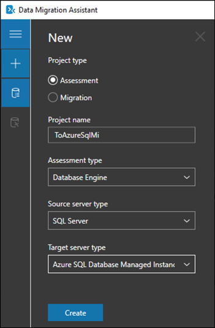

13. Select **Create**.

14. On the **Options** screen, ensure **Check database compatibility** and **Check feature parity** are both checked, and then select **Next**.

    

15. On the **Sources** screen, enter the following into the **Connect to a server** dialog that appears on the right-hand side:

    - **Server name**: Enter the IP Address name your SqlServer2008R2 VM which you can retrieve from the Environment Details sheet. (e.g., 52.151.19.148)
    - **Authentication type**: Select **SQL Server Authentication**.
    - **Username**: Enter **WorkshopUser**
    - **Password**: Enter **Password.1!!**
    - **Encrypt connection**: Check this box.
    - **Trust server certificate**: Check this box.

    

16. Select **Connect**.

17. On the **Add sources** dialog that appears next, check the box for **ContosoAutoDb** and select **Add**.

    

18. Select **Start Assessment**.

    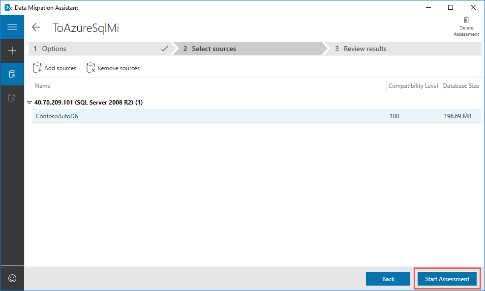

19. Review the assessment of ability to migrate to Azure SQL Database Managed Instance.

    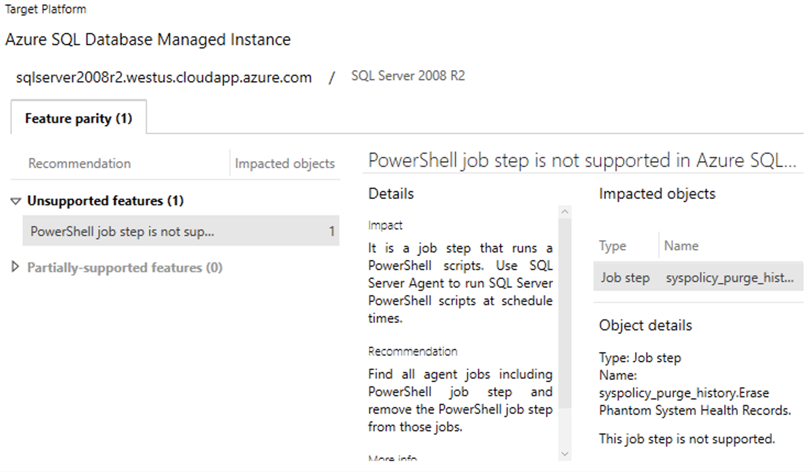

    > The assessment report for a migrating the `ContosoAutoDb` database to a target platform of Azure SQL Database Managed Instance shows one feature parity issue relating to a PowerShell job step. The PowerShell feature is not applicable to the ContosoAuto scenario and can be safely ignored. The database, including the cross-database references and Service broker features, can be migrated as is, providing the opportunity for ContosoAuto to have a fully managed PaaS database instance running in Azure. Previously, their options for migrating a database using features incompatible with Azure SQL Database, such as Service Broker, were to deploy the database to a virtual machine running in Azure (IaaS) or modify their database and applications to not use the unsupported features. The introduction of Azure SQL MI, however, provides the ability to migrate databases into a managed Azure SQL database with near 100% compatibility, including the features that prevented them from using Azure SQL Database.

## Task 2: Review how to test workloads on the target platform with DEA

Next, let's take a look at the Microsoft [Database Experimentation Assistant](https://docs.microsoft.com/en-us/sql/dea/database-experimentation-assistant-overview?view=sql-server-ver15) (DEA), and how it can help in choosing the right target platform for a SQL database upgrade and migration. DEA is an experimentation solution for SQL Server upgrades. DEA can help you evaluate a targeted version of SQL Server for a specific workload. Customers who are upgrading from earlier SQL Server versions (starting with 2005) to a more recent version of SQL Server can use the analysis metrics that the tool provides.

> **NOTE**: Running DEA traces and replays takes a minimum of 10 minutes, which is more time than is alloted for this workshop experience, so we will just discuss the steps and benefits of using the tool in this task.

DEA analysis metrics include:

- Queries that have compatibility errors
- Degraded queries and query plans
- Other workload comparison data

Comparison data can lead to higher confidence and a successful upgrade experience.

DEA guides you through running an A/B test by completing three steps:

- Capture
- Replay
- Analysis

### Capture

The first step of SQL Server A/B testing is to capture a trace on your source server. The source server usually is the production server. Trace files capture the entire query workload on that server, including timestamps. Later, this trace is replayed on your target servers for analysis. The analysis report provides insights on the difference in performance of the workload between your two target servers. Traces can be run from 5 - 180 minutes.

### Replay

The second step of SQL Server A/B testing is to replay the trace file that was captured to your target servers. Then, collect extensive traces from the replays for analysis.

You replay the trace file on two target servers: one that mimics your source server (Target 1) and one that mimics your proposed change (Target 2). The hardware configurations of Target 1 and Target 2 should be as similar as possible so SQL Server can accurately analyze the performance effect of your proposed changes.

### Analysis

The final step is to generate an analysis report by using the replay traces. The analysis report can help you gain insight about the performance implications of the proposed change.

## Task 3: Migrate the database to SQL MI

In this task, you use the [Azure Database Migration Service](https://docs.microsoft.com/azure/dms/dms-overview) (DMS) to perform an online migration the `ContosoAutoDb` database from the on-premises SQL 2008 R2 database to SQL MI. You can refer to the [Database Migration Guide](https://datamigration.microsoft.com/) for recommendations, step-by-step guidance, and expert tips on your specific database migration. To meet ContosoAuto's requirements, the migration will target the [Business Critical service tier](https://docs.microsoft.com/azure/sql-database/sql-database-managed-instance#managed-instance-service-tiers) of SQL Managed Instance.

> The Business Critical service tier is designed for business applications with the highest performance and high-availability (HA) requirements.

Performing an online migration from SQL Server to an Azure SQL Database managed instance using the Azure Database Migration Service requires an existing full database taken using the `WITH CHECKSUM` option. DMS does not perform any backups. The full backup and subsequent transaction log backups must be written to an SMB network share accessible by both the source database and DMS. Online migrations limit downtime to the time to cut over at the end of the migration.

> For this workshop, an SMB network share named `\\SQLSERVER2008R2\dms-backups` has been created for you, and a full backup of the `ContosoAutoDb` database has already been placed in that folder.

To migrate the `ContosoAutoDb` database from SQL 2008 R2 to SQL MI, DMS will use the backup provided to restore the database on your SQL MI. The migration is then left open and any subsequent changes in the source database are captured as log backups. When you are ready to complete the migration, you instruct DMS to complete the cut over, which will finish restoring any transaction logs and then take the database live. The following diagram provides a high-level overview of the process:

![This solution diagram includes a virtual network containing SQL MI in a isolated subnet, along with a JumpBox VM and Database Migration Service in a management subnet. The MI Subnet displays both the primary managed instance, along with a read-only replica, which is accessed by reports from the web app. The web app connects to SQL MI via a subnet gateway and point-to-site VPN. The web app is published to App Services using Visual Studio 2019. An online data migration is conducted from the on-premises SQL Server to SQL MI using the Azure Database Migration Service, which reads backup files from an SMB network share.](./media/preferred-solution-architecture.png "Solution diagram")

1. In the [Azure portal](https://portal.azure.com), navigate to the Azure Database Migration Service by selecting **Resource groups** from the left-hand navigation menu, select the **tech-immersion-XXXXX** resource group (where XXXXX is the unique identifier provided to you for this workshop), and then select the **tech-immersion-dms** Azure Database Migration Service in the list of resources.

    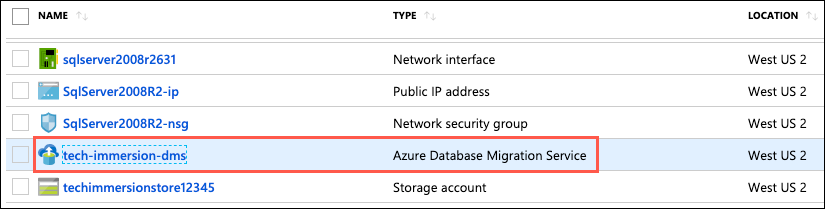

2. On the Azure Database Migration Service blade, select **+New Migration Project**.

    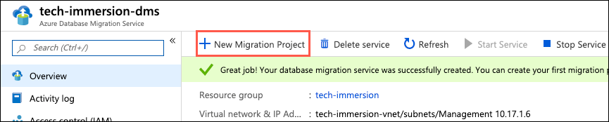

3. On the New migration project blade, enter the following:

    - **Project name**: Enter OnPremToSqlMi.
    - **Source server type**: Select SQL Server.
    - **Target server type**: Select Azure SQL Database Managed Instance.
    - **Choose type of activity**: Select **Online data migration** and select **Save**.

    

4. Select **Create and run activity**.

5. On the Migration Wizard **Select source** blade, enter the following:

    - **Source SQL Server instance name**: Enter the IP address of your SqlServer2008R2 VM, which you can find in the Environment Details sheet provided to you for this workshop. For example, `52.151.19.148`.
    - **Authentication type**: Select SQL Authentication.
    - **Username**: Enter **WorkshopUser**.
    - **Password**: Enter **Password.1!!**.
    - **Connection properties**: Check both Encrypt connection and Trust server certificate.

    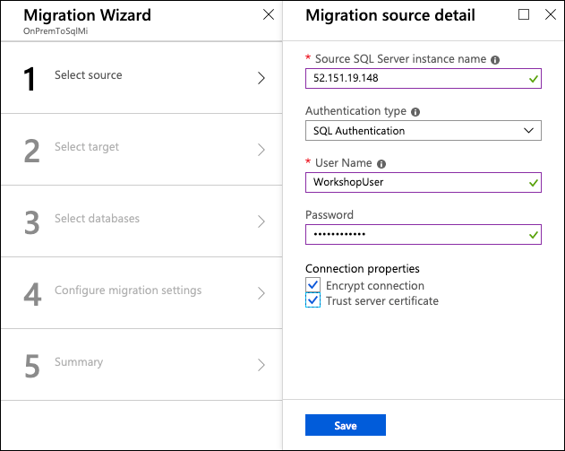

6. Select **Save**.

7. On the Migration Wizard **Select target** blade, enter the following:

    - **Application ID**: Enter the `Application ID` value from the Environment Details sheet provided to you for this workshop.
    - **Key**: Enter the `Application Key` value from the Environment Details sheet provided to you for this workshop.
    - **Subscription**: Select the subscription being using for this workshop.
    - **Target Azure SQL Managed Instance**: Select the tech-immersion-sqlmi instance.
    - **SQL Username**: Enter **tiuser**
    - **Password**: Enter **Password.1234567890**

    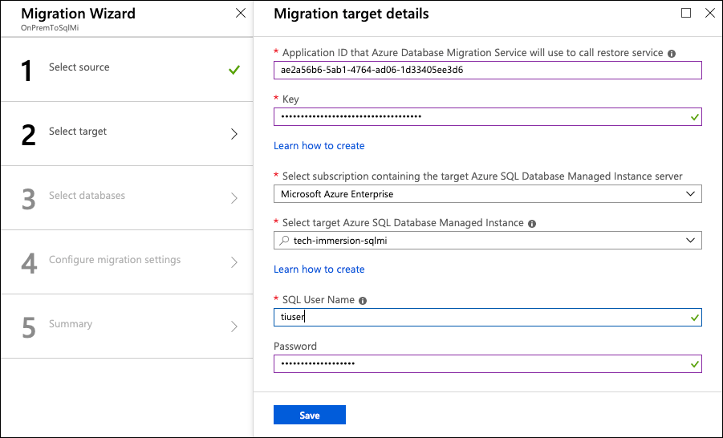

8. Select **Save**.

9. On the Migration Wizard **Select databases** blade, select `ContosoAutoDb`.

    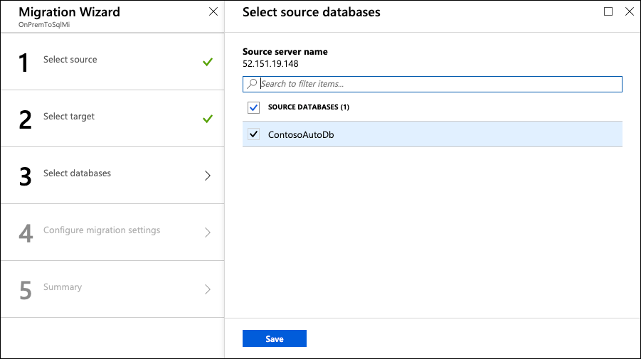

10. Select **Save**.

11. On the Migration Wizard **Configure migration settings** blade, enter the following configuration:

    - **Network share location**: Enter `\\SQLSERVER2008R2\dms-backups`. This is the path of the SMB network share created to store the database and log backups.
    - **Windows User Azure Database Migration Service impersonates to upload files to Azure Storage**: Enter `SQLSERVER2008R2\tiuser`
    - **Password**: Enter **Password.1234567890**
    - **Subscription containing storage account**: Select the subscription you are using for this workshop.
    - **Storage account**: Select the techimmersionstoreXXXXX storage account, where XXXXX is the unique identifier provided to you for this workshop.
    - Expand **Advanced settings**, and then expand **ContosoAutoDb**.
    - **Target database name**: Enter **ContosoAutoDb-XXXXX**, where XXXXX is the unique identifier provided to you for this workshop. This setting allows you to change the name of the database created on the SQL MI. SQL MI is a shared resource for all workshop attendees, so everyone will create a unique copy of the database.

    

12. Select **Save** on the **Configure migration setting** blade.

13. On the Migration Wizard **Summary** blade, enter the following:

    - **Activity name**: Enter ContosoAutoDbMigration.

    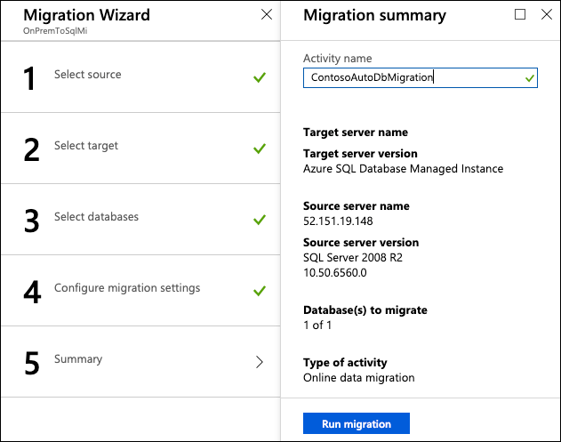

14. Select **Run migration**.

15. Monitor the migration on the status screen that appears. Select the refresh icon in the toolbar to retrieve the latest status. Continue selecting **Refresh** every 5-10 seconds, until you see the status change to **Log files uploading**. When that status appears, move on to the next task.

    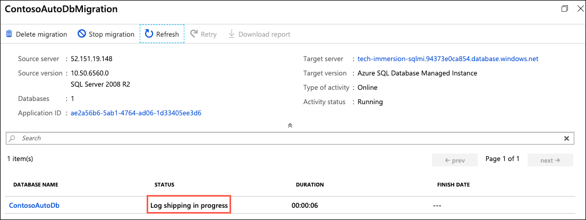

## Task 4: Perform migration cutover

Since you performed the migration as an "online data migration," the migration wizard will continue to monitor the SMB network share for newly added log files. This allows for any updates that happen on the source database to be captured until you cut over to the SQL MI database. In this task, you will add a record to one of the database tables, backup the logs, and complete the migration of the `ContosoAutoDb` database by cutting over to the SQL MI database.

1. In the migration status window in the Azure portal and select **ContosoAutoDb** under database name to view further details about the database migration.

    

2. On the ContosoAutoDb screen you will see a status of **Restored** for the `ContosoAutoDb.bak` file.

    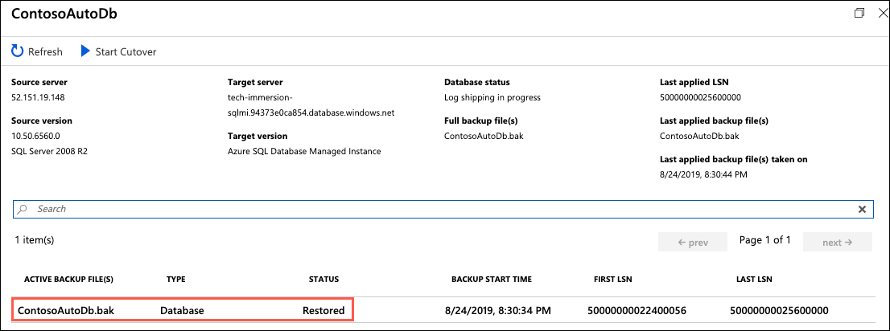

3. To demonstrate log shipping and how transactions made on the source database during the migration process will be added to the target SQL MI database, you will add a record to one of the database tables.

4. Open Microsoft SQL Server Management Studio (SSMS) by selecting the **Search** icon on the Windows start bar, entering "sql server" into the search box, and then selecting **Microsoft SQL Server Management Studio 18**.

   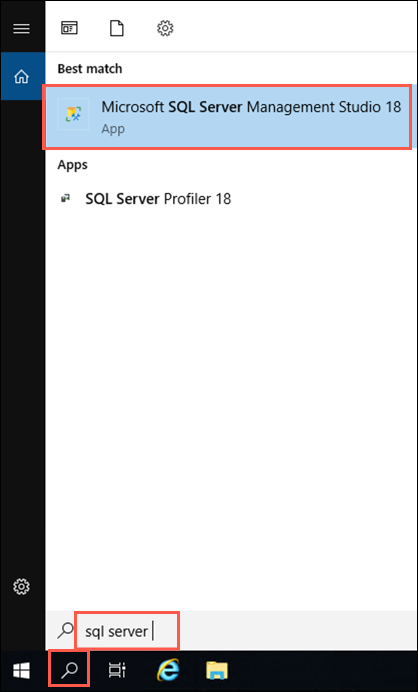

5. In the Connect to Server dialog, enter the following:

   - **Server name**: Enter the IP address of your SqlServer2008R2 VM, which you can find in the Environment Details sheet provided.
   - **Authentication**: Select SQL Server Authentication.
   - **Login**: Enter **WorkshopUser**
   - **Password**: Enter **Password.1!!**

   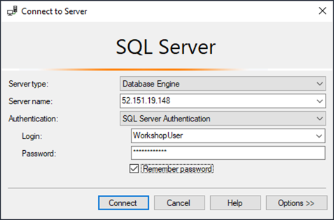

6. Select **Connect**.

7. Once connected, expand Databases in the Object Explorer, select the `ContosoAutoDb` database, and then select **New Query** from the SSMS toolbar.

    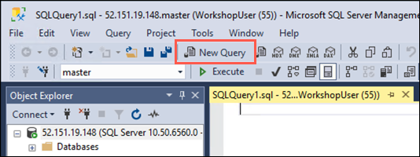

8. Paste the following SQL script, which inserts a record into the `Cars` table, into the new query window:

    ```sql
    USE ContosoAutoDb;
    GO

    INSERT [dbo].[Cars] (Make, Model, Displacement, Year, Cylinders, Transmission, Drv, MpgCity, MpgHighway, Fl, Class)
    VALUES ('Lamborghini', 'Aventador', 6.5, 2019, 12, 'auto(7)', 'r', 10, 17, 'p', '2seater')
    ```

9. Execute the query by selecting **Execute** in the SSMS toolbar.

    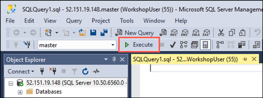

10. With the new record added to the `Cars` table, you will now backup the transaction logs, which will be shipped to DMS. Select **New Query** again on the toolbar, and paste the following script into the new query window:

    ```sql
    USE master;
    GO

    BACKUP LOG ContosoAutoDb
    TO DISK = 'c:\dms-backups\ContosoAutoDbLog.trn'
    WITH CHECKSUM
    GO
    ```

11. Execute the query by selecting **Execute** in the SSMS toolbar.

12. Return to the DMS migration status page in the Azure portal. On the ContosoAutoDb screen, select **Refresh** you should see the **ContosoAutoDbLog.trn** file appear, with a status of **Uploaded**.

    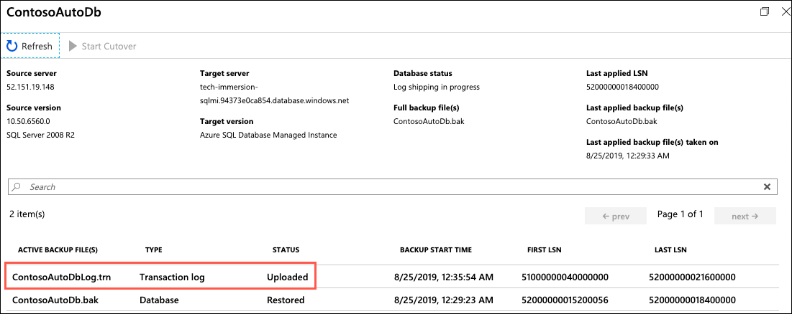

    >**Note**: If you don't see it the transaction logs entry, continue selecting Refresh every few seconds until it appears.

13. Once the transaction logs are uploaded, they need to be restored to the database. Select **Refresh** every 10-15 seconds until you see the status change to **Restored**, which can take a minute or two.

    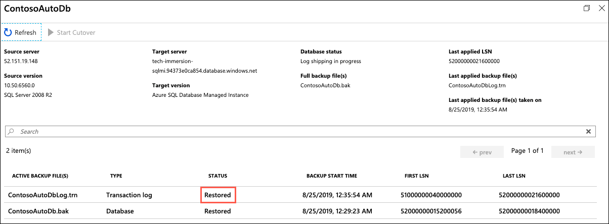

14. After verifying the transaction log status of **Restored**, select **Start Cutover**.

    

15. On the Complete cutover dialog, verify pending log backups is `0`, check Confirm, and select **Apply**.

    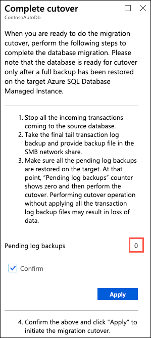

16. You will be given a progress bar below the Apply button in the Complete cutover dialog. When the migration is complete, you will see the status as **Completed**.

    > **NOTE**: The cutover process can take several minutes to complete.

17. Close the Complete cutover dialog by selecting the "X" in the upper right corner of the dialog, and do the same thing for the ContosoAutoDb blade. This will return you to the ContosoAutoDbMigration blade. Select **Refresh**, and you should see a status of **Completed** from the ContosoAutoDb database.

    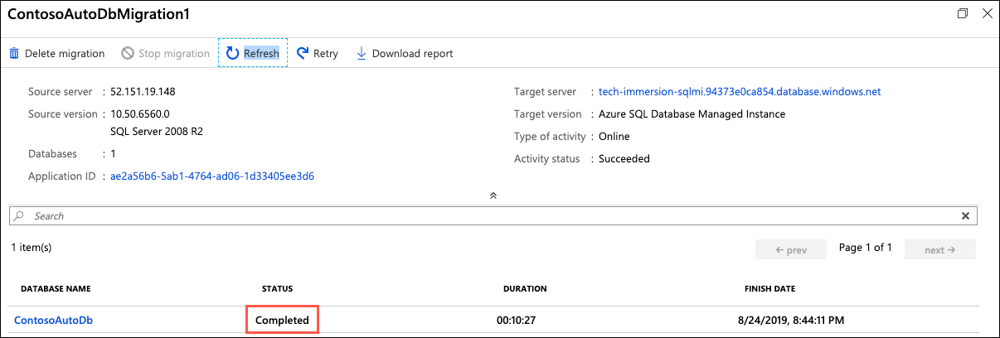

18. You have now successfully migrated the `ContosoAutoDb` database to Azure SQL Managed Instance.

### Task 5: Verify database and transaction log migration

In this task, you will connect to the SQL MI database using SSMS, and quickly verify the migration.

1. Return to SSMS on your JumpBox VM, and then select **Connect** and **Database Engine** from the Object Explorer menu.

    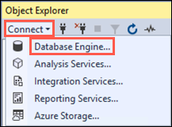

2. In the Connect to Server dialog, enter the following:

    - **Server name**: Enter the fully qualified domain name of your SQL managed instance, which you can retrieve from the Environment Details sheet provided for this workshop.
    - **Authentication**: Select SQL Server Authentication.
    - **Login**: Enter **tiuser**
    - **Password**: Enter **Password.1234567890**
    - Check the **Remember password** box.

    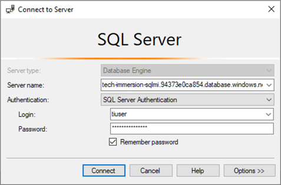

3. Select **Connect**.

4. You will see you SQL MI connection appear below the SQLSERVER2008R2 connection. Expand Databases the SQL MI connection and select the `ContosoAutoDb-XXXXX` database, where XXXXX is the unique identifier provided to you for this workshop.

    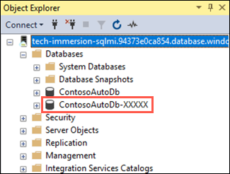

    > **NOTE**: Your database name will differ from the above screen shot, in that it will contain the unique identifier assigned to you for this workshop, such as `ContosoAutoDb-01234`. The SQL Managed Instance is shared for all workshop participants, so you may also see databases for other participants.

5. With the `ContosoAutoDb-XXXXX` database selected, select **New Query** on the SSMS toolbar to open a new query window.

6. In the new query window, enter the following SQL script:

    ```sql
    SELECT * FROM Cars
    ```

7. Select **Execute** on the SSMS toolbar to run the query. You will see the records contained in the `Cars` table displayed. Scroll to the bottom of the results to see the new `Lamborghini Aventador` you added after initiating the migration process.

    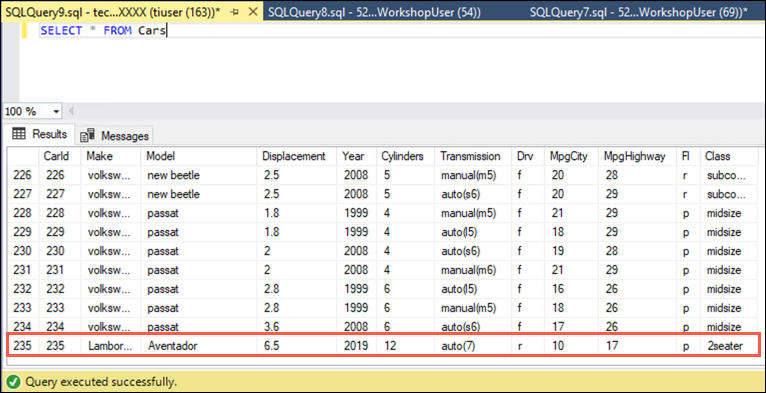

## Task 6: Update the web application to use the new SQL MI database

With the `ContosoAutoDb` database now running on SQL MI in Azure, the next step is to make the required modifications to the ContosoAuto operations web application. The operations web app is currently running an [Azure App Service Environment](https://docs.microsoft.com/azure/app-service/environment/intro), which was provisioned in the same virtual network as the SQL Managed Instance.

> SQL Managed Instance has private IP address in its own VNet, so to connect an application you need to configure access to the VNet where Managed Instance is deployed. To learn more, read [Connect your application to Azure SQL Database Managed Instance](https://docs.microsoft.com/azure/sql-database/sql-database-managed-instance-connect-app).

In this task, you will make updates to the ContosoAuto operations web application to enable it to connect to and utilize the SQL MI database.

1. Using a web browser, navigate to the [Azure portal](https://portal.azure.com), select **Resource groups** from the left-hand menu, and then select the resource group named **tech-immersion-XXXXX** (where XXXXX is the unique identifier assigned to you for this workshop).

   

2. Select the **Tech Immersion Web App Service** ending with your unique identifier (e.g., techimmersionwebapp1XXXXX) from the list of resources.

   

3. On the App Service blade, select **Configuration** under Settings on the left-hand side.

   

4. On the Application settings tab, locate the **Connection strings** section. Select the pencil (Edit) icon to the right of the `ContosoAutoDbContext` connection string, and in the dialog that appears, paste the connection string value below into the **Value** field. Also be sure to set the `Type` drop-down to `SQLServer`.

   ```sql
   Server=tcp:tech-immersion-sql-mi-shared.521f7783692d.database.windows.net,1433;Persist Security Info=False;Database=ContosoAutoDb;User ID=tiuser;Password=Password.1234567890;MultipleActiveResultSets=False;Encrypt=True;TrustServerCertificate=False;Connection Timeout=30;
   ```

   

5. Select **OK**.

6. Repeat the previous two steps, this time pasting the same connection string into the `ContosoAutoDbReadOnlyContext` connection string.

   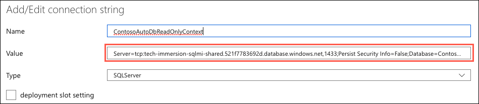

7. Select **Save** at the top of the Application settings blade.

   

   > NOTE: The astute reader may have noticed in the above steps that the Web App continues to query a database called `ContosoAutoDb` and not the database that was just restored. This is intended only to shorten the application configuration steps. Rest assured that the changes you made to the database connection string would enable your application to reach any of the databases loaded on to the SQL Server Managed Instance.

8. Select **Overview** to the left of the Application settings blade to return to the overview blade of your App Service.

   

9. On the overview blade, click the **URL** of your App service to launch the website. This will open the URL in a browser window.

   

10. Verify that the web site and data is loaded correctly. The page should look similar to the following:

    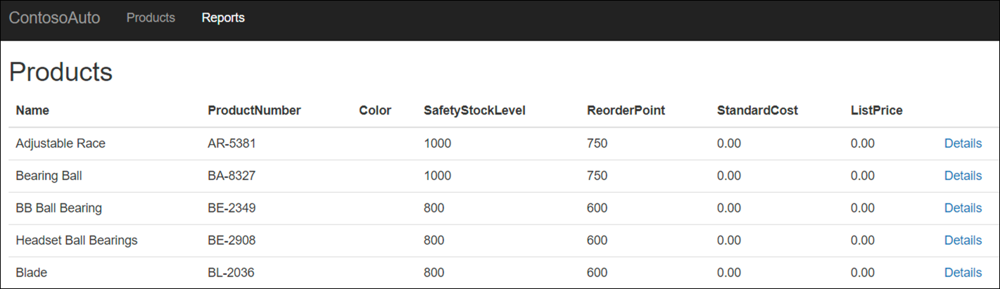

> That is it. You were able to successfully connect your application to the new SQL MI database by simply updating the application's connection string. No code changes or other updates are needed!

## Task 7: Enable Dynamic Data Masking

[Dynamic Data Masking](https://docs.microsoft.com/azure/sql-database/sql-database-dynamic-data-masking-get-started) (DDM) limits sensitive data exposure by masking it to non-privileged users. This feature helps prevent unauthorized access to sensitive data by enabling customers to designate how much of the sensitive data to reveal with minimal impact on the application layer. It’s a policy-based security feature that hides the sensitive data in the result set of a query over designated database fields, while the data in the database is not changed.

> For example, a service representative at a call center may identify callers by several digits of their credit card number, but those data items should not be fully exposed to the service representative. A masking rule can be defined that masks all but the last four digits of any credit card number in the result set of any query. As another example, an appropriate data mask can be defined to protect personally identifiable information (PII) data, so that a developer can query production environments for troubleshooting purposes without violating compliance regulations.

In this task, you will enable DDM on the `CardNumber` field in the `CreditCard` table in the `ContosoAutoDb` database, to prevent queries against that table from returning the full credit card number.

1. Return to the SQL Server Management Studio (SSMS) window you opened previously.

2. Expand **Tables** under the **ContosoAutoDb-XXXXX** (where XXXXX is the unique identifier assigned to you for this workshop) and locate the `Sales.CreditCard` table. Expand the table columns and observe that there is a column named `CardNumber`. Right-click the table, and choose **Select Top 1000 Rows** from the context menu.

   

3. In the query window that opens, review the Results, including the `CardNumber` field. Notice it is displayed in plain text, making the data available to anyone with access to query the database.

   

4. So we can test the mask being applied to the `CardNumber` field, you will first create a user in the database that will be used for testing the masked field. In SSMS, select **New Query** and paste the following SQL script into the new query window, replacing `XXXXX` with your unique ID (if the DDMUser already exists in your environment, the following script will show an error, but you are free to proceed to the next step):

   ```sql
   USE [ContosoAutoDb-XXXXX];
   GO

   CREATE USER DDMUser WITHOUT LOGIN;
   GRANT SELECT ON [Sales].[CreditCard] TO DDMUser;
   ```

   

   > The SQL script above create a new user in the database named `DDMUser`, and grants that user `SELECT` rights on the `Sales.CreditCard` table.

5. Select **Execute** from the SSMS toolbar to run the query. You will get a message that the commands completed successfully in the Messages pane.

6. With the new user created, let's run a quick query to verify the results. Select **New Query** again, and paste the following into the new query window. Replace `XXXXX` in the `USE` statement to include the unique identifier of your database which will be `ContosoAutoDb-XXXXX` (e.g., ContosoAutoDb-01234).

   ```sql
   USE [ContosoAutoDb-XXXXX];
   GO

   EXECUTE AS USER = 'DDMUser';
   SELECT * FROM [Sales].[CreditCard];
   REVERT;
   ```

   

7. Select **Execute** from the toolbar, and examine the Results pane. Notice the credit card number, as above, is visible in clear text.

   

8. You will now apply DDM on the `CardNumber` field to prevent it from being viewed in query results. Select **New Query** from the SSMS toolbar and paste the following query into the query window to apply a mask to the `CardNumber` field, replacing `XXXXX` with your unique ID. Select **Execute** to run the query.

   ```sql
   USE [ContosoAutoDb-XXXXX];
   GO

   ALTER TABLE [Sales].[CreditCard]
   ALTER COLUMN [CardNumber] NVARCHAR(25) MASKED WITH (FUNCTION = 'partial(0,"xxx-xxx-xxx-",4)')
   ```

   

9. Run the `SELECT` query you opened in step 7 above again, and observe the results, specifically inspect the output in the `CardNumber` field. For reference the query is below. You replaced `XXXXX` in the `USE` statement to include the unique identifier of your database which will be `ContosoAutoDb-XXXXX` (e.g., ContosoAutoDb-01234).

   ```sql
   USE [ContosoAutoDb-XXXXX];
   GO

   EXECUTE AS USER = 'DDMUser';
   SELECT * FROM [Sales].[CreditCard];
   REVERT;
   ```

   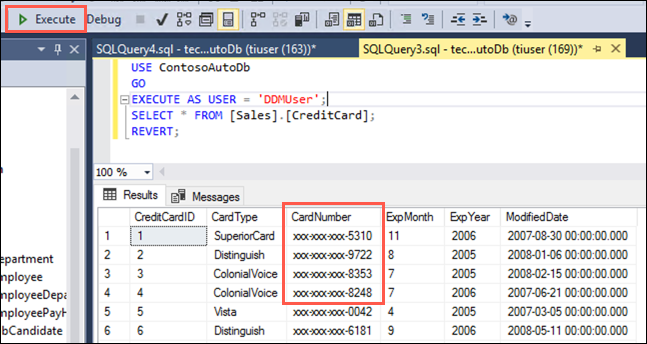

   > The `CardNumber` is now displayed using the mask applied to it, so only the last four digits of the card number are visible. Dynamic Data Masking is a powerful feature that enables you to prevent unauthorized users from viewing sensitive or restricted information. It’s a policy-based security feature that hides the sensitive data in the result set of a query over designated database fields, while the data in the database is not changed.

## Task 8: Add clustered columnstore index

ContosoAuto is looking to take advantage of some of the performance improvement features available in Azure SQL MI. In particular, they are interested in optimizing performance by using [In-Memory technologies](https://docs.microsoft.com/azure/sql-database/sql-database-in-memory).

In this task, you will create a new table based on the existing `[Sales].[SalesOrderDetail]` table and apply a [ColumnStore index](https://docs.microsoft.com/sql/relational-databases/indexes/columnstore-indexes-overview?view=azuresqldb-mi-current).

> Columnstore indexes are the standard for storing and querying large data warehousing fact tables. This index uses column-based data storage and query processing to achieve gains up to **10 times the query performance** in your data warehouse over traditional row-oriented storage. You can also achieve gains up to **10 times the data compression** over the uncompressed data size.

1. In SSMS, ensure you are connected to the Azure SQL Database Managed Instance.

2. Open a new query window by selecting **New Query** from the toolbar.

   

3. Copy the script below, and paste it into the query window. Replace `XXXXX` in the `USE` statement to include the unique identifier of your database which will be `ContosoAutoDb-XXXXX` (e.g., ContosoAutoDb-01234).

   ```sql
   USE [ContosoAutoDb-XXXXX];
   GO

   SELECT *
   INTO [Sales].[ColumnStore_SalesOrderDetail]
   FROM [Sales].[SalesOrderDetail]
   GO
   ```

4. Select **Execute** on the toolbar to run the query, and create a new table named `[Sales].[ColumnStore_SalesOrderDetail]`, populated with data from the `[Sales].[SalesOrderDetail]` table.

   

5. Select **New Query** in the toolbar again, and paste the following query into the new query window. The query contains multiple parts; one to get the size of the `ColumnStore_SalesOrderDetail` table, a second to create a clustered ColumnStore index on the `[Sales].[ColumnStore_SalesOrderDetail]` table, and then the size query is repeated to get the size after adding the clustered ColumnStore index. Replace `XXXXX` in the `USE` statement to include the unique identifier of your database which will be `ContosoAutoDb-XXXXX` (e.g., ContosoAutoDb-01234).

   ```sql
   USE [ContosoAutoDb-XXXXX];
   GO

   -- Get the Size of the [Sales].[ColumnStore_SalesOrderDetail] table
   SELECT
   t.Name AS TableName,
   p.rows AS RowCounts,
   CAST(ROUND((SUM(a.total_pages) / 128.00), 2) AS NUMERIC(36, 2)) AS Size_MB
   FROM sys.tables t
   INNER JOIN sys.indexes i ON t.OBJECT_ID = i.object_id
   INNER JOIN sys.partitions p ON i.object_id = p.OBJECT_ID AND i.index_id = p.index_id
   INNER JOIN sys.allocation_units a ON p.partition_id = a.container_id
   WHERE t.Name = 'ColumnStore_SalesOrderDetail'
   GROUP BY t.Name, p.Rows
   GO

   -- Create a clustered columnstore index on the [Sales].[ColumnStore_SalesOrderDetail] table
   CREATE CLUSTERED COLUMNSTORE INDEX [cci_SalesOrderDetail]
   ON [Sales].[ColumnStore_SalesOrderDetail]
   GO

   -- Get the Size of the [Sales].[ColumnStore_SalesOrderDetail] table
   SELECT
   t.Name AS TableName,
   p.rows AS RowCounts,
   CAST(ROUND((SUM(a.total_pages) / 128.00), 2) AS NUMERIC(36, 2)) AS Size_MB
   FROM sys.tables t
   INNER JOIN sys.indexes i ON t.OBJECT_ID = i.object_id
   INNER JOIN sys.partitions p ON i.object_id = p.OBJECT_ID AND i.index_id = p.index_id
   INNER JOIN sys.allocation_units a ON p.partition_id = a.container_id
   WHERE t.Name = 'ColumnStore_SalesOrderDetail'
   GROUP BY t.Name, p.Rows
   GO
   ```

6. Select **Execute** on the toolbar to run the query.

7. In the query results, observe the `Size_MB` value of the table before and after the creation of the clustered ColumnStore index. The first value is the size before the index was created, and the second value is the size after the ColumnStore index was created.

   ![The SSMS results pane is displayed, with the size of the [Sales].[ColumnStore_SalesOrderDetail] table highlighted both before and after the creation of the clustered ColumnStore index.](media/ssms-sql-mi-columnstore-size-reduction.png "ColumnStore_SalesOrderDetail size query results")

8. Create another new query window by selecting **New Query** from the toolbar, and then select **Include Actual Execution Plan** by selecting its button in the toolbar.

   

9. Paste the queries below into the new query window, replace `XXXXX` with your unique ID, and select **Execute** on the toolbar:

   ```sql
   USE [ContosoAutoDb-XXXXX];
   GO

   SELECT ProductId, LineTotal
   FROM [Sales].[ColumnStore_SalesOrderDetail]

   SELECT ProductId, LineTotal
   FROM [Sales].[SalesOrderDetail]
   ```

   > Running queries against both the `SalesOrderDetail` and `ColumnStore_SalesOrderDetail` will allow you to compare the query execution plans between tables with and without a columnstore index.

10. In the Results pane, select the **Execution Plan** tab. Check the _Query cost (relative to the batch)_ percentage value of the two queries and compare them.

    

    > From the query cost, it is clear the query against the table with the columnstore index was more performant. Using a columnstore index, queries get an order of magnitude better performance boost with _BatchMode_ processing, a unique value proposition in SQL Server. The basic idea of batch mode processing is to process multiple values, hence the term ‘batch’, together instead of one value at a time. Batch mode processing is perfectly suited for analytics where a large number of rows need to be processed, for example, to compute aggregates or apply filter predicates.

11. Run the same queries again, but this time set statistics IO on in the query by adding the following to the top of the query window:

    ```sql
    SET STATISTICS IO ON
    GO
    ```

12. Your final query should look like, with `XXXXX` replaced with your unique ID:

    ```sql
    USE [ContosoAutoDb-XXXXX];
    GO

    SET STATISTICS IO ON
    GO

    SELECT ProductId, LineTotal
    FROM [Sales].[ColumnStore_SalesOrderDetail]

    SELECT ProductId, LineTotal
    FROM [Sales].[SalesOrderDetail]
    ```

13. Select **Execute** from the toolbar to run the query.

    > Statistics IO reports on the amount of logical pages that are read in order to return the query results.

14. Select the **Messages** tab of the Results pane, and compare two numbers, logical reads and lob logical reads. You should see a significant drop in total number of logical reads on the columns store table.

    

## Task 9: Use online secondary for read-only queries

In this task, you will look at how you can use the automatically created online secondary for reporting, without feeling the impacts of a heavy transactional load on the primary database. Each database in the SQL MI Business Critical tier is automatically provisioned with several AlwaysON replicas to support the availability SLA.

> High availability in this architectural model is achieved by replication of compute (SQL Server Database Engine process) and storage (locally attached SSD) deployed in 4-node cluster, using technology similar to SQL Server [Always On Availability Groups](https://docs.microsoft.com/sql/database-engine/availability-groups/windows/overview-of-always-on-availability-groups-sql-server). You can read more in the [SQL Database high availability](https://docs.microsoft.com/azure/sql-database/sql-database-high-availability#premium-and-business-critical-service-tier-availability) documentation.

[**Read Scale-Out**](https://docs.microsoft.com/azure/sql-database/sql-database-read-scale-out) allows you to load balance Azure SQL Database read-only workloads using the capacity of one read-only replica. This way the read-only workload will be isolated from the main read-write workload and will not affect its performance. To learn more, check out the [SQL Database Read Scale-Out documentation](https://docs.microsoft.com/azure/sql-database/sql-database-read-scale-out).

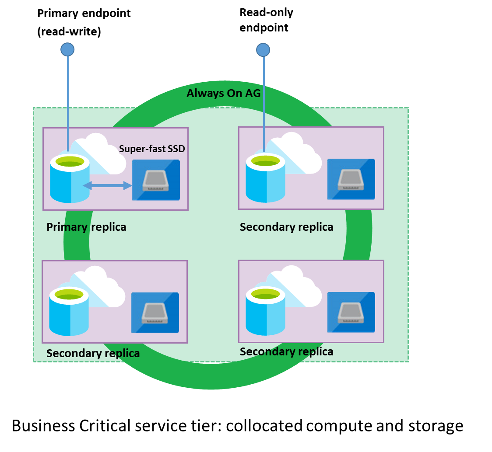

> The feature is intended for the applications that include logically separated read-only workloads, such as analytics, and therefore could gain performance benefits using this additional capacity at no extra cost.

When you enable Read Scale-Out for a database, the `ApplicationIntent` option in the connection string provided by the client dictates whether the connection is routed to the write replica or to a read-only replica. Specifically, if the `ApplicationIntent` value is `ReadWrite` (the default value), the connection will be directed to the database’s read-write replica. This is identical to existing behavior. If the `ApplicationIntent` value is `ReadOnly`, the connection is routed to a read-only replica.

For example, the following connection string connects the client to a read-only replica of the `tech-immersion-sql-mi` database:

```sql
Server=tcp:tech-immersion-sql-mi.3e134c88d9f6.database.windows.net;Database=ContosoAutoDb;User ID=tiuser;Password=Password.1234567890;Trusted_Connection=False;Encrypt=True;ApplicationIntent=ReadOnly;
```

> Note the addition of `ApplicationIntent=ReadOnly;` to the end of the connection string.

1. Using a web browser, navigate to the [Azure portal](https://portal.azure.com), select **Resource groups** from the left-hand menu, and then select the resource group named **tech-immersion-XXXXX** (where XXXXX is the unique ID assigned to you for this workshop).

   

2. In the tech-immersion resource group, select the **techimmersionwebapp1XXXXX** App Service from the list of resources (where XXXXX is the unique ID assigned to you for this workshop).

   

3. On the App Service overview blade, select the **URL** to open the web application in a browser window.

   

4. In the ContosoAuto web app, select **Reports** from the menu.

   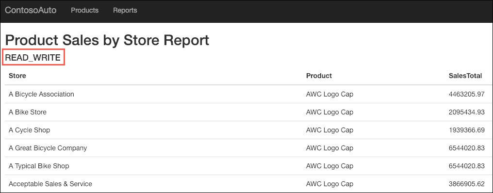

   > Note the `READ_WRITE` string on the page. This is the output from reading the `Updateability` property associated with the `ApplicationIntent` option on the target database. This can be retrieved using the SQL query `SELECT DATABASEPROPERTYEX(DB_NAME(), "Updateability")`.

5. Return to the App Service blade, and then select **Configuration** under Settings on the left-hand side.

   

6. On the Application settings tab, scroll down and locate the connection string named `ContosoAutoDbReadOnlyContext` within the **Connection strings** section.

   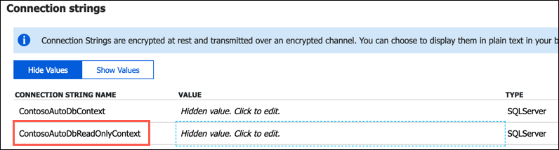

7. Select the pencil (Edit) icon to the right of the `ContosoAutoDbReadOnlyContext` setting, and in the Add/Edit connection string dialog paste the following parameter to end of the connection string.

   ```sql
   ApplicationIntent=ReadOnly;
   ```

8. Your `ContosoAutoDbReadOnlyContext` connection string should now look something like the following:

   ```sql
   Server=tcp:tech-immersion-sqlmi-shared.521f7783692d.database.windows.net,1433;Persist Security Info=False;Database=ContosoAutoDb;User ID=tiuser;Password=Password.1234567890;MultipleActiveResultSets=False;Encrypt=True;TrustServerCertificate=False;Connection Timeout=30;ApplicationIntent=ReadOnly;
   ```

9. Select **OK** in the Add/Edit connection string dialog.

10. Select **Save** at the top of the Application settings blade.

    

11. Return to the ContosoAuto operations website you opened previously, and refresh the **Reports** page. The page should now look similar to the following:

    

    > Notice the `updability` option is now displaying as `READ_ONLY`. With a simple addition to your database connection string, you are able to send read-only queries to the online secondary of your SQL MI database, allowing you to load-balance read-only workloads using the capacity of one read-only replica. The SQL MI Business Critical cluster has built-in Read Scale-Out capability that provides free-of charge built-in read-only node that can be used to run read-only queries that should not affect performance of your primary workload.

## Task 10: Review Advanced Data Security Vulnerability Assessment

[SQL Database Advance Data Security](https://docs.microsoft.com/azure/sql-database/sql-database-advanced-data-security) (ADS) provides advanced SQL security capabilities, including functionality for discovering and classifying sensitive data, surfacing and mitigating potential database vulnerabilities, and detecting anomalous activities that could indicate a threat to your database. ADS is enabled at the managed instance level by selecting **ON** on the **Advanced Data Security** blade for your managed instance. This turns ADS on for all databases on the managed instance. ADS uses an Azure Blob Storage account to save the associated outputs (e.g., assessment and vulnerability reports). In the interest of time for this workshop, the steps to enable ADS have already been performed on the shared SQL MI.

In this task, you will review an assessment report generated by [Advance Data Security](https://docs.microsoft.com/azure/sql-database/sql-database-advanced-data-security) for the `ContosoAutoDb` database and take action to remediate one of the findings in your copy of the `ContosoAutoDb` database.

> Advanced Data Security is enabled at the server level, and for this workshop it has already been enabled on the SQL MI, so you will focus on just your user-specific database.

1. To review the Advanced Data Security assessment for your `ContosoAutoDb-XXXXX` database, navigate to the **tech-immersion-day1-shared-rg** resource group.

   

2. In the shared resource group, select the **SQL Managed Instance** resource from the list.

   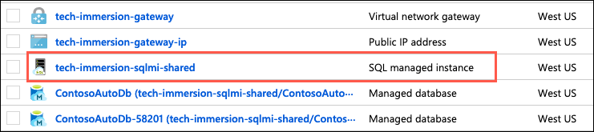

3. On the SQL MI blade, select **Overview** from the left-hand menu.

   

4. On the SQL MI Overview blade, scroll down and locate the list of databases on the Managed Instance, and then select your copy of the **ContosoAutoDb** database, which will be named `ContosoAutoDb-XXXXX` (e.g., ContosoAutoDb-01234), where XXXXX is the unique identifier assigned to you for this workshop.

   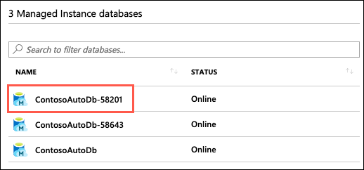

   > You will see a list of all the databases on the SQL MI. Make sure you select the one which includes your assigned unique identifier from the list.

5. On the **ContosoAutoDb-XXXXX** Managed database blade, select **Advanced Data Security** under Security in the left-hand menu and then select the **Vulnerability Assessment** tile.

   

   > The [SQL Vulnerability Assessment service](https://docs.microsoft.com/azure/sql-database/sql-vulnerability-assessment) is a service that provides visibility into your security state, and includes actionable steps to resolve security issues, and enhance your database security.

6. On the Vulnerability Assessment blade, select **Scan** on the toolbar.

   

   > Scans are run on a schedule, but to ensure you have the latest scan results, you are forcing a scan to run by selecting the **Scan** button on the toolbar. This will take around a minute to complete.

7. When the scan completes, you will see a dashboard, displaying the number of failing checks, passing checks, and a breakdown of the risk summary by severity level.

   

8. In the scan results, take a few minutes to browse both the Failed and Passed checks, and review the types of checks that are performed. In the **Failed** the list, locate the security check for **Transparent data encryption**. This check has an ID of **VA1219**.

   

9. Select the **VA1219** finding to view the detailed description.

   

   > The details for each finding provide more insight into the reason for the finding. Of note are the fields describing the finding, the impact of the recommeneded settings, and details on remediation for the finding.

10. Let's now act on the recommendation remediation steps for the finding, and enable [Transparent Data Encryption](https://docs.microsoft.com/azure/sql-database/transparent-data-encryption-azure-sql) for the `ContosoAutoDb` database. To accomplish this, you will switch back to using SSMS for the next few steps.

    > Transparent data encryption (TDE) needs to be manually enabled for Azure SQL Managed Instance. TDE helps protect Azure SQL Database, Azure SQL Managed Instance, and Azure Data Warehouse against the threat of malicious activity. It performs real-time encryption and decryption of the database, associated backups, and transaction log files at rest without requiring changes to the application.

11. In SSMS, select **New Query** from the toolbar, paste the following SQL script into the new query window. Replace `<XXXXX>` in the `ALTER DATABASE` statement to include the unique identifier of your database which will be `ContosoAutoDb-XXXXX` (e.g., ContosoAutoDb-01234).

    ```sql
    ALTER DATABASE [ContosoAutoDb-XXXXX] SET ENCRYPTION ON
    ```

    

    > You turn transparent data encryption on and off on the database level. To enable transparent data encryption on a database in Azure SQL Managed Instance use must use T-SQL.

12. Select **Execute** from the SSMS toolbar. After a few seconds, you will see a message that the "Commands completed successfully."

    

13. You can verify the encryption state and view information the associated encryption keys by using the [sys.dm_database_encryption_keys view](https://docs.microsoft.com/sql/relational-databases/system-dynamic-management-views/sys-dm-database-encryption-keys-transact-sql). Select **New Query** on the SSMS toolbar again, and paste the following query into the new query window:

    ```sql
    SELECT * FROM sys.dm_database_encryption_keys
    ```

    

14. Select **Execute** from the SSMS toolbar. You will see two records in the Results window, which provide information about the encryption state and keys used for encryption.

    

    > By default, service-managed transparent data encryption is used. A transparent data encryption certificate is automatically generated for the server that contains the database.

15. Return to the Azure portal and the Vulnerability Assessment blade for your copy of the `ContosoAutoDb` managed database (e.g, ContosoAutoDb-01234). On the toolbar, select **Scan** to start a new assessment of the database.

    

16. When the scan completes, notice that the numbers for failing and passing checks has changed. The number of failing checks has been reduced by 1 and the number of passing checks has increased by 1.

    

17. On the **Failed** tab, enter **VA1219** into the search filter box, and observe that the previous failure is no longer in the Failed list.

    

18. Now, select the **Passed** tab, and observe the **VA1219** check is listed with a status of PASS.

    

    > Using the SQL Vulnerability Assessment it is simple to identify and remediate potential database vulnerabilities, allowing you to proactively improve your database security.

## Task 11: SQL Data Discovery and Classification

In this task, you will look at another **Advanced Data Security** feature available within the SQL MI database, [SQL Data Discovery and Classification](https://docs.microsoft.com/sql/relational-databases/security/sql-data-discovery-and-classification?view=sql-server-2017). Data Discovery & Classification introduces a new tool built into SQL Server Management Studio (SSMS) for discovering, classifying, labeling & reporting the sensitive data in your databases. It introduces a set of advanced services, forming a new SQL Information Protection paradigm aimed at protecting the data in your database, not just the database. Discovering and classifying your most sensitive data (business, financial, healthcare, etc.) can play a pivotal role in your organizational information protection stature.

>**Note**: This functionality is currently available *in Preview* for SQL MI through the Azure portal.

1. On the Advanced Data Security blade, select the **Data Discovery & Classification** tile.

    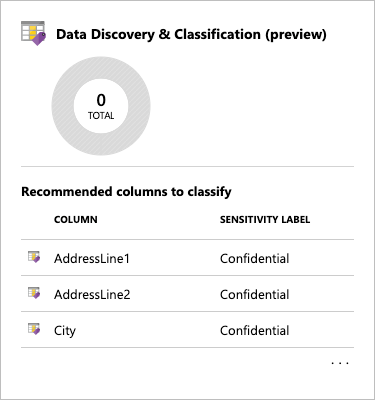

2. In the **Data Discovery & Classification** blade, select the info link with the message **We have found 33 columns with classification recommendations**.

    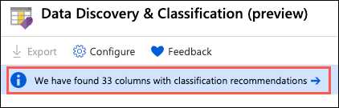

3. Look over the list of recommendations to get a better understanding of the types of data and classifications are assigned, based on the built-in classification settings. In the list of classification recommendations, select the recommendation for the **Sales - CreditCard - CardNumber** field.

    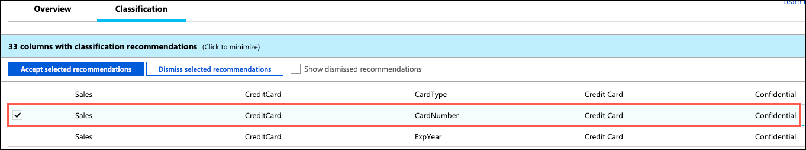

4. Due to the risk of exposing credit card information, ContosoAuto would like a way to classify it as highly confidential, not just **Confidential**, as the recommendation suggests. To correct this, select **+ Add classification** at the top of the Data Discovery & Classification blade.

    

5. Quickly expand the **Sensitivity label** field, and review the various built-in labels you can choose from. You can also add your own labels, should you desire.

    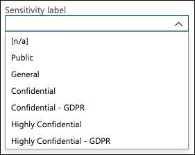

6. In the Add classification dialog, enter the following:

    - **Schema name**: Select Sales.
    - **Table name**: Select CreditCard.
    - **Column name**: Select CardNumber (nvarchar).
    - **Information type**: Select Credit Card.
    - **Sensitivity level**: Select Highly Confidential.

    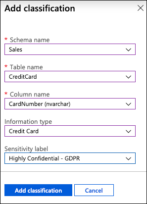

7. Select **Add classification**.

8. You will see the **Sales - CreditCard - CardNumber** field disappear from the recommendations list, and the number of recommendations drop by 1.

9. Other recommendations you can review are the **HumanResources - Employee** fields for **NationIDNumber** and **BirthDate**. Note that these have been flagged by the recommendation service as **Confidential - GDPR**. As ContosoAuto maintains data about gamers from around the world, including Europe, having a tool which helps them discover data which may be relevant to GDPR compliance will be very helpful.

    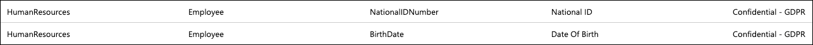

10. Check the **Select all** check box at the top of the list to select all the remaining recommended classifications, and then select **Accept selected recommendations**.

    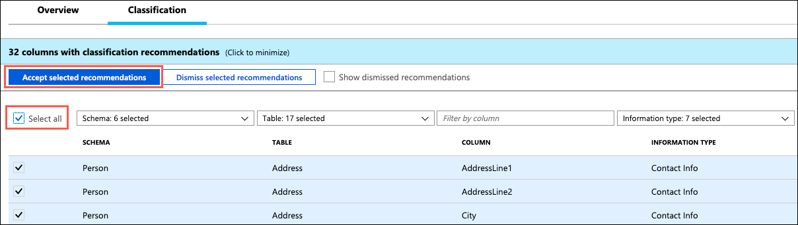

11. Select **Save** on the toolbar of the Data Classification window. It may take several minutes for the save to complete.

    

    >**Note**: This feature is still in preview.  If you receive an error when saving, try returning to the Advanced Data Security blade, and selecting the Data Discovery & Classification tile again to see the results.

12. When the save completes, select the **Overview** tab on the Data Discovery & Classification blade to view a report with a full summary of the database classification state.

    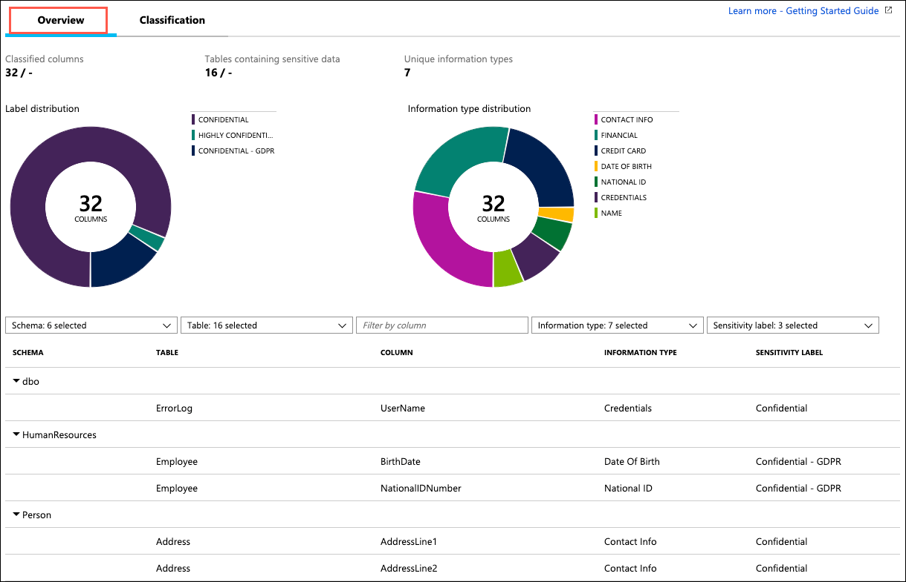

## Wrap-up

In this experience you unlocked new capabilities for a SQL Server 2008 R2 database by performing a friction-free migration to Azure SQL Database Managed Instance. You learned how Azure SQL Database Managed Instance enables you to migrate on-premises databases quickly and easily into a fully-managed PaaS database running in Azure, with no application code changes. SQL MI provides a migration path for databases using features, such as Service broker, which previously prevented them from running in Azure SQL Database.

After you migrated the database into SQL MI, you explored some of advanced SQL features available only in Azure, including Advanced Data Security Vulnerability Assessments and Data Classification and Discovery. In addition, you enabled Dynamic Data Masking and created a ColumnStore index on a table in the database, demonstrating how SQL MI allows you to utilize features unavailable in SQL Server 2008 R2. You also examined how to connect to an online secondary replica of your database, which provides a free read-only copy of your database. This feature takes advantage of one the high-availability features of the Azure SQL MI Business Critical service tier.

This experience was meant to provided a brief introduction to Azure SQL Database Managed Instance. There are many more features of SQL MI that you can now explore, including [Advanced Threat Detection](https://docs.microsoft.com/en-us/azure/sql-database/sql-database-threat-detection-overview) and [Transactional replication](https://docs.microsoft.com/azure/sql-database/replication-with-sql-database-managed-instance). Threat detection for Azure SQL Database Managed Instance detects anomalous activities indicating unusual and potentially harmful attempts to access or exploit databases. Transactional replication allows you to replicate data into an Azure SQL MI database from a remote SQL Server database or another instance database. You an also use it to push changes made in an instance database in SQL MI to a remote SQL Server database, to a single database in Azure SQL Database, or to a pooled database in an Azure SQL Database elastic pool.

## Additional resources and more information

Use the links below as a starting point to continue learning about the capabilities and features available with Azure SQL Database Managed Instance.

- [Azure SQL Database](https://azure.microsoft.com/services/sql-database/)
  - [Service tiers](https://docs.microsoft.com/azure/sql-database/sql-database-service-tiers-general-purpose-business-critical)
- [What is Azure SQL Database Managed Instance?](https://docs.microsoft.com/azure/sql-database/sql-database-managed-instance-index)
- [Database Migration Guide](https://datamigration.microsoft.com/)
  - [Database Migration Assistant](https://docs.microsoft.com/sql/dma/dma-overview?view=azuresqldb-mi-current)
  - [Azure Database Migration Service](https://docs.microsoft.com/azure/dms/dms-overview)
- [Migrate SQL Server to an Azure SQL Database Managed Instance](https://datamigration.microsoft.com/scenario/sql-to-azuresqldbmi)
- [SQL Database Platform as a Service](https://docs.microsoft.com/azure/sql-database/sql-database-paas)
  - [Business continuity](https://docs.microsoft.com/en-us/azure/sql-database/sql-database-business-continuity)
  - [High availability](https://docs.microsoft.com/en-us/azure/sql-database/sql-database-high-availability)
  - [Automated backups](https://docs.microsoft.com/en-us/azure/sql-database/sql-database-automated-backups)
  - [Long-term back retention](https://docs.microsoft.com/en-us/azure/sql-database/sql-database-long-term-retention)
  - [Geo-replication](https://docs.microsoft.com/en-us/azure/sql-database/sql-database-auto-failover-group)
  - [Scale resources](https://docs.microsoft.com/en-us/azure/sql-database/sql-database-scale-resources)
- [How to use Azure SQL Database](https://docs.microsoft.com/en-us/azure/sql-database/sql-database-howto)
- [Azure updates for Azure SQL Database](https://azure.microsoft.com/en-us/updates/?product=sql-database)
- [Azure SQL Database pricing](https://azure.microsoft.com/en-us/pricing/details/sql-database/managed/)
- [Overview of Azure SQL Database security capabilities](https://docs.microsoft.com/azure/sql-database/sql-database-security-overview)
  - [Advanced data security](https://docs.microsoft.com/azure/sql-database/sql-database-advanced-data-security)
  - [Data discovery and classification](https://docs.microsoft.com/azure/sql-database/sql-database-data-discovery-and-classification)
  - [SQL Vulnerability Assessment service](https://docs.microsoft.com/azure/sql-database/sql-vulnerability-assessment)
  - [Threat detection](https://docs.microsoft.com/en-us/azure/sql-database/sql-database-threat-detection-overview)
- [SQL Database Read Scale-Out](https://docs.microsoft.com/azure/sql-database/sql-database-read-scale-out)
- [Connect an application to Azure SQL Database Managed Instance](https://docs.microsoft.com/azure/sql-database/sql-database-managed-instance-connect-app)
