# Data & AI Tech Immersion Workshop – Product Review Guide and Lab Instructions

## Day 1, Experience 1 - Business Critical Performance and Security with SQL Server 2019

- [Data & AI Tech Immersion Workshop – Product Review Guide and Lab Instructions](#Data--AI-Tech-Immersion-Workshop-%E2%80%93-Product-Review-Guide-and-Lab-Instructions)
  - [Day 1, Experience 1 - Business Critical Performance and Security with SQL Server 2019](#Day-1-Experience-1---Business-Critical-Performance-and-Security-with-SQL-Server-2019)
  - [Technology overview](#Technology-overview)
  - [Scenario overview](#Scenario-overview)
  - [Experience requirements](#Experience-requirements)
  - [Task 1: Database migration](#Task-1-Database-migration)
    - [Perform assessment using Database Migration Assistant](#Perform-assessment-using-Database-Migration-Assistant)
    - [Test workloads on the target platform](#Test-workloads-on-the-target-platform)
      - [Capture](#Capture)
      - [Replay](#Replay)
      - [Analysis](#Analysis)
    - [Migrate the database](#Migrate-the-database)
  - [Task 2: Connect to SQL Server 2019 with SSMS](#Task-2-Connect-to-SQL-Server-2019-with-SSMS)
  - [Task 3: Query performance improvements with intelligent query processing](#Task-3-Query-performance-improvements-with-intelligent-query-processing)
  - [Task 2: Identify PII and GDPR-related compliance issues using Data Discovery & Classification in SSMS](#Task-2-Identify-PII-and-GDPR-related-compliance-issues-using-Data-Discovery--Classification-in-SSMS)
  - [Task 3: Fix compliance issues with dynamic data masking](#Task-3-Fix-compliance-issues-with-dynamic-data-masking)
  - [Task 4: Restrict data access with Row-level security](#Task-4-Restrict-data-access-with-Row-level-security)
  - [Task 5: Always Encrypted with secure enclaves](#Task-5-Always-Encrypted-with-secure-enclaves)
    - [Configure a secure enclave](#Configure-a-secure-enclave)
    - [Provision enclave-enabled keys](#Provision-enclave-enabled-keys)
    - [Encrypt customer email column](#Encrypt-customer-email-column)
    - [Run rich queries against an encrypted column](#Run-rich-queries-against-an-encrypted-column)
  - [Wrap-up](#Wrap-up)
  - [Additional resources and more information](#Additional-resources-and-more-information)

## Technology overview

SQL Server 2019 brings innovative security and compliance features, industry leading performance, mission-critical availability, and advanced analytics to all data workloads, now with support for big data built-in.

SQL Server 2019 is a hub for data integration. Data virtualization allows queries across relational and non-relational data without movement or replication. The enhanced PolyBase feature of SQL Server 2019 is able to connect to Hadoop clusters, Oracle, Teradata, MongoDB, and more.

Customers will be able to deliver transformational insights over structured and unstructured data with the power of SQL Server, Hadoop and Spark. SQL Server 2019 big data clusters offer scalable compute and storage composed of SQL Server, Spark and HDFS. Big data clusters will also cache data in scale-out data marts.

SQL Server 2019 is a complete AI platform to train and operationalize R and Python models in SQL Server Machine Learning Services or Spark ML using Azure Data Studio notebooks.

SQL Server 2019 will give customers and ISVs the choice of programming language and platform. They will be able to build modern applications with innovative features using .NET, PHP, Node.JS, Java, Python, Ruby, and more – and deploy the application on either Windows, Linux, or containers both on-premises and in the cloud. Application developers are now able to run Java code on SQL Server and store and analyze graph data.

SQL Server 2019 allows customers to run real-time analytics on operational data using HTAP (Hybrid Transactional and Analytical Processing), leverage the in-memory technologies for faster transactions and analytical queries, and get higher concurrency and scale through persistent memory.

Intelligent Query Processing features in SQL Server 2019 improve scaling of queries, and Automatic Plan Correction resolves performance problems.

SQL Server 2019 enables several layers of security including protection of computations in Always Encrypted secure enclaves. Customers can track compliance with sophisticated tools such as Data Discovery & Classification labeling for GDPR and Vulnerability Assessment tool.

For High Availability and Disaster Recovery, SQL Server 2019 now supports up to eight secondary replicas in an Always On Availability Group. Customers can also run Always On Availability Groups on containers using Kubernetes.

SQL Server 2019 also has powerful tools for Business Intelligence including Analysis Services and Power BI Report Server which provide visual data exploration and interactive analysis of business data.

## Scenario overview

Contoso Auto is currently running their `ContosoAutoDb` operations database on an on-premises SQL Server 2008 R2 server. This database is critical to their operations, and they are concerned about the approaching end-of-support for SQL Server 2008 R2. They are looking to understand what is involved in upgrading their database and migrating it to a VM running in Azure. They are also interested in learning more about SQL Server 2019 and the many performance and security improvements that it includes.

This experience will highlight the new features of SQL Server 2019 with a focus on performance and security. You will begin by performing an assessment of Contoso Auto's on-premises database to determine feasibility for migrating to SQL Server on a VM in Azure, and then complete the database migration. Next, you will gain hands-on experience by running queries using some of the new query performance enhancements and evaluating the results. You will evaluate the data security and compliance features provided by SQL Server 2019 by using the Data Discovery & Classification tool in SSMS to identify tables and columns with PII and GDPR-related compliance issues. You will then address some of the security issues by layering on dynamic data masking, row-level security, and Always Encrypted with secure enclaves.

## Experience requirements

Before you begin this lab, you need to find the following information on the Tech Immersion Mega Data & AI Workshop On Demand Lab environment details page, or the document provided to you for this experience:

- SQL Server 2019 VM IP address: `SQL_SERVER_2019_VM_IP`
- Sales database name (your unique copy): `SALES_DB`

## Task 1: Database migration

Contoso Auto would like a proof-of-concept (POC) to upgrade and migration their on-premises SQL Server 2008 R2 `ContosoAutoDb` database to SQL Server 2017 running on a VM in Azure. As part of the process, they would like to know about any incompatible features that might block their eventual production move. In this task, you will use the [Microsoft Database Migration Assistant](https://docs.microsoft.com/en-us/sql/dma/dma-overview?view=sql-server-2017) (DMA) to perform an assessment on their SQL Server 2008 R2 database, and then migrate the `sales` database from the "on-premises" SQL Server 2008 R2 instance to [SQL Server 2017 on an Azure VM](https://docs.microsoft.com/en-us/azure/virtual-machines/windows/sql/virtual-machines-windows-sql-server-iaas-overview).

Microsoft provides multiple tools for streamlining the process of migrating and upgrading databases. Contoso Auto is currently running their `ContosoAutoDb` database on an on-premises SQL Server 2008 R2 instance. They are aware that SQL Server 2008 R2 is approaching end-of-support, and they are interested in seeing a proof-of-concept for migrating this database to a newer version of SQL Server.   In this task, you will be using several migration tools to perform an assessment on the Contoso Auto sales database, and then migrate the database from SQL Server 2008 R2 to SQL Server 2017.

  > **NOTE**: SQL Server 2019 is currently in preview and most of the assessment and migration tools do not yet officially support it. However, the experience will be very similar to that of migrating the SQL Server 2017, so we will use that as a substitute for this workshop.

### Perform assessment using Database Migration Assistant

Prior to migrating their database to a newer version, Contoso Auto would like to know about any incompatible features that might block their eventual production move. In this task, you will use the Microsoft [Data Migration Assistant](https://docs.microsoft.com/sql/dma/dma-overview?view=azuresqldb-mi-current) (DMA) to perform assessments on the `ContosoAutoDb` database. This assessment will provide reports about any feature parity and compatibility issues between the on-premises database and SQL Server on an Azure VM.

> DMA helps you upgrade to a modern data platform by detecting compatibility issues that can impact database functionality in your new version of SQL Server or Azure SQL Database. DMA recommends performance and reliability improvements for your target environment and allows you to move your schema, data, and uncontained objects from your source server to your target server.

1. Launch the Microsoft Data Migration Assistant from the Windows Start menu within your lab environment.

   

2. In the Data Migration Assistant window, select the New **(+)** icon in the left-hand menu.

    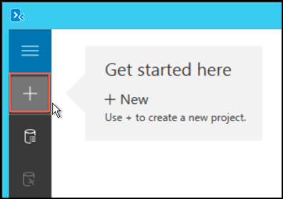

3. In the New project dialog, enter the following:

    - **Project type**: Select Assessment.
    - **Project name**: Enter Assessment.
    - **Source server type**: SQL Server
    - **Target server type**: SQL Server on Azure Virtual Machines

    

4. Select **Create**.

5. On the **Options** tab, select a target version of **SQL Server 2017 on Windows** and ensure the **Check database compatibility** and **Check feature parity** report types are checked, and select **Next**.

    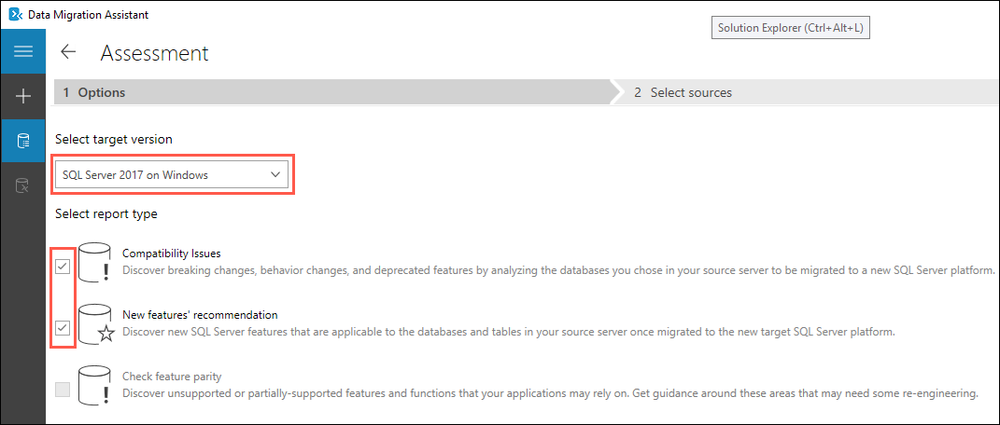

6. In the **Connect to a server** dialog on the **Select sources** tab, enter the following:

   - **Server name**: Enter the DNS name of the shared sqlServer2008R2 VM, **`sqlserver2008r2.westus.cloudapp.azure.com`**.
   - **Authentication type**: Select **SQL Server Authentication**.
   - **Username**: Enter **WorkshopUser**
   - **Password**: Enter **Password.1!!**
   - **Encrypt connection**: Check this box.
   - **Trust server certificate**: Check this box.

   

7. Select **Connect**.

8. On the **Add sources** dialog that appears next, check the box for **ContosoAutoDb** and select **Add**.

   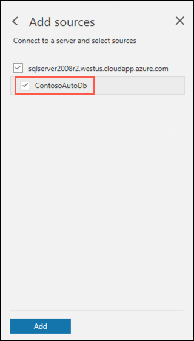

9. Select **Start Assessment**.

   

10. Review the assessment of ability to migrate to SQL Server 2017 on an Azure VM by starting with any reported compatibility issues. You can review compatibility issues by analyzing the affected object, its details, and potentially a fix for every issue identified under Breaking changes, Behavior changes, and Deprecated features.

    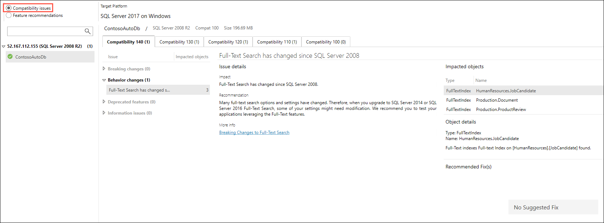

    > The DMA assessment for a migrating the `ContosoAutoDb` database to a target platform of SQL Server 2017 on a Windows VM running in Azure shows a compatibility issue associated with a change to Full-Text Search. This is a non-breaking change, and will not impact their ability to migrate the database.

11. Next, select **Feature recommendations** in the DMA report, and select the **Security** tab.

    

    > DMA has made several security recommendations for improving the security posture of the `ContosoAutoDb` database. The details of the each recommendation are listed, as well as the recommended steps to apply the recommendation.

### Test workloads on the target platform

Next, let's take a look at the Microsoft [Database Experimentation Assistant](https://docs.microsoft.com/en-us/sql/dea/database-experimentation-assistant-overview?view=sql-server-ver15) (DEA), and how it can help in choosing the right target platform for a SQL database upgrade and migration. DEA is an experimentation solution for SQL Server upgrades. DEA can help you evaluate a targeted version of SQL Server for a specific workload. Customers who are upgrading from earlier SQL Server versions (starting with 2005) to a more recent version of SQL Server can use the analysis metrics that the tool provides.

> **NOTE**: Running DEA traces and replays takes a minimum of 10 minutes, which is more time than is alloted for this workshop experience, so we will just discuss the steps and benefits of using the tool in this task.

DEA analysis metrics include:

- Queries that have compatibility errors
- Degraded queries and query plans
- Other workload comparison data

Comparison data can lead to higher confidence and a successful upgrade experience.

DEA guides you through running an A/B test by completing three steps:

- Capture
- Replay
- Analysis

#### Capture

The first step of SQL Server A/B testing is to capture a trace on your source server. The source server usually is the production server. Trace files capture the entire query workload on that server, including timestamps. Later, this trace is replayed on your target servers for analysis. The analysis report provides insights on the difference in performance of the workload between your two target servers. Traces can be run from 5 - 180 minutes.

#### Replay

The second step of SQL Server A/B testing is to replay the trace file that was captured to your target servers. Then, collect extensive traces from the replays for analysis.

You replay the trace file on two target servers: one that mimics your source server (Target 1) and one that mimics your proposed change (Target 2). The hardware configurations of Target 1 and Target 2 should be as similar as possible so SQL Server can accurately analyze the performance effect of your proposed changes.

#### Analysis

The final step is to generate an analysis report by using the replay traces. The analysis report can help you gain insight about the performance implications of the proposed change.

### Migrate the database

Let's now look at how you can use the Database Migration Assistant to perform the migration from SQL Server 2008 R2 to SQL Server 2017.

1. Return to the Microsoft Data Migration Assistant application, or launch it from the Windows Start menu within your lab environment if you closed it.

   

2. In the Data Migration Assistant window, select the New **(+)** icon in the left-hand menu.

    

3. In the New project dialog, enter the following:

    - **Project type**: Select Migration.
    - **Project name**: Enter Migration.
    - **Source server type**: SQL Server
    - **Target server type**: SQL Server on Azure Virtual Machines

    

4. Select **Create**.

5. On the **Specify source & target** dialog that appears next, enter the following:

   - Source server details:

     - **Server name**: Enter the DNS name of the shared sqlServer2008R2 VM, **`sqlserver2008r2.westus.cloudapp.azure.com`**.
     - **Authentication type**: Select **SQL Server Authentication**.
     - **Username**: Enter **WorkshopUser**
     - **Password**: Enter **Password.1!!**
     - **Encrypt connection**: Check this box.
     - **Trust server certificate**: Check this box.

   - Target server details:

     - **Server name**: Enter the IP address of your sql-2017 VM, e.g, 52.229.17.189.
     - **Authentication type**: Select **SQL Server Authentication**.
     - **Username**: Enter **demouser**
     - **Password**: Enter **Password.1!!**
     - **Encrypt connection**: Check this box.
     - **Trust server certificate**: Check this box.

   

6. Select **Next**.

7. On the Add databases screen, set the following configuration:

   - Check the **ContosoAutoDb** database on the left, under the source database server.
   - **Shared backup location**: Enter **`\\sqlserver2008r2\db-backups`**.
   - **Location to restore data files**: Enter **`C:\Contoso\`.
   - **Location to restore log files**: Enter **`C:\Contoso\`.

   

8. Select **Next**.

9. Check the WorkshopUser and demouser logins.

   

10. Select **Start Migration**.

11. When the migration completes, you will see success messages for the `ContosoAutoDb` database and the two logins.

    

12. To verify the migration, you will connect to the new database running on your sql-2017 VM using SQL Server Management Studio (SSMS). On the bottom-left corner of your Windows desktop, locate the search box next to the Start Menu. Type **SQL Server Management** into the search box, then select the SQL Server Management Studio 18 desktop app in the search results.

    

13. Within the Connection dialog that appears, configure the following:

    - **Server name:** Enter the IP address of your sql-2017 VM. Use the value from the `SQL_SERVER_2017_VM_IP` for this from the environment documentation.
    - **Authentication:** Select SQL Server Authentication.
    - **Login:** Enter `demouser`
    - **Password:** Enter `Password.1!!`
    - **Remember password:** Check this box.

    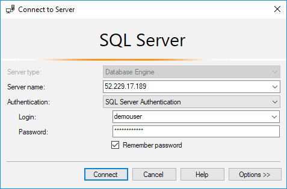

14. Select **Connect**.

15. In the SSMS Object Explorer, expand Databases and confirm you see the `ContosoAutoDb` database listed.

    

16. You have successfully migrated the `ContosoAutoDb` database from SQL Server 2008 R2 to SQL Server 2017 running on a VM in Azure in just a few simple steps using the Database Migration Assistant.

## Task 2: Connect to SQL Server 2019 with SSMS

You will be accessing a shared SQL Server 2019 server for this experience. Please follow the steps below to connect to the SQL Server 2019 VM with SQL Server Management Studio (SSMS).

1. On the bottom-left corner of your Windows desktop, locate the search box next to the Start Menu. Type **SQL Server Management** into the search box, then select the SQL Server Management Studio 18 desktop app in the search results.

    

2. Within the Connection dialog that appears, configure the following:

    - **Server name:** Enter the SQL Server 2019 VM IP address. Use the value from the `SQL_SERVER_2019_VM_IP` for this from the environment documentation.
    - **Authentication:** Select SQL Server Authentication.
    - **Login:** Enter `demouser`
    - **Password:** Enter `Password.1!!`
    - **Remember password:** Check this box.

    

3. Select **Connect**.

## Task 3: Query performance improvements with intelligent query processing

In this task, you will execute a series of SQL scripts in SQL Server Management Studio (SSMS) to explore the improvements to the family of intelligent query processing (QP) features in SQL Server 2019. These features improve the performance of existing workloads with minimal work on your part to implement. The key to enabling these features in SQL Server 2019 is to set the [database compatibility level](https://docs.microsoft.com/en-us/sql/t-sql/statements/alter-database-transact-sql-compatibility-level?view=sql-server-ver15) to `150`. You will be executing these queries against the `sales_XXXXX` database (where XXXXX is the unique identifier assigned to you for this workshop).

To learn more, read [intelligent query processing](https://docs.microsoft.com/sql/relational-databases/performance/intelligent-query-processing?view=sql-server-ver15) in SQL databases.

1. To get started, expand databases in the SQL Server Management Studio (SSMS) Object Explorer, right-click the `sales_XXXXX` database (where XXXXX is the unique identifier assigned to you for this workshop), and then select **New Query**.

   

2. The first query you will run is to set the database compatibility level to `150`, which is the new compatibility level for SQL Server 2019, enabling the most recent intelligent QP features. Copy the SQL script below and paste it into the new query window. Replace `XXXXX` with the unique identifier you have been given for this workshop in both the `USE` and `ALTER DATABASE` statements.

   ```sql
   USE sales_XXXXX;
   GO

   ALTER DATABASE sales_XXXXX
   SET COMPATIBILITY_LEVEL = 150;
   GO
   ```

3. To run the query, select **Execute** in the SSMS toolbar.

   

4. Next, you will run a query to create a user-defined function (UDF) named `customer_category`. This UDF contains several steps to identify the discount price category for each customer. Notice that at the top of the query we run to create this UDF sets the database compatibility level to `150`, which is the new compatibility level for SQL Server 2019, enabling the most recent intelligent QP features. This UDF will be called inline from the two queries that follow in order to show QP improvements on scalar UDF inlining. Paste the following SQL code into your query window, overwriting the current content, replace `XXXXX` in the `USE` statement with the unique identifier assigned to you for this workshop, and then select **Execute** on the SSMS toolbar.

   ```sql
   USE sales_XXXXX;
   GO

   ALTER DATABASE SCOPED CONFIGURATION
   CLEAR PROCEDURE_CACHE;
   GO

   CREATE OR ALTER FUNCTION
     dbo.customer_category(@CustomerKey INT)
   RETURNS CHAR(10) AS
   BEGIN
     DECLARE @total_amount DECIMAL(18,2);
     DECLARE @category CHAR(10);

     SELECT @total_amount =
     SUM([ws_net_paid_inc_ship])
     FROM [dbo].[web_sales]
     WHERE [ws_bill_customer_sk] = @CustomerKey;

     IF @total_amount < 50000
       SET @category = 'REGULAR';
     ELSE IF @total_amount < 100000
       SET @category = 'GOLD';
     ELSE
       SET @category = 'PLATINUM';

     RETURN @category;
   END
   GO
   ```

   > Scalar UDF inlining automatically transforms [scalar UDFs](https://docs.microsoft.com/sql/relational-databases/user-defined-functions/create-user-defined-functions-database-engine?view=sql-server-2017#Scalar) into relational expressions. It embeds them in the calling SQL query. This transformation improves the performance of workloads that take advantage of scalar UDFs. Scalar UDF inlining facilitates cost-based optimization of operations inside UDFs. The results are efficient, set-oriented, and parallel instead of inefficient, iterative, serial execution plans. This feature is enabled by default under database compatibility level 150. _For more information, see [Scalar UDF inlining](https://docs.microsoft.com/sql/relational-databases/user-defined-functions/scalar-udf-inlining?view=sql-server-2017)_.

5. Right-click on the `sales_XXXXX` database (where XXXXX is the unique identifier assigned to you for this workshop), then select **New Query**. This will open a new query window into which you can paste the following queries. You may wish to reuse the same query window, replacing its contents with each SQL statement blocks below, or follow these same steps to create new query windows for each.

   

6. The query below selects the top 100 rows from the `customer` table, calling the `customer_category` user-defined function (UDF) inline for each row. It uses the `DISABLE_TSQL_SCALAR_UDF_INLINING` hint to disable the new scalar UDF inlining QP feature. Paste the following query into the the empty query window. Replace `XXXXX` in the `USE` statement with the unique identifier assigned to you for this workshop. **Do not execute yet**.

    ```sql
    USE sales_XXXXX;
    GO

    -- Before (show actual query execution plan for legacy behavior)
    SELECT TOP 100
        [c_customer_sk], [c_first_name], [c_last_name],
          dbo.customer_category([c_customer_sk]) AS [Discount Category]
    FROM [dbo].[customer]
    ORDER BY [c_customer_sk]
    OPTION (RECOMPILE, USE HINT('DISABLE_TSQL_SCALAR_UDF_INLINING'));
    ```

7. Select the **Include Actual Execution Plan** (Ctrl+M) button in the toolbar above the query window. This will allow us to view the actual (not estimated) query plan after executing the query.

   

8. Execute the query by selecting **Execute** from the SSMS toolbar.

9. After the query executes, select the **Execution plan** tab. As the plan shows, SQL Server adopts a simple strategy here: for every tuple in the `customer` table, invoke the UDF and output the results (single line from the clustered index scan to compute scalar). This strategy is naïve and inefficient, especially with more complex queries.

   

10. Clear the query window, or open a new one, then paste the following query that makes use of the scalar UDF inlining QP feature. Replace `XXXXX` in the `USE` statement with the unique identifier assigned to you for this workshop. If you opened a new query window instead of reusing this one, make sure to select the **Include Actual Execution Plan** button to enable it. **Execute** the query.

    ```sql
    USE sales_XXXXX;
    GO

    -- After (show actual query execution plan for legacy behavior)
    SELECT TOP 100
        [c_customer_sk], [c_first_name], [c_last_name],
          dbo.customer_category([c_customer_sk]) AS [Discount Category]
    FROM [dbo].[customer]
    ORDER BY [c_customer_sk]
    OPTION (RECOMPILE);
    ```

11. After the query executes, select the **Execution plan** tab once again. With scalar UDF inlining, this UDF is transformed into equivalent scalar subqueries, which are substituted in the calling query in place of the UDF.

    

    > As you can see, the query plan no longer has a user-defined function operator, but its effects are now observable in the plan, like views or inline TVFs. Here are some key observations from the above plan:

    A. SQL Server has inferred the implicit join between `dbo.customer` and `dbo.web_sales` and made that explicit via a join operator.

    B. SQL Server has also inferred the implicit `GROUP BY [Customer Key] on dbo.web_sales` and has used the IndexSpool + StreamAggregate to implement it.

    > Depending upon the complexity of the logic in the UDF, the resulting query plan might also get bigger and more complex. As we can see, the operations inside the UDF are now no longer a black box, and hence the query optimizer is able to cost and optimize those operations. Also, since the UDF is no longer in the plan, iterative UDF invocation is replaced by a plan that completely avoids function call overhead.

12. Either highlight and delete everything in the query window, or open a new query window. Paste the following query into the query window, replacing `XXXXX` in the `USE` statement with the unique identifier assigned to you for this workshop. This query makes use of the table variable deferred compilation feature, since the database compatibility level is set to `150`. If you opened a new query window instead of reusing this one, make sure to click the **Include Actual Execution Plan** button to enable it. **Execute** the query.

    ```sql
    USE sales_XXXXX
    GO

    DECLARE @ItemClick TABLE (
      [itemKey] BIGINT NOT NULL,
      [clickDate] BIGINT NOT NULL
    );

    INSERT @ItemClick
    SELECT [wcs_item_sk], [wcs_click_date_sk]
    FROM [dbo].[web_clickstreams]

    -- Look at estimated rows, speed, join algorithm
    SELECT i.[i_item_sk], i.[i_current_price], c.[clickDate]
    FROM dbo.item AS i
    INNER JOIN @ItemClick AS c
      ON i.[i_item_sk] = c.[itemKey]
    WHERE i.[i_current_price] > 90
    ORDER BY i.[i_current_price] DESC;
    GO
    ```

    > The script above assigns a table variable, `@ItemClick`, storing the `itemKey` and `clickDate` fields from the `web_clickstreams` table to be used in an INNER JOIN below.

    **Old method**

    In prior versions of SQL Server (compatibility level of 140 or lower), the table variable deferred compilation QP feature is not used (more on this below).

    There are two plans. The one you want to observe is the second query plan. When we mouse over the INNER JOIN to view the estimated number of rows and the output list, which shows the join algorithm. The estimated number of rows is 1. Also, observe the execution time. In our case, it took 10 seconds to complete.

    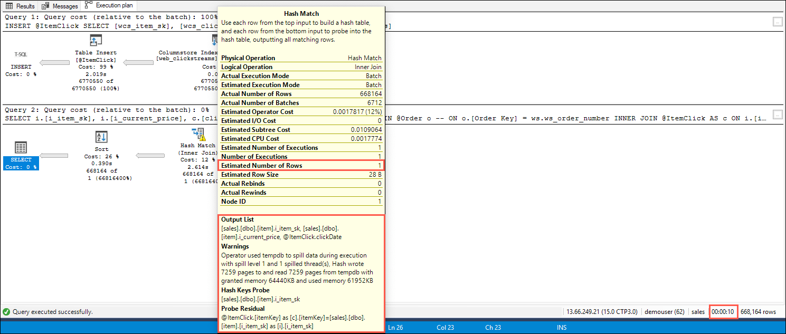

    **New method**

    After the query above executes, select the **Execution plan** tab once again. Since our database compatibility level is set to 150, notice that the join algorithm is a hash match, and that the overall query execution plan looks different. When you hover over the INNER JOIN, notice that there is a high value for estimated number of rows and that the output list shows the use of hash keys and an optimized join algorithm. Once again, observe the execution time. In our case, it took 6 seconds to complete, which is approximately half the time it took to execute without the table variable deferred compilation feature.

    

    > Table variable deferred compilation improves plan quality and overall performance for queries that reference table variables. During optimization and initial compilation, this feature propagates cardinality estimates that are based on actual table variable row counts. This accurate row count information optimizes downstream plan operations. Table variable deferred compilation defers compilation of a statement that references a table variable until the first actual run of the statement. This deferred compilation behavior is the same as that of temporary tables. This change results in the use of actual cardinality instead of the original one-row guess. _For more information, see [Table variable deferred compilation](https://docs.microsoft.com/sql/t-sql/data-types/table-transact-sql?view=sql-server-2017#table-variable-deferred-compilation)._

13. Either highlight and delete everything in the query window, or open a new query window. Paste the following query to simulate out-of-date statistics on the `web_sales` table, followed by a query that executes a hash match, replacing `XXXXX` in the `USE` statement with the unique identifier assigned to you for this workshop. If you opened a new query window instead of reusing this one, make sure to click the **Include Actual Execution Plan** button to enable it. **Execute** the query.

    ```sql
    USE sales_XXXXX;
    GO

    -- Simulate out-of-date stats
    UPDATE STATISTICS dbo.web_sales
    WITH ROWCOUNT = 1;
    GO

    SELECT
      ws.[ws_order_number], ws.ws_quantity,
      i.[i_current_price], i.[i_item_desc]
    FROM    dbo.web_sales AS ws
    INNER HASH JOIN dbo.[item] AS i
      ON ws.[ws_item_sk] = i.[i_item_sk]
    WHERE   i.[i_current_price] > 10
      AND ws.[ws_quantity] > 40;
    ```

14. After the query executes, select the **Execution plan** tab. Hover over the Hash Match step of the execution plan. You should see a warning toward the bottom of the Hash Match dialog showing spilled data. Also observe the execution time. In our case, this query took 16 seconds to execute.

    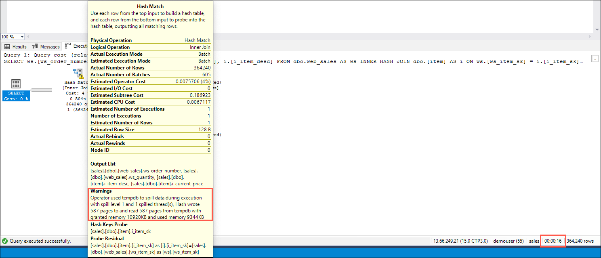

15. Either highlight and delete everything in the query window, or open a new query window. Paste the following query to execute the select query that contains the hash match once more, replacing `XXXXX` in the `USE` statement with the unique identifier assigned to you for this workshop. If you opened a new query window instead of reusing this one, make sure to click the **Include Actual Execution Plan** button to enable it. **Execute** the query.

    ```sql
    USE sales_XXXXX;
    GO

    SELECT
      ws.[ws_order_number], ws.ws_quantity,
      i.[i_current_price], i.[i_item_desc]
    FROM    dbo.web_sales AS ws
    INNER HASH JOIN dbo.[item] AS i
      ON ws.[ws_item_sk] = i.[i_item_sk]
    WHERE   i.[i_current_price] > 10
      AND ws.[ws_quantity] > 40;
    ```

16. After the query executes, select the **Execution plan** tab. Hover over the Hash Match step of the execution plan. You should **no longer** see a warning about spilled data. Also observe the execution time. In our case, this query took 11 seconds to execute.

    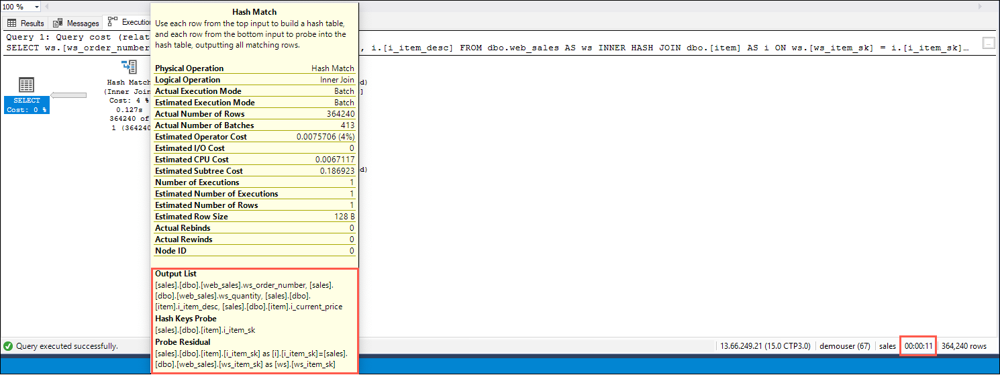

    > So what happened? A query's post-execution plan in SQL Server includes the minimum required memory needed for execution and the ideal memory grant size to have all rows fit in memory. Performance suffers when memory grant sizes are incorrectly sized. Excessive grants result in wasted memory and reduced concurrency. Insufficient memory grants cause expensive spills to disk. By addressing repeating workloads, batch mode memory grant feedback recalculates the actual memory required for a query and then updates the grant value for the cached plan. **When an identical query statement is executed**, the query uses the revised memory grant size, reducing excessive memory grants that impact concurrency and fixing underestimated memory grants that cause expensive spills to disk. Row mode memory grant feedback expands on the batch mode memory grant feedback feature by adjusting memory grant sizes for both batch and row mode operators. _For more information, see [Row mode memory grant feedback](https://docs.microsoft.com/sql/relational-databases/performance/adaptive-query-processing?view=sql-server-2017#row-mode-memory-grant-feedback)._

## Task 2: Identify PII and GDPR-related compliance issues using Data Discovery & Classification in SSMS

Contoso Auto has several databases that include tables containing sensitive data, such as personally identifiable information (PII) like phone numbers, social security numbers, financial data, etc. Since some of their personnel and customer data include individuals who reside within the European Union (EU), they need to adhere to the General Data Protection Regulation ([GDPR](https://en.wikipedia.org/wiki/General_Data_Protection_Regulation)) as well. Because of this, Contoso Auto is required to provide periodic data auditing reports to identify sensitive and GDPR-related data that reside within their various databases.

With SQL Server Management Studio, they are able to identify, classify, and generate reports on sensitive and GDPR-related data by using the [SQL Data Discovery & Classification](https://docs.microsoft.com/sql/relational-databases/security/sql-data-discovery-and-classification?view=sql-server-ver15) tool. This tool introduces a set of advanced services, forming a new SQL Information Protection paradigm aimed at protecting the data, not just the database:

- **Discovery & recommendations** - The classification engine scans your database and identifies columns containing potentially sensitive data. It then provides you an easy way to review and apply the appropriate classification recommendations, as well as to manually classify columns.
- **Labeling** - Sensitivity classification labels can be persistently tagged on columns.
- **Visibility** - The database classification state can be viewed in a detailed report that can be printed/exported to be used for compliance & auditing purposes, as well as other needs.

In this exercise, you will run the SQL Data Discovery & Classification tool against their customer database, which includes personal, demographic, and sales data.

1. To get started, expand databases in the SQL Server Management Studio (SSMS) Object Explorer, right-click the `sales_XXXXX` database (where XXXXX is the unique identifier assigned to you for this workshop), and then choose **Tasks > Classify Data...**.

    

2. When the tool runs, it will analyze all of the columns within all of the tables and recommend appropriate data classifications for each. What you should see is the Data Classification dashboard showing no currently classified columns, and a classification recommendations box at the top showing that there are 45 columns that the tool identified as containing sensitive (PII) or GDPR-related data. **Click** on this classification recommendations box.

    

3. The list of recommendations displays the schema, table, column, type of information, and recommended sensitivity label for each identified column. You can change the information type and sensitivity labels for each if desired. In this case, accept all recommendations by **checking the checkbox** in the recommendations table header.

    

4. Click **Accept selected recommendations**.

    

5. Click **Save** in the toolbar above to apply your changes.

    

6. After the changes are saved, click **View Report**.

    

7. What you should see is a report with a full summary of the database classification state. When you right-click on the report, you can see options to print or export the report in different formats.

    

## Task 3: Fix compliance issues with dynamic data masking

Some of the columns identified by the Data Discovery & Classification tool as containing sensitive (PII/GDPR) information include phone numbers, email addresses, billing addresses, and credit card numbers. One way to ensure compliance with various rules and regulations that enforce policies to protect such sensitive data is to prevent those who are not authorized from seeing it. An example would be displaying `XXX-XXX-XX95` instead of `123-555-2695` when outputting a phone number within a SQL query result, report, web page, etc. This is commonly called data masking. Traditionally, modifying systems and applications to implement data masking can be challenging. This is especially true when the masking has to apply all the way down to the data source level. Fortunately, SQL Server and its cloud-related product, Azure SQL Database, provides a feature named [Dynamic Data Masking](https://docs.microsoft.com/sql/relational-databases/security/dynamic-data-masking?view=sql-server-ver15) (DDM) to automatically protect this sensitive data from non-privileged users.


DDM helps prevent unauthorized access to sensitive data by enabling customers to designate how much of the sensitive data to reveal with minimal impact on the application layer. DDM can be configured on the database to hide sensitive data in the result sets of queries over designated database fields, while the data in the database is not changed. Dynamic Data Masking is easy to use with existing applications, since masking rules are applied in the query results. Many applications can mask sensitive data without modifying existing queries.

In this task, you will apply DDM to one of the database fields so you can see how to address the reported compliance issues. To test the data mask, you will create a test user and query the field as that user.

1. To get started, expand databases in the SQL Server Management Studio (SSMS) Object Explorer, right-click the `sales_XXXXX` database (where XXXXX is the unique identifier assigned to you for this workshop), and then select **New Query**.

   

2. Add a dynamic data mask to the existing `dbo.customer.c_last_name` field by pasting the below query into the new query window:

   ```sql
   ALTER TABLE dbo.customer
   ALTER COLUMN c_last_name ADD MASKED WITH (FUNCTION = 'partial(2,"XXX",0)');
   ```

   > The `partial` custom string masking method above exposes the first two characters and adds a custom padding string after for the remaining characters. The parameters are: `prefix,[padding],suffix`

3. Execute the query by selecting the **Execute** button in the SSMS toolbar, or pressing the _F5_ key on your keyboard.

   

4. Clear the query window and replace the previous query with the following to add a dynamic data mask to the `dbo.customer.c_email_address` field:

   ```sql
   ALTER TABLE dbo.customer
   ALTER COLUMN c_email_address ADD MASKED WITH (FUNCTION = 'email()');
   ```

   > The `email` masking method exposes the first letter of an email address and the constant suffix ".com", in the form of an email address: `aXXX@XXXX.com`.

5. Clear the query window and replace the previous query with the following, selecting all rows from the customer table:

   ```sql
   SELECT * FROM dbo.customer
   ```

   

6. Notice that the full last name and email address values are visible. That is because the user you are logged in as is a privileged user. Let's create a new user and execute the query again:

   ```sql
   CREATE USER TestUser WITHOUT LOGIN;
   GRANT SELECT ON dbo.customer TO TestUser;

   EXECUTE AS USER = 'TestUser';
   SELECT * FROM dbo.customer;
   REVERT;
   ```

7. Run the query by selecting the **Execute** button. Observe that with the the `c_last_name` and `c_email_address` filed values are now masked, hiding the full value contained within the field and preventing expose of sensitive information.

   

## Task 4: Restrict data access with Row-level security

[Row-Level Security](https://docs.microsoft.com/en-us/sql/relational-databases/security/row-level-security?view=sql-server-ver15) (RLS) enables you to use group membership or execution context to control access to rows in a database table. RLS simplifies the design and coding of security in your application by helping you implement restrictions on data row access. For example, a hospital can create a security policy that allows doctors to view data rows for their patients only. Another example is a multi-tenant application can create a policy to enforce a logical separation of each tenant's data rows from every other tenant's rows. Efficiencies are achieved by the storage of data for many tenants in a single table. Each tenant can see only its data rows.


The access restriction logic is located in the database tier rather than away from the data in another application tier. The database system applies the access restrictions every time that data access is attempted from any tier. This makes your security system more reliable and robust by reducing the surface area of your security system.

In this task, you will apply row-level security to one of the database tables and run some queries using multiple user contexts to see how data access is restricted.

1. To get started, expand databases in the SQL Server Management Studio (SSMS) Object Explorer, right-click the `sales_XXXXX` database (where XXXXX is the unique identifier assigned to you for this workshop), and then select **New Query**.

   

2. Within the `store` table, there are three stores located in Kentucky. Using RLS, we will restrict access to sales records so that user can only see sales from their own store, while the regional manager for Kentucky will be able to see all sales data for the state. In the new query window, enter the following SQL commands to create users that will be used for querying data secured by RLS with different contexts, and then grant them `SELECT` permissions on the `dbo.store_sales` table. Run the query by selecting **Execute** on the SSMS toolbar.

   ```sql
   CREATE USER ManagerKY WITHOUT LOGIN;  
   CREATE USER Elmwood WITHOUT LOGIN;  
   CREATE USER Egypt WITHOUT LOGIN;
   CREATE USER Bedford WITHOUT LOGIN;
   GO

   GRANT SELECT ON dbo.store_sales TO ManagerKY;  
   GRANT SELECT ON dbo.store_sales TO Elmwood;  
   GRANT SELECT ON dbo.store_sales TO Egypt;
   GRANT SELECT ON dbo.store_sales TO Bedford;
   GO
   ```

   > Row-level security will be applied to the `dbo.store_sales` table, and you will run queries against that to observe how RLS affects the results displayed for users with different contexts.

3. Next, you will create a new schema, and an inline table-valued function that will be used to apply the RLS policy. The function returns 1 when a row in the `ss_store_sk` column is the same as the store for the user executing the query (`s.s_store_sk = @StoreId`) and the store name is the same of the user's store (`s.s_store_name = USER_NAME()`), or if the user executing the query is the Manager user (`USER_NAME() = 'ManagerKY'`). Create a new query window and paste the following SQL script into the window, and then select **Execute**.

   ```sql
   CREATE SCHEMA Security;  
   GO  

   CREATE FUNCTION Security.fn_securitypredicate(@StoreId AS INT)
     RETURNS TABLE
   WITH SCHEMABINDING
   AS
   RETURN (SELECT 1 AS fn_securitypredicate_result
      FROM dbo.store_sales ss
         INNER JOIN dbo.store s ON ss.ss_store_sk = s.s_store_sk
      WHERE s.s_state = 'KY'
      AND s.s_store_sk = @StoreId
      AND (s.s_store_name = USER_NAME() OR USER_NAME() = 'ManagerKY'));
   GO
   ```

   > RLS is implement by using the [`CREATE SECURITY POLICY`](https://docs.microsoft.com/en-us/sql/t-sql/statements/create-security-policy-transact-sql?view=sql-server-2017) Transact-SQL statement, and predicates created as [inline table-valued functions](https://docs.microsoft.com/en-us/sql/relational-databases/user-defined-functions/create-user-defined-functions-database-engine?view=sql-server-2017).

4. The next step is to create a security policy by adding the function as a filter predicate. The state must be set to ON to enable the policy. Create a new query window and paste the following SQL script into the window, and then select **Execute**.

   ```sql
   CREATE SECURITY POLICY SalesFilter
   ADD FILTER PREDICATE Security.fn_securitypredicate(ss_store_sk)
   ON dbo.store_sales
   WITH (STATE = ON);
   GO
   ```

   > RLS filter predicates are functionally equivalent to appending a `WHERE` clause to a query against the target table. The predicate can be as sophisticated as business practices dictate, or the clause can be as simple as `WHERE TenantId = 42`.

5. Allow `SELECT` permissions to the `fn_securitypredicate` function by executing the following query in a new query window.

   ```sql
   GRANT SELECT ON security.fn_securitypredicate TO ManagerKY;  
   GRANT SELECT ON security.fn_securitypredicate TO Elmwood;  
   GRANT SELECT ON security.fn_securitypredicate TO Egypt;
   GRANT SELECT ON security.fn_securitypredicate TO Bedford;
   GO
   ```

6. Now test the filtering predicate, by selecting from the `store_sales` table as each user. Paste each of the queries below into a new query window and run each the commands. Observe the count of records returned, as well as the data in the `ss_store_sk` column.

   ```sql
   EXECUTE AS USER = 'Elmwood';  
   SELECT * FROM dbo.store_sales;
   REVERT;
   ```

   

   ```sql
   EXECUTE AS USER = 'Egypt';  
   SELECT * FROM dbo.store_sales;
   REVERT;
   ```

   

   ```sql
   EXECUTE AS USER = 'Bedford';  
   SELECT * FROM dbo.store_sales;
   REVERT;
   ```

   

   ```sql
   EXECUTE AS USER = 'ManagerKY';  
   SELECT * FROM dbo.store_sales;
   REVERT;
   ```

   

> As you can see within each set of results, users in a Store context see only the data for their store, while queries run within the Manager context see data for all three stores. Row-Level Security makes it easy to implement filtering to restrict access to data within SQL Server tables.

## Task 5: Always Encrypted with secure enclaves

[Always Encrypted](https://docs.microsoft.com/en-us/sql/relational-databases/security/encryption/always-encrypted-database-engine?view=sql-server-ver15) is a feature designed to protect sensitive data, such as credit card numbers or national identification numbers (for example, U.S. social security numbers), stored in SQL Server databases. It allows clients to encrypt sensitive data inside client applications and never reveal the encryption keys to the Database Engine. As a result, Always Encrypted provides a separation between those who own the data (and can view it) and those who manage the data (but should have no access). By ensuring on-premises database administrators, cloud database operators, or other high-privileged, but unauthorized users, cannot access the encrypted data, Always Encrypted enables customers to confidently store sensitive data outside of their direct control.

Always Encrypted protects data by encrypting it on the client side and never allowing the data or the corresponding cryptographic keys to appear in plaintext inside the SQL Server Engine. As a result, the functionality on encrypted columns inside the database is severely restricted. The only operations SQL Server could perform on encrypted data were equality comparisons (and equality comparisons were only available with deterministic encryption). All other operations, including cryptographic operations (initial data encryption or key rotation), or rich computations (for example, pattern matching) were not supported inside the database. Users needed to move the data outside of the database to perform these operations on the client-side.

[Always Encrypted with secure enclaves](https://docs.microsoft.com/en-us/sql/relational-databases/security/encryption/always-encrypted-enclaves?view=sql-server-ver15) addresses these limitations by allowing computations on plaintext data inside a secure enclave on the server side. A secure enclave is a protected region of memory within the SQL Server process, and acts as a trusted execution environment for processing sensitive data inside the SQL Server engine. A secure enclave appears as a black box to the rest of the SQL Server and other processes on the hosting machine. There is no way to view any data or code inside the enclave from the outside, even with a debugger.


When parsing an application's query, the SQL Server Engine determines if the query contains any operations on encrypted data that require the use of the secure enclave. For queries where the secure enclave needs to be accessed:

- The client driver sends the column encryption keys required for the operations to the secure enclave (over a secure channel).
- Then, the client driver submits the query for execution along with the encrypted query parameters.

During query processing, the data or the column encryption keys are not exposed in plaintext in the SQL Server Engine outside of the secure enclave. The SQL Server engine delegates cryptographic operations and computations on encrypted columns to the secure enclave. If needed, the secure enclave decrypts the query parameters and/or the data stored in encrypted columns and performs the requested operations.

### Configure a secure enclave

In this task, you will use SSMS to verify that Always Encrypted with secure enclaves is loaded on the SQL Server instance.

> **NOTE**: When you use SSMS to configure Always Encrypted, SSMS handles both Always Encrypted keys and sensitive data, so both the keys and the data appear in plaintext inside the SSMS process. As the primary goal of Always Encrypted is to ensure encrypted sensitive data is safe even if the database system gets compromised, this approach is recommended only for development and non-production environments.

1. Return to SSMS, open a new query window, and verify Always Encrypted with secure enclaves is loaded by running the following query:

   ```sql
   SELECT [name], [value], [value_in_use] FROM sys.configurations
   WHERE [name] = 'column encryption enclave type';
   ```

2. The query should return the following result:

   |name|value|value_in_use|
   |----|-----|------------|
   |column encryption enclave type|1|1|

3. Next, enable [rich computations](https://docs.microsoft.com/en-us/sql/relational-databases/security/encryption/configure-always-encrypted-enclaves?view=sql-server-ver15#configure-a-secure-enclave) on encrypted columns by running the following query:

   ```sql
   DBCC traceon(127,-1)
   ```

   > **NOTE**: Rich computations are disabled by default in SQL Server 2019 preview. They need to be enabled using the above statement after each restart of your SQL Server instance.

### Provision enclave-enabled keys

In this step, you will create a column master key and a column encryption key that allow enclave computations.

1. Expand databases in the SQL Server Management Studio (SSMS) Object Explorer, then expand the `sales_XXXXX` database (where XXXXX is the unique identifier assigned to you for this workshop), and locate the **Security** folder under the database.

   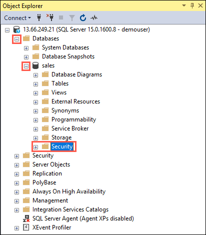

2. Expand the **Security** folder, right-click **Always Encrypted Keys**, and then select **New Column Master Key...**"

   

3. In the New Column Master Key dialog, enter **TI-MK** as the name, ensure the Key store is set to **Windows Certificate Store - Current User**, and then select **Generate Certificate**.

   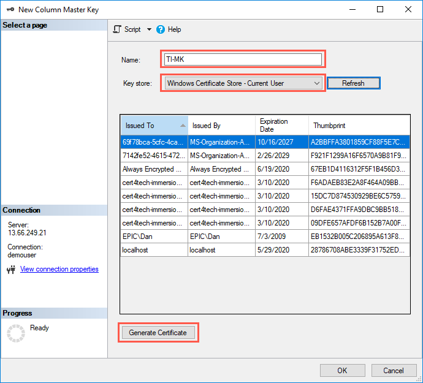

4. Ensure the generated key is highlighted in the list of keys, and then select **OK** in the New Column Master Key dialog.

   

5. Right-click on **Always Encrypted Keys** again, and this time select **New Column Encryption Key...**

   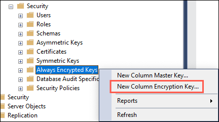

6. In the **New Column Encryption Key** dialog, enter **TI-EK** for the name, select **TI-MK** for the Column master key, and select **OK**.

   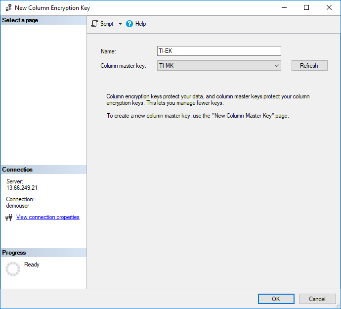

### Encrypt customer email column

In this step, you will encrypt the data stored in the email column inside the server-side enclave, and then test a SELECT query of the data. For testing purposes, you will open two new query windows. One of the query windows will be configured with Always Encrypted enabled and the other will have it disabled, so you can see the results of running with Always Encrypted with secure enclaves.

1. In SSMS, select the `sales` database in the Object Explorer, and then select **New query** in the SSMS toolbar to open a new query window.

2. Right-click anywhere in the new query window, and select **Connection > Change Connection**.

   

3. In the Connect to Database Engine dialog, select **Options**, navigate to the **Always Encrypted** tab, then check the **Enable Always Encrypted** box and enter the following URL into the Enclave Attestation URL box: `http://10.0.0.8/Attestation`.

   

4. Select **Connect**.

   > TODO: Finish these steps once a solution to the error is found...
   > Error: Unable to apply connection settings. The detailed error message is: No enclave provider found for enclave type 'SIMULATOR'. Please specify the provider in the application configuration.

5. In the query window, copy and paste the following query to encrypt the `c_email_address` column in the `dbo.customer` table.

   ```sql
   ALTER TABLE [dbo].[customer]
   ALTER COLUMN [c_email_address] [char](50) COLLATE Latin1_General_BIN2
   ENCRYPTED WITH (COLUMN_ENCRYPTION_KEY = [TI-EK], ENCRYPTION_TYPE = Randomized, ALGORITHM = 'AEAD_AES_256_CBC_HMAC_SHA_256') NOT NULL
   WITH (ONLINE = ON);

   ALTER DATABASE SCOPED CONFIGURATION CLEAR PROCEDURE_CACHE;
   ```

   > **NOTE**: Notice the `ALTER DATABASE SCOPED CONFIGURATION CLEAR PROCEDURE_CACHE` statement to clear the query plan cache for the database in the above script. After you have altered the table, you need to clear the plans for all batches and stored procedures that access the table, to refresh parameters encryption information.

6. Open another new query window in SSMS, and right-click anywhere in the new query window, then select **Connection > Change Connection**.

7. In the Connect to Database Engine dialog, select **Options**, navigate to the **Always Encrypted** tab and make sure **Enable Always Encrypted** is not checked, and then select **Connect**.

   

8. To verify the `c_email_address` column is now encrypted, paste in and execute the below statement in the query window with Always Encrypted disabled. The query window should return encrypted values in the SSN and Salary columns.

   ```sql
   SELECT c_customer_sk, c_first_name, c_last_name, c_email_address FROM [dbo].[customer]
   ```

   > TODO: Add screen shot of results

9. Now, run the same query in the query window with the Always Encrypted enabled. The returned results should contain the data decrypted.

  > TODO: Add screen shot of results

### Run rich queries against an encrypted column

Now, you can run rich queries against the encrypted columns. Some query processing will be performed inside your server-side enclave.

1. Ensure that Parameterization for Always Encrypted is enabled, by selecting **Query** from the main menu of SSMS, and then selecting **Query Option...**.

   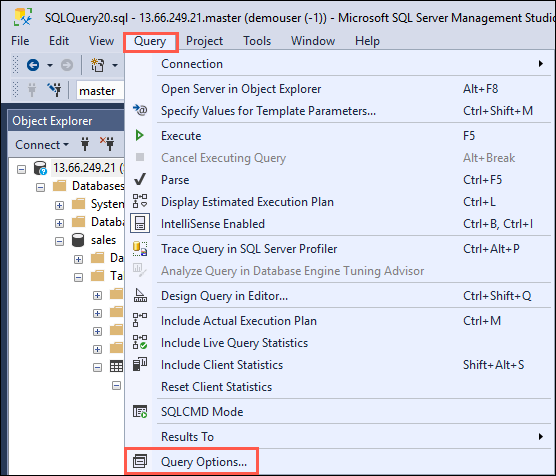

2. On the Query Options dialog, select **Advanced** under Execution, and then check the box for **Enable Parameterization for Always Encrypted**.

   

3. Select **OK**.

4. In the query window with Always Encrypted enabled, paste in and execute the below query. The query should return plaintext values and rows meeting the specified search criteria.

   ```sql
   DECLARE @EmailPattern [char](50) = '%@gmx.%';

   SELECT c_customer_sk, c_first_name, c_last_name, c_email_address FROM [dbo].[customer]
   WHERE c_email_address LIKE @EmailPattern;
   ```

   > TODO: Add screen shot of results

5. Try the same query again in the query window that does not have Always Encrypted enabled, and note the failure that occurs.

   > TODO: Add screen shot of error

## Wrap-up

Thank you for participating in the SQL Server 2019 DBA experience! We hope you are excited about the new capabilities, and will refer back to this experience to learn more about these features.

To recap, you experienced:

1. Using migration tools to evaluate and perform a migration from SQL Server 2008 R2 to a newer version of SQL Server.
2. Intelligent Query Processing (QP) performance improvements with SQL Server 2019's new database compatibility level: `150`.
3. Using the [SQL Data Discovery & Classification](https://docs.microsoft.com/sql/relational-databases/security/sql-data-discovery-and-classification?view=sql-server-ver15) tool to identify and tag PII and GDPR-related compliance issues.
4. Used dynamic data masking to automatically protect sensitive data from unauthorized users.
5. Enabled Row-Level Security to restrict access to data rows using user contexts.
6. Using Always Encrypted with secure enclaves to perform rich queries on encrypted data columns.

## Additional resources and more information

- [What's new in SQL Server 2019 preview](https://docs.microsoft.com/en-us/sql/sql-server/what-s-new-in-sql-server-ver15?view=sql-server-ver15)
- [SQL Server 2019 big data clusters overview and architecture](https://docs.microsoft.com/en-us/sql/big-data-cluster/big-data-cluster-overview?view=sql-server-ver15)
- [How to run a sample notebook in Azure Data Studio on a SQL Server 2019 big data cluster, and leverage Spark](https://docs.microsoft.com/en-us/sql/big-data-cluster/tutorial-notebook-spark?view=sqlallproducts-allversions)
- [What is Azure Data Studio?](https://docs.microsoft.com/en-us/sql/azure-data-studio/what-is?view=sql-server-ver15)
- [Security Center for SQL Server Database Engine and Azure SQL Database](https://docs.microsoft.com/en-us/sql/relational-databases/security/security-center-for-sql-server-database-engine-and-azure-sql-database?view=sql-server-2017)
- [SQL Data Discovery and Classification tool documentation](https://docs.microsoft.com/en-us/sql/relational-databases/security/sql-data-discovery-and-classification?view=sql-server-2017)
- [Intelligent query processing in SQL databases](https://docs.microsoft.com/en-us/sql/relational-databases/performance/intelligent-query-processing?view=sql-server-2017)
- [What's new in SQL Server Machine Learning Services](https://docs.microsoft.com/en-us/sql/advanced-analytics/what-s-new-in-sql-server-machine-learning-services?view=sql-server-ver15)
- [How to run Java code in SQL Server 2019](https://docs.microsoft.com/en-us/sql/advanced-analytics/java/extension-java?view=sql-server-ver15)
- [Learning content in GitHub: SQL Server Workshops](https://github.com/Microsoft/sqlworkshops)
- [SQL Server Samples Repository in GitHub. Feature demos, code samples etc.](https://github.com/Microsoft/sql-server-samples)
- [Always Encrypted with secure enclaves](https://docs.microsoft.com/en-us/sql/relational-databases/security/encryption/always-encrypted-enclaves?view=sql-server-ver15)
