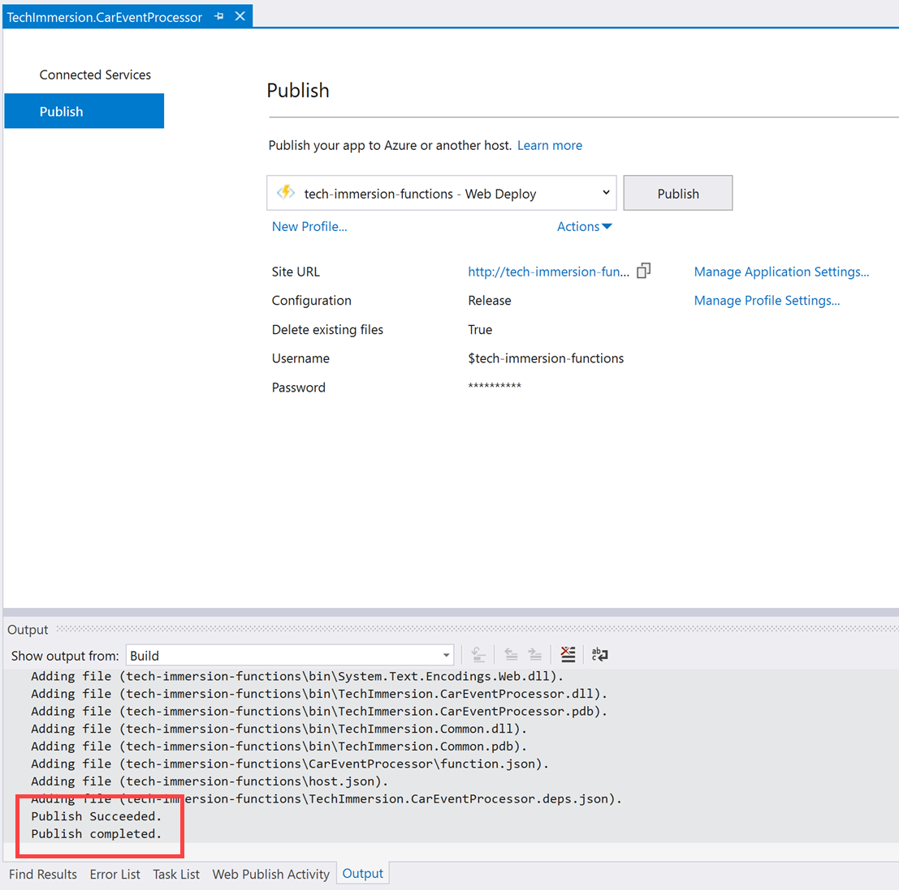

# Day 1, Experience 2 - Leveraging Cosmos DB for near real-time analytics

- [Day 1, Experience 2 - Leveraging Cosmos DB for near real-time analytics](#day-1-experience-2---leveraging-cosmos-db-for-near-real-time-analytics)
  - [Technology overview](#technology-overview)
    - [Azure Cosmos DB](#azure-cosmos-db)
    - [Azure Functions](#azure-functions)
    - [Azure Stream Analytics](#azure-stream-analytics)
    - [Power BI](#power-bi)
    - [Serverless computing using Azure Cosmos DB and Azure Functions](#serverless-computing-using-azure-cosmos-db-and-azure-functions)
  - [Scenario overview](#scenario-overview)
  - [Experience requirements](#experience-requirements)
  - [Task 1: Configure Cosmos DB](#task-1-configure-cosmos-db)
  - [Task 2: Configure Event Hubs](#task-2-configure-event-hubs)
  - [Task 3: Configure Stream Analytics](#task-3-configure-stream-analytics)
  - [Task 4: Configure Azure Function App](#task-4-configure-azure-function-app)
  - [Task 5: Publish Function App and run data generator](#task-5-publish-function-app-and-run-data-generator)
  - [Task 6: Create Power BI dashboard](#task-6-create-power-bi-dashboard)
  - [Wrap-up](#wrap-up)
  - [Additional resources and more information](#additional-resources-and-more-information)

## Technology overview

### Azure Cosmos DB

Develop high-concurrency, low-latency applications with Azure Cosmos DB, a fully managed database service that supports NoSQL APIs and can scale out [multi-master](https://docs.microsoft.com/en-us/azure/cosmos-db/multi-region-writer) workloads anywhere in the world. Ensure blazing fast performance with [industry-leading service level agreements (SLAs)](https://azure.microsoft.com/en-us/support/legal/sla/cosmos-db/v1_2/) for single-digit-millisecond reads and writes, data consistency and throughput, and 99.999% high availability. Transparent [horizontally-partitioning](https://docs.microsoft.com/en-us/azure/cosmos-db/partitioning-overview) provides elastic scaling, matching capacity with demand to controls costs and ensures your applications maintains high performance during peak traffic.

Azure Cosmos DB offers built-in, cloud-native capabilities to simplify app development and boost developer productivity, including five well-defined consistency models, [auto-indexing](https://docs.microsoft.com/en-us/azure/cosmos-db/index-policy), and multiple data models. Easily migrate existing NoSQL data with open-source APIs for [MongoDB](https://docs.microsoft.com/en-us/azure/cosmos-db/mongodb-introduction), [Cassandra](https://docs.microsoft.com/en-us/azure/cosmos-db/cassandra-introduction), Gremlin (Graph), and others. Developers can work with tools to build microservices and the languages of their choice, while enjoying seamless integration with Azure services for IoT, advanced analytics, AI and machine learning, and business intelligence.

Azure Cosmos DB enables you to innovate with IoT data to build enhanced user experiences and turn insights into action:

- Ingest and query diverse IoT data easily using Azure Cosmos DB's global presence to capture data from anywhere.
- Scale elastically to accommodate real-time fluctuations in IoT data.
- Seamlessly integrate into tools like Azure Event Hub, Azure IoT Hub and Azure Functions to ingest and stream data.

Performing real-time analytics on data of any size or type from anywhere, using a Lambda architecture, and easy integration with Azure Databricks.

- Source and serve data quickly through integration with other Azure services for real-time insights.
- Run in-depth queries over diverse data sets to understand trends and make better decisions.
- Apply Analytics, Machine Learning, and Cognitive capabilities to your NoSQL data.

By using Azure Cosmos DB you no longer have to make the extreme [tradeoffs](https://docs.microsoft.com/en-us/azure/cosmos-db/consistency-levels-tradeoffs) between consistency, availability, latency and programmability. You can choose from five well-defined consistency choices (strong, bounded staleness, consistent-prefix, session, and eventual) to better control your user’s experience through consistency, availability, latency and programmability.

Focus your time and attention on developing great apps while Azure handles management and optimization of infrastructure and databases. Deploy databases in a fraction of the time on Microsoft’s platform as a service and leverage built-in configuration options to get up and running fast. You can rest assured your apps are running on a fully managed database service built on world-class infrastructure with enterprise-grade security and compliance

### Azure Functions

[Azure Functions](https://docs.microsoft.com/en-us/azure/azure-functions/functions-overview) enables you to easily build the apps you need using simple, serverless functions that [scale](https://docs.microsoft.com/en-us/azure/azure-functions/functions-scale) to meet demand.

Azure Functions allows you to focus on running great apps, instead of the infrastructure on which they run. You don’t need to worry about provisioning and maintaining servers. Azure Functions provides a fully managed compute platform with high reliability and security. With [scale](https://docs.microsoft.com/en-us/azure/azure-functions/functions-scale) on demand, your code gets the compute resources it needs, when it needs them, freeing you of capacity planning concerns.

Write code only for what truly matters to your business. Utilize innovative programming model for everything else such as [communicating with other services](https://docs.microsoft.com/en-us/azure/azure-functions/functions-scale), building [HTTP-based API](https://docs.microsoft.com/en-us/azure/azure-functions/functions-bindings-http-webhook) or orchestrating complex workflows. Azure Functions naturally leads you to a microservices-friendly approach for building more scalable and stable applications.

You can create Functions in the [programming language of your choice](https://docs.microsoft.com/en-us/azure/azure-functions/supported-languages). Write code in an easy-to-use web-based interface or build and debug on your local machine with your favorite development tool. You can take advantage of built-in continuous deployment and use integrated monitoring tools to [troubleshoot issues](https://docs.microsoft.com/en-us/azure/app-service/overview-diagnostics).

### Azure Stream Analytics

As more and more data is generated from a variety of connected devices and sensors, transforming this data into actionable insights and predictions in near real-time is now an operational necessity. [Azure Stream Analytics](https://docs.microsoft.com/en-us/azure/stream-analytics/stream-analytics-introduction) seamlessly integrates with your real-time application architecture to enable powerful, real-time analytics on your data no matter what the volume.

Azure Stream Analytics enables you to develop massively parallel Complex Event Processing (CEP) pipelines with simplicity. It allows you to author powerful, real-time analytics solutions using very simple, declarative [SQL like language](https://docs.microsoft.com/en-us/stream-analytics-query/stream-analytics-query-language-reference) with embedded support for temporal logic. Extensive array of [out-of-the-box connectors](https://docs.microsoft.com/en-us/azure/stream-analytics/stream-analytics-define-outputs), advanced debugging and job monitoring capabilities help keep costs down by significantly lowering the developer skills required. Additionally, Azure Stream Analytics is highly extensible through support for custom code with [JavaScript User Defined functions](https://docs.microsoft.com/en-us/azure/stream-analytics/stream-analytics-javascript-user-defined-functions) further extending the streaming logic written in SQL.

Getting started in seconds is easy with Azure Stream Analytics as there is no infrastructure to worry about, and no servers, virtual machines, or clusters to manage. You can instantly [scale-out the processing power](https://docs.microsoft.com/en-us/azure/stream-analytics/stream-analytics-streaming-unit-consumption) from one to hundreds of streaming units for any job. You only pay for the processing used per job.

[Guaranteed event delivery](https://docs.microsoft.com/en-us/stream-analytics-query/event-delivery-guarantees-azure-stream-analytics) and an enterprise grade SLA, provide the three 9's of availability, making sure that Azure Stream Analytics is suitable for mission critical workloads. Automated checkpoints enable fault tolerant operation with fast restarts with no data loss.

Azure Stream Analytics can be used to allow you to quickly build real-time dashboards with Power BI for a live command and control view. [Real-time dashboards](https://docs.microsoft.com/en-us/azure/stream-analytics/stream-analytics-power-bi-dashboard) help transform live data into actionable and insightful visuals, and help you focus on what matters to you the most.

### Power BI

[Power BI](https://docs.microsoft.com/en-us/power-bi/) is a business analytics service that delivers insights to enable fast, informed decisions. Enabling you to transform data into stunning visuals and share them with colleagues on any device. Power BI provides a rich canvas on which to visually [explore and analyze your data](https://docs.microsoft.com/en-us/power-bi/service-basic-concepts). The ability to collaborate on and share customized [dashboards](https://docs.microsoft.com/en-us/azure/stream-analytics/stream-analytics-power-bi-dashboard) and interactive reports is part of the experience, enabling you to scale across your organization with built-in governance and security.

### Serverless computing using Azure Cosmos DB and Azure Functions


Serverless computing is all about the ability to focus on individual pieces of logic that are repeatable and stateless. These pieces require no infrastructure management and they consume resources only for the seconds, or milliseconds, they run for. At the core of the serverless computing movement are functions, which are made available in the Azure ecosystem by Azure Functions. To learn about other serverless execution environments in Azure see ‘serverless in Azure’ page.

With the native integration between [Azure Cosmos DB and Azure Functions](https://docs.microsoft.com/en-us/azure/cosmos-db/serverless-computing-database), you can create database triggers, input bindings, and output bindings directly from your Azure Cosmos DB account.

Azure Functions and Azure Cosmos DB allow you can create, deploy, and easily manage great low-latency event-driven serverless apps based on rich data, and serving a globally distributed user base seamlessly.


• For an example of event sourcing architectures based on Azure Cosmos DB in a real world use case see [https://blogs.msdn.microsoft.com/azurecat/2018/05/17/azure-cosmos-db-customer-profile-jet-com](https://blogs.msdn.microsoft.com/azurecat/2018/05/17/azure-cosmos-db-customer-profile-jet-com)

## Scenario overview

Contoso Auto is collecting vehicle telemetry and wants to use Cosmos DB to rapidly ingest and store the data in its raw form, then do some processing in near real-time. In the end, they want to create a dashboard that automatically updates with new data as it flows in after being processed. What they would like to see on the dashboard are various visualizations of detected anomalies, like engines overheating, abnormal oil pressure, and aggressive driving, using components such as a map to show anomalies related to cities, as well as various charts and graphs depicting this information in a clear way.

In this experience, you will use Azure Cosmos DB to ingest streaming vehicle telemetry data as the entry point to a near real-time analytics pipeline built on Cosmos DB, Azure Functions, Event Hubs, Azure Stream Analytics, and Power BI. To start, you will complete configuration and performance-tuning on Cosmos DB to prepare it for data ingest, and use the change feed capability of Cosmos DB to trigger Azure Functions for data processing. The function will enrich the telemetry data with location information, then send it to Event Hubs. Azure Stream Analytics extracts the enriched sensor data from Event Hubs, performs aggregations over windows of time, then sends the aggregated data to Power BI for data visualization and analysis. A vehicle telemetry data generator will be used to send vehicle telemetry data to Cosmos DB.

## Experience requirements

- Azure subscription
- Visual Studio 2017 Community (or better)
- Power BI account (sign up at <https://powerbi.microsoft.com>)

## Task 1: Configure Cosmos DB

[Azure Cosmos DB](https://docs.microsoft.com/en-us/azure/cosmos-db/introduction) provides a multi-model, globally available NoSQL database with high concurrency, low latency, and predictable results. One of its biggest strengths is that it transparently synchronizes data to all regions around the globe, which can quickly and easily be added at any time. This adds value by reducing the amount of development required to read and write the data and removes any need for synchronization. The speed in which Cosmos DB can ingest as well as return data, coupled with its ability to do so at a global scale, makes it ideal for both ingesting real-time data and serving that data to consumers worldwide.

When storing and delivering your data on a global scale, there are some things to consider. Most distributed databases offer two consistency levels: strong and eventual. These live at different ends of a spectrum, where strong consistency often results in slower transactions because it synchronously writes data to each replica set. This guarantees that the reader will always see the most recent committed version of the data. Eventual consistency, on the other hand, asynchronously writes to each replica set with no ordering guarantee for reads. The replicas eventually converge, but the risk is that it can take several reads to retrieve the most up-to-date data.

Azure Cosmos DB was designed with control over the tradeoffs between read consistency, availability, latency, and throughput. This is why Cosmos DB offers five consistency levels: strong, bounded staleness, session, consistent prefix, and eventual. As a general rule of thumb, you can get about 2x read throughput for session, consistent prefix, and eventual consistency models compared to bounded staleness or strong consistency.

The Session consistency level is the default, and is suitable for most operations. It provides strong consistency for the session (application or connection), where all reads are current with writes from that session. Data from other sessions come in the correct order, but aren't guaranteed to be current. Session consistency level provides a balance of good performance and good availability at half the cost of both strong consistency and bounded staleness. As mentioned before, session provides about 2x read throughput compared to these two stronger consistency levels as well.

For this scenario, Contoso Auto does not need to ingest and serve their data globally just yet. Right now, they are working on a POC to rapidly ingest vehicle telemetry data, process that data as it arrives, and visualize the processed data through a real-time dashboard. Cosmos DB gives them the flexibility to add regions in the future either programmatically through its APIs, or through the "Replicate data globally" Cosmos DB settings in the portal.

To do this, go to the "Replicate data globally" settings, select the option to add a region, then choose the region you wish to add.


Once you are finished adding regions, simply select the Save button to apply your changes. You will see the regions highlighted on a map.


To ensure high write and read availability, configure your Cosmos account to span at least two regions with multiple-write regions. This configuration will provide the availability, lowest latency, and scalability for both reads and writes backed by SLAs. To learn more, see [how to configure your Cosmos account with multiple write-regions](https://docs.microsoft.com/en-us/azure/cosmos-db/tutorial-global-distribution-sql-api). To configure multi-master in your applications, see [How to configure multi-master](https://docs.microsoft.com/en-us/azure/cosmos-db/how-to-multi-master).

You may be wondering how you can control the throughput, or speed at which data can be written to or read from Cosmos DB at a global level. In Azure Cosmos DB, provisioned throughput is represented as request units/second (RUs). RUs measure the cost of both read and write operations against your Cosmos DB container. Because Cosmos DB is designed with transparent horizontal scaling (e.g., scale out) and multi-master replication, you can very quickly and easily increase or decrease the number of RUs to handle thousands to hundreds of millions of requests per second around the globe with a single API call.

Cosmos DB allows you to increment/decrement the RUs in small increments of 1000 at the database level, and in even smaller increments of 100 RU/s at the container level. It is recommended that you configure throughput at the container granularity for guaranteed performance for the container all the time, backed by SLAs. Other guarantees that Cosmos DB delivers are 99.999% read and write availability all around the world, with those reads and writes being served in less than 10 milliseconds at the 99th percentile.

When you set a number of RUs for a container, Cosmos DB ensures that those RUs are available in all regions associated with your Cosmos DB account. When you scale out the number of regions by adding a new one, Cosmos will automatically provision the same quantity of RUs in the newly added region. You cannot selectively assign different RUs to a specific region. These RUs are provisioned for a container (or database) for all associated regions.

In this task, you will create a new Cosmos DB database and collection, set the throughput units, and obtain the connection details.

1.  To start, open a new web browser window and navigate to <https://portal.azure.com>. Log in with the credentials provided to you for this lab.

2.  After logging into the Azure portal, select **Resource groups** from the left-hand menu. Then select the resource group named **tech-immersion-YOUR_UNIQUE_IDENTIFIER**. The `YOUR_UNIQUE_IDENTIFIER` portion of the name is the unique identifier assigned to you for this lab.

    

3.  Select the **Azure Cosmos DB account** from the list of resources in your resource group.

    

4.  Within the Cosmos DB account blade, select **Data Explorer** on the left-hand menu.

    

5.  If the ContosoAuto database and telemetry collection already exist, **skip ahead** to step 9.

    

6.  Select **New Collection** in the top toolbar.

    

7.  In the **Add Collection** blade, configure the following:

    - **Database id:** Select **Create new**, then enter "ContosoAuto" for the id.
    - **Provision database throughput:** Unchecked.
    - **Collection id:** Enter "telemetry".
    - **Partition key:** Enter "/vin".
    - **Throughput:** Enter 15000.

    > The /vin partition was selected because the data will include this value, and it allows us to partition by vehicle from which the transaction originated. This field also contains a wide range of values, which is preferable for partitions.

    

    On the subject of partitions, choosing an appropriate partition key for Cosmos DB is a critical step for ensuring balanced reads and writes, scaling, and, in this case, in-order change feed processing per partition. While there are no limits, per se, on the number of logical partitions, a single logical partition is allowed an upper limit of 10 GB of storage. Logical partitions cannot be split across physical partitions. For the same reason, if the partition key chosen is of bad cardinality, you could potentially have skewed storage distribution. For instance, if one logical partition becomes larger faster than the others and hits the maximum limit of 10 GB, while the others are nearly empty, the physical partition housing the maxed out logical partition cannot split and could cause an application downtime. This is why we specified `vin` as the partition key. It has good cardinality for this data set.

8.  Select **OK** on the bottom of the form when you are finished entering the values.

9.  Select **Firewall and virtual networks** from the left-hand menu, then select Allow access from **All networks**. Select **Save**. This will allow the vehicle telemetry generator application to send data to your Cosmos DB collection. Select **Save**.

    

10. Select **Keys** from the left-hand menu.

    

11. Copy the **Primary Connection String** value by selecting the copy button to the right of the field. **SAVE THIS VALUE** in Notepad or similar text editor for later.

    

## Task 2: Configure Event Hubs

Azure Event Hubs is a Big Data streaming platform and event ingestion service, capable of receiving and processing millions of events per second. We are using it to temporarily store vehicle telemetry data that is processed and ready to be sent to the real-time dashboard. As data flows into Event Hubs, Azure Stream Analytics will query the data, applying aggregates and tagging anomalies, then send it to Power BI.

In this task, you will create and configure a new event hub within the provided Event Hubs namespace. This will be used to capture vehicle telemetry after it has been processed and enriched by the Azure function you will create later on.

1.  Navigate to the [Azure portal](https://portal.azure.com).

2.  Select **Resource groups** from the left-hand menu. Then select the resource group named **tech-immersion-YOUR_UNIQUE_IDENTIFIER**.

    

3.  Select the **Event Hubs Namespace** from the list of resources in your resource group.

    

4.  Within the Event Hubs Namespace blade, select **Event Hubs** within the left-hand menu.

    

5.  Select **+ Event Hub** in the top toolbar to create a new event hub in the namespace.

    

6.  In the **Create Event Hub** blade, configure the following:

    - **Name:** Enter "telemetry".
    - **Partition Count:** Select 2.
    - **Message Retention**: Select 1.
    - **Capture:** Select Off.

    

7.  Select **Create** on the bottom of the form when you are finished entering the values.

8.  Select your newly created **telemetry** event hub from the list after it is created.

    

9.  Select **Shared access policies** from the left-hand menu.

    

10. Select **+ Add** in the top toolbar to create a new shared access policy.

    

11. In the **Add SAS Policy** blade, configure the following:

    - **Name:** Enter "Read".
    - **Managed:** Unchecked.
    - **Send:** Unchecked.
    - **Listen:** Checked.

    

    > It is a best practice to create separate policies for reading, writing, and managing events. This follows the principle of least privilege to prevent services and applications from performing unauthorized operations.

12. Select **Create** on the bottom of the form when you are finished entering the values.

13. Select **+ Add** in the top toolbar to create a new shared access policy.

    

14. In the **Add SAS Policy** blade, configure the following:

    - **Name:** Enter "Write".
    - **Managed:** Unchecked.
    - **Send:** Checked.
    - **Listen:** Unchecked.

    

15. Select **Create** on the bottom of the form when you are finished entering the values.

16. Select your **Write** policy from the list. Copy the **Connection string - primary key** value by selecting the Copy button to the right of the field. **SAVE THIS VALUE** in Notepad or similar text editor for later.

    

## Task 3: Configure Stream Analytics

Azure Stream Analytics is an event-processing engine that allows you to examine high volumes of data streaming from devices. Incoming data can be from devices, sensors, web sites, social media feeds, applications, and more. It also supports extracting information from data streams, identifying patterns, and relationships. You can then use these patterns to trigger other actions downstream, such as create alerts, feed information to a reporting tool, or store it for later use.

In this task, you will configure Stream Analytics to use the event hub you created as a source, query and analyze that data, then send it to Power BI for reporting.

1.  Navigate to the [Azure portal](https://portal.azure.com).

2.  Select **Resource groups** from the left-hand menu. Then select the resource group named **tech-immersion-YOUR_UNIQUE_IDENTIFIER**.

    

3.  Select the **Stream Analytics job** from the list of resources in your resource group.

    

4.  Within the Stream Analytics job blade, select **Inputs** within the left-hand menu.

    

5.  Select **+ Add stream input** in the top toolbar, then select **Event Hub** to create a new Event Hub input.

    

6.  In the **New Input** blade, configure the following:

    - **Name:** Enter "eventhub".
    - **Select Event Hub from your subscriptions:** Selected.
    - **Subscription:** Make sure the subscription you are using for this lab is selected.
    - **Event Hub namespace:** Select the Event Hub namespace you are using for this lab.
    - **Event Hub name:** Select **Use existing**, then select **telemetry**, which you created earlier.
    - **Event Hub policy name:** Select **Read**.
    - Leave all other values at their defaults.

    

7.  Select **Save** on the bottom of the form when you are finished entering the values.

8.  Within the Stream Analytics job blade, select **Outputs** within the left-hand menu.

    

9.  Select **+ Add** in the top toolbar, then select **Power BI** to create a new Power BI output.

    

10. In the **New Output** blade, select the **Authorize** button to authorize a connection from Stream Analytics to your Power BI account. If you do not have a Power BI account, select the **Sign up** link below the button.

    

11. When prompted, sign in to your Power BI account.

    

12. After successfully signing in to your Power BI account, the New Output blade will update to show you are currently authorized.

    

13. In the **New Output** blade, configure the following:

    - **Output alias:** Enter "powerBIAlerts".
    - **Group workspace:** Select My Workspace.
    - **Dataset name:** Enter "VehicleAnomalies".
    - **Table name:** Enter "Alerts".

    

14. Select **Save** on the bottom of the form when you are finished entering the values.

15. Within the Stream Analytics job blade, select **Query** within the left-hand menu.

    

16. Clear the edit **Query** window and paste the following in its place:

    ```sql
    WITH
    Averages AS (
    select
        AVG(engineTemperature) averageEngineTemperature,
        AVG(speed) averageSpeed
    FROM
        eventhub TIMESTAMP BY [timestamp]
    GROUP BY
        TumblingWindow(Duration(second, 2))
    ),
    Anomalies AS (
    select
        t.vin,
        t.[timestamp],
        t.city,
        t.region,
        t.outsideTemperature,
        t.engineTemperature,
        a.averageEngineTemperature,
        t.speed,
        a.averageSpeed,
        t.fuel,
        t.engineoil,
        t.tirepressure,
        t.odometer,
        t.accelerator_pedal_position,
        t.parking_brake_status,
        t.headlamp_status,
        t.brake_pedal_status,
        t.transmission_gear_position,
        t.ignition_status,
        t.windshield_wiper_status,
        t.abs,
        (case when a.averageEngineTemperature >= 405 OR a.averageEngineTemperature <= 15 then 1 else 0 end) as enginetempanomaly,
        (case when t.engineoil <= 1 then 1 else 0 end) as oilanomaly,
        (case when (t.transmission_gear_position = 'first' OR
            t.transmission_gear_position = 'second' OR
            t.transmission_gear_position = 'third') AND
            t.brake_pedal_status = 1 AND
            t.accelerator_pedal_position >= 90 AND
            a.averageSpeed >= 55 then 1 else 0 end) as aggressivedriving
    from eventhub t TIMESTAMP BY [timestamp]
    INNER JOIN Averages a ON DATEDIFF(second, t, a) BETWEEN 0 And 2
    )
    SELECT
        *
    INTO
        powerBIAlerts
    FROM
        Anomalies
    where aggressivedriving = 1 OR enginetempanomaly = 1 OR oilanomaly = 1
    ```

    

    The query averages the engine temperature and speed over a two second duration. Then it selects all telemetry data, including the average values from the previous step, and specifies the following anomalies as new fields:

    a. **enginetempanomaly**: When the average engine temperature is \>= 405 or \<= 15.

    b. **oilanomaly**: When the engine oil \<= 1.

    c. **aggressivedriving**: When the transmission gear position is in first, second, or third, and the brake pedal status is 1, the accelerator pedal position \>= 90, and the average speed is \>= 55.

    Finally, the query outputs all fields from the anomalies step into the `powerBIAlerts` output where aggressivedriving = 1 or enginetempanomaly = 1 or oilanomaly = 1.

17. Select **Save** in the top toolbar when you are finished updating the query.

18. Within the Stream Analytics job blade, select **Overview** within the left-hand menu. On top of the Overview blade, select **Start**.

    

19. In the Start job blade that appears, select **Now** for the job output start time, then select **Start**. This will start the Stream Analytics job so it will be ready to start processing and sending your events to Power BI later on.

    

## Task 4: Configure Azure Function App

Azure Functions is a solution for easily running small pieces of code, or "functions," in the cloud. You can write just the code you need for the problem at hand, without worrying about a whole application or the infrastructure to run it. Functions can make development even more productive, and you can use your development language of choice, such as C#, F#, Node.js, Java, or PHP.

When you use the Azure Functions consumption plan, you only pay for the time your code runs. Azure automatically handles scaling your functions to meet demand.

Azure Functions uses special bindings that allow you to automatically trigger the function when an event happens (a document is added to Azure Cosmos DB, a file is uploaded to blob storage, an event is added to Event Hubs, an HTTP request to the function is made, etc.), as well as to retrieve or send information to and from various Azure services. In the case of our function for this solution, we are using the `CosmosDBTrigger` to automatically trigger the function through the Cosmos DB change feed. This trigger supplies an input binding of type `IReadOnlyList<Document>` we name "input", that contains the records that triggered the function. This removes any code you would have to otherwise write to query that data. We also have an output binding to the event hub, of type `IAsyncCollector<EventData>`, which we name "eventHubOutput". Again, this reduces code by automatically sending data added to this collection to the specified event hub.


The function code itself is very lightweight, lending to the resource bindings and the `TelemetryProcessing.ProcessEvent` method that it calls:


The `TelemetryProcessing` class contains a simple method named `ProcessEvent` that evaluates the vehicle telemetry data sent by Cosmos DB and enriches it with the region name based on a simple map.


In this task, you will configure the Function App with the Azure Cosmos DB and Event Hubs connection strings.

1.  Navigate to the [Azure portal](https://portal.azure.com).

2.  Select **Resource groups** from the left-hand menu. Then select the resource group named **tech-immersion-YOUR_UNIQUE_IDENTIFIER**.

    

3.  Select the **App Service** (Azure Function App) that includes **day1** in its name from the list of resources in your resource group.

    

4.  Within the Function App Overview blade, scroll down and select **Application settings**.

    

5.  Select **Add new setting** at the bottom of the Application settings section.

    

6.  Enter `CosmosDbConnectionString` into the **Name** field, then paste your Cosmos DB connection string into the **Value** field. If you cannot locate your connection string, refer to Task 1, step 10.

    

7.  Select **Add new setting** underneath the new application setting you just added to add a new one.

8.  Enter `EventHubsConnectionString` into the **Name** field, then paste your Event Hubs connection string into the **Value** field. This is the connection string for the **Write** shared access policy you created. If you cannot locate your connection string, refer to Task 2, step 17.

    

9.  Scroll to the top of the page and select **Save** in the top toolbar to apply your changes.

    

## Task 5: Publish Function App and run data generator

The data generator console application creates and sends simulated vehicle sensor telemetry for an array of vehicles (denoted by VIN (vehicle identification number)) directly to Cosmos DB. For this to happen, you first need to configure it with the Cosmos DB connection string.

In this task, you will open the lab solution in Visual Studio, publish the Function App, and configure and run the data generator. The data generator saves simulated vehicle telemetry data to Cosmos DB, which triggers the Azure function to run and process the data, sending it to Event Hubs, prompting your Stream Analytics job to aggregate and analyze the enriched data and send it to Power BI. The final step will be to create the Power BI report in the task that follows.

1.  Open Windows Explorer and navigate to `C:\lab-files\data\2`. Double-click on **TechImmersion.sln** to open the solution in Visual Studio. If you are prompted by Visual Studio to log in, log in with your Azure Active Directory credentials you are using for this lab.

    

    The Visual Studio solution contains the following projects:

    - **TechImmersion.CarEventProcessor**: Azure Function App project from which you will publish the Azure function that processes Cosmos DB documents as they arrive, and sends them to Event Hubs.
    - **TechImmersion.Common**: Common library that contains models and structs used by the other projects within the solution.
    - **TransactionGenerator**: Console app that generates simulated vehicle telemetry and writes it to Cosmos DB.

2.  Select the **Build** menu item, then select **Build Solution**. You should see a message in the output window on the bottom of the Visual Studio window that the build successfully completed. One of the operations that completes during this process is to download and install all NuGet packages.

    

3.  You will see the projects listed within the Solution Explorer in Visual Studio. Right-click the **TechImmersion.CarEventProcessor** solution, then select **Publish...** in the context menu.

    

4.  Select **Select Existing** underneath Azure App Service since you will be publishing this to an existing Function App. Click **Publish** on the bottom of the dialog window. If you are prompted to log into your Azure Account, log in with the Azure account you are using for this lab.

    

5.  In the App Service dialog that follows, make sure your Azure **Subscription** for this lab is selected, then find and expand the **tech-immersion-YOUR_UNIQUE_IDENTIFIER** resource group. Select your Function App that includes **day1** in its name, then click **OK** on the bottom of the dialog window

    

6.  The Function App will start publishing in a moment. You can watch the output window for the publish status. When it is done publishing, you should see a "Publish completed" message on the bottom of the output window.

     

7.  Expand the **TransactionGenerator** project within the Solution Explorer, then double-click on **appsettings.json** to open it.

    

8.  Paste your Cosmos DB connection string value next to `COSMOS_DB_CONNECTION_STRING`. Make sure you have quotes ("") around the value, as shown.

    

    `SECONDS_TO_LEAD` is the amount of time to wait before sending vehicle telemetry data. Default value is `0`.

    `SECONDS_TO_RUN` is the maximum amount of time to allow the generator to run before stopping transmission of data. The default value is `600`. Data will also stop transmitting when you enter Ctrl+C while the generator is running, or if you close the window.

9.  Now you are ready to run the transaction generator. Select the **Debug** menu item, then select **Start Debugging**, or press _F-5_ on your keyboard.

    

10. A new console window will open, and you should see it start to send data after a few seconds. Once you see that it is sending data to Cosmos DB, _minimize_ the window and keep it running in the background.

    

    The top of the output displays information about the Cosmos DB collection you created (telemetry), the requested RU/s as well as estimated hourly and monthly cost. After every 1,000 records are requested to be sent, you will see output statistics.

---

Some key areas to point out about the data generator code are as follows:

Within the `Program.cs` file, we instantiate a new Cosmos DB client (`DocumentClient`), passing in the Cosmos DB service endpoint, authorization key, and connection policy (direct connect over TCP for fastest results). Next, we retrieve the Cosmos DB collection information and create an offer query (`CreateOfferQuery`) to pull statistics about the offered throughput in RU/s so we can estimate the monthly and hourly cost. Finally, we call the `SendData` method to start sending telemetry data to Cosmos DB.


The `SendData` method outputs statistics about how much data was sent to Cosmos DB and how long it took to send, which varies based on your available system resources and internet bandwidth. It sends the telemetry data (`carEvent`) in one line of code:

```csharp
// Send to Cosmos DB:
var response = await _cosmosDbClient.CreateDocumentAsync(collectionUri, carEvent)
    .ConfigureAwait(false);
```

The last bit of interesting code within the generator is where we create the Cosmos DB database and collection if it does not exist. We also specify the collection partition key, indexing policy, and the throughput set to 15,000 RU/s:


## Task 6: Create Power BI dashboard

In this task, you will use Power BI to create a report showing captured vehicle anomaly data. Then you will pin that report to a live dashboard for near real-time updates.

1.  Open your web browser and navigate to <https://powerbi.microsoft.com/>. Select **Sign in** on the upper-right.

    

2.  Enter your Power BI credentials you used when creating the Power BI output for Stream Analytics.

3.  After signing in, select **My Workspace** on the left-hand menu.

    

4.  Select the **Datasets** tab on top of the workspace. Locate the dataset named **VehicleAnomalies**, then select the **Create Report** action button to the right of the name. If you do not see the dataset, you may need to wait a few minutes and refresh the page.

    

    > **Note:** It can take several minutes for the dataset to appear. You may need to periodically refresh the page before you see the Datasets tab.

5.  You should see a new blank report for VehicleAnomalies with the field list on the far right.

    

6.  Select the **Map** visualization within the Visualizations section on the right.

    

7.  Drag the **city** field to **Location**, and **aggressivedriving** to **Size**. This will place points of different sizes over cities on the map, depending on how many aggressive driving records there are.

    

8.  Your map should look similar to the following:

    

9.  Select a blank area on the report to deselect the map. Now select the **Treemap** visualization.

    

10. Drag the **enginetemperature** field to **Values**, then drag the **transmission_gear_position** field to **Group**. This will group the engine temperature values by the transmission gear position on the treemap so you can see which gears are associated with the hottest or coolest engine temperatures. The treemap sizes the groups according to the values, with the largest appearing on the upper-left and the lowest on the lower-right.


    

11. Select the down arrow next to the **enginetemperature** field under **Values**. Select **Average** from the menu to aggregate the values by average instead of the sum.


    

12. Your treemap should look similar to the following:

    

13. Select a blank area on the report to deselect the treemap. Now select the **Area chart** visualization.

    

14. Drag the **region** field to **Legend**, the **speed** field to **Values**, and the **timestamp** field to **Axis**. This will display an area chart with different colors indicating the region and the speed at which drivers travel over time within that region.

    

15. Select the down arrow next to the **speed** field under **Values**. Select **Average** from the menu to aggregate the values by average instead of the sum.

    

16. Your area chart should look similar to the following:

    

17. Select a blank area on the report to deselect the area chart. Now select the **Multi-row card** visualization.

    

18. Drag the **aggressivedriving** field, **enginetempanomaly**, and **oilanomaly** fields to **Fields**.

    

19. Select the **Format** tab in the multi-row card settings, then expand **Data labels**. Set the **Text size** to 30. Expand **Category labels** and set the **Text size** to 12.

    

20. Your multi-row card should look similar to the following:

    

21. Select **Save** on the upper-right of the page.

    

22. Enter a name, such as "Vehicle Anomalies", then select **Save**.

    

23. Now let's add this report to a dashboard. Select **Pin Live Page** on the upper-right of the page.

    

24. Select **New dashboard**, then enter a name, such as "Vehicle Anomalies Dashboard". Select **Pin live**. When prompted select the option to view the dashboard. Otherwise, you can find the dashboard under My Workspace on the left-hand menu.

    

25. The live dashboard will automatically refresh and update while data is being captured. You can hover over any point on a chart to view information about the item. Select one of the regions in the legend above the average speed chart. All other charts will filter by that region automatically. Click on a blank area of the chart to clear the filter.

    

## Wrap-up

Thank you for participating in the Leveraging Cosmos DB for near real-time analytics experience! There are many aspects of Cosmos DB that make it suitable for ingesting and serving real-time data at a global scale, some of which we have covered here today. Of course, there are other services that work alongside Cosmos DB to complete the processing pipeline.

To recap, you experienced:

- How to configure and send real-time data to Cosmos DB.
- Processing data as it is saved to Cosmos DB through the use of Azure functions, with the convenience of the Cosmos DB trigger to reduce code and automatically handle kicking off the processing logic as data arrives.
- Ingesting processed data with Event Hubs and querying and reshaping that data with Azure Stream Analytics, then sending it to Power BI for reporting.
- Rapidly creating a real-time dashboard in Power BI with interesting visualizations to view and explore vehicle anomaly data.

## Additional resources and more information

- [Introduction to Azure Cosmos DB](https://docs.microsoft.com/en-us/azure/cosmos-db/introduction)
- [Overview of the Cosmos DB change feed](https://docs.microsoft.com/en-us/azure/cosmos-db/change-feed)
- [High availability with Azure Cosmos DB](https://docs.microsoft.com/en-us/azure/cosmos-db/high-availability)
- [Scaling throughput in Azure Cosmos DB](https://docs.microsoft.com/azure/cosmos-db/scaling-throughput)
- [Partitioning and horizontal scaling](https://docs.microsoft.com/azure/cosmos-db/partition-data) in Azure Cosmos DB, plus [guide for scaling throughput](https://docs.microsoft.com/azure/cosmos-db/scaling-throughput)
- [About Event Hubs](https://docs.microsoft.com/azure/event-hubs/event-hubs-about)
- [What is Azure Stream Analytics?](https://docs.microsoft.com/en-us/azure/stream-analytics/stream-analytics-introduction)
- [Intro to Stream Analytics windowing functions](https://docs.microsoft.com/en-us/azure/stream-analytics/stream-analytics-window-functions)
- [Trigger Azure Functions from Azure Cosmos DB](https://docs.microsoft.com/en-us/azure/cosmos-db/change-feed-functions)
