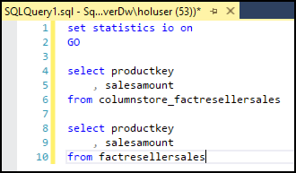

# Day 1, Experience 3 - Unlocking new capabilities with friction-free migrations to Azure SQL Managed Instance

ContosoAuto's primary database, `ContosoAuto`, is currently running the on-premises on SQL Server 2008 R2. They have looked at migrating this database into Azure in the past, but were unable to do so because they are using Service Broker, which is not supported in Azure SQL Database. The introduction of Azure SQL Managed Instance (SQL MI), however, now provides the ability to migrate their database into an managed Azure SQL database, and take advantage of features only available in Azure.

In this experience, you will migrate the `ContosoAuto` database from an on-premises SQL 2008 R2 database to SQL MI - Business Critical. You will start by using Data Migration Assistant (DMA) to copy the database up into SQL MI, and then updating ContosoAuto's web application to use the SQL MI database. Once that is complete, you will review some of the features that are only available in Azure to tune performance and security in the ContosoAuto database.

- [Day 1, Experience 3 - Unlocking new capabilities with friction-free migrations to Azure SQL Managed Instance](#day-1-experience-3---unlocking-new-capabilities-with-friction-free-migrations-to-azure-sql-managed-instance)
  - [Task 1: Migrate the database to SQL MI](#task-1-migrate-the-database-to-sql-mi)
  - [Task 2: Update web application to use SQL MI database](#task-2-update-web-application-to-use-sql-mi-database)
  - [Task 3: Review and improve query performance](#task-3-review-and-improve-query-performance)
  - [Task 4: Enable Dynamic Data Masking](#task-4-enable-dynamic-data-masking)
  - [Task 5: Add clustered columnstore index](#task-5-add-clustered-columnstore-index)
  - [Task 6: Transactional replication](#task-6-transactional-replication)
  - [Task 7: Use online secondary for reporting](#task-7-use-online-secondary-for-reporting)
  - [Task 8: Replication from SQL MI to SQL Server on-premises](#task-8-replication-from-sql-mi-to-sql-server-on-premises)
  - [Task 9: Enable Advanced Data Security](#task-9-enable-advanced-data-security)

## Task 1: Migrate the database to SQL MI

Service Broker is a feature of SQL Server used for sending and receiving guaranteed, asynchronous messages by using extensions to the Transact-SQL Data Manipulation Language (DML). ContosoAuto is using this for several critical processes, and they cannot afford to lose this capability in migrating their application database to the cloud.

In this task, you will use the Microsoft Data Migration Assistant (DMA) to perform assessments on the `ContosoAutoDb` database. You will create two assessments, one for a migration to Azure SQL Database, and then a second for SQL MI. These assessments will provide reports about any feature parity and compatibility issues.

1. Launch the Microsoft Data Migration Assistant on your lab VM.

2. In the DMA dialog, select **+** to create a new project.

    

3. In the New project pane, set the following:

    - **Project type**: Select Assessment.
    - **Project name**: Enter ToAzureSqlDb.
    - **Source server type**: Select SQL Server.
    - **Target server type**: Select Azure SQL Database

    

4. Select **Create**.

5. On the **Options** screen, ensure **Check database compatibility** and **Check feature parity** are both checked, and then select **Next**.

    

6. On the **Sources** screen, enter the following into the **Connect to a server** dialog that appears on the right-hand side:

    - **Server name**: Enter the IP address of your SqlServer2008R2 VM. You can retrieve this by navigating to the VM resource in the Azure portal, and copying the **Public IP address** value on the overview blade.
    - **Authentication type**: Select SQL Server Authentication.
    - **Username**: Enter sa.
    - **Password**: Enter **Password.1!!**.
    - **Encrypt connection**: Check this box.
    - **Trust server certificate**: Check this box.

        

7. Select **Connect**.

8. On the **Add sources** dialog that appears next, check the box for **ContosoAutoDb** and select **Add**.

    

9. Select **Start Assessment**.

    

10. Review the assessment of ability to migrate to Azure SQL Database.

    

    > The DMA assessment for a migrating the `ContosoAutoDb` database to a target platform of Azure SQL Database shows two features which are not supported in Azure SQL Database. These features, cross-database references and Service broker, will prevent ContosoAuto from migrating to the Azure SQL Database PaaS offering.

11. Now, you will perform a second assessment, this time for a migration to Azure SQL Database Managed Instance. To get started, select **+** on the left-hand menu to create another new project.

    

12. In the New project pane, set the following:

    - **Project type**: Select Assessment.
    - **Project name**: Enter ToAzureSqlMi.
    - **Source server type**: Select SQL Server.
    - **Target server type**: Select Azure SQL Database Managed Instance.

    

13. Select **Create**.

14. On the **Options** screen, ensure **Check database compatibility** and **Check feature parity** are both checked, and then select **Next**.

    

15. On the **Sources** screen, enter the following into the **Connect to a server** dialog that appears on the right-hand side:

    - **Server name**: Enter the IP address of your SqlServer2008R2 VM. You can retrieve this by navigating to the VM resource in the Azure portal, and copying the **Public IP address** value on the overview blade.
    - **Authentication type**: Select SQL Server Authentication.
    - **Username**: Enter sa.
    - **Password**: Enter **Password.1!!**.
    - **Encrypt connection**: Check this box.
    - **Trust server certificate**: Check this box.

        

16. Select **Connect**.

17. On the **Add sources** dialog that appears next, check the box for **ContosoAutoDb** and select **Add**.

    

18. Select **Start Assessment**.

    

19. Review the assessment of ability to migrate to Azure SQL Database Managed Instance.

    

    > The DMA assessment for a migrating the `ContosoAutoDb` database to a target platform of Azure SQL Database Managed Instance shows no feature parity. The database, including the cross-database references and Service broker features, can be migrated as is, allowing ContosoAuto to have a fully managed database instance running in Azure.

20. Next, you will migrate the `ContosoAutoDb` database from SQL 2008 R2 to SQL MI using a backup of the database stored in a Azure Blob storage account. For this, you will need to retrieve the host name of your SQL Managed Instance. In the [Azure portal](https://portal.azure.com), select **Resource groups** in the left-hand navigation menu and select the **tech-immersion** resource group from the list.

    

21. In the tech-immersion resource group, select your **SQL Managed Instance** resource.

    

22. On the overview blade of your SQL MI, copy the **host** value.

    

23. Now, open SQL Server Management Studio (SSMS) from the Windows Start menu and connect to your SQL MI database. On the connection dialog enter the following:

    - **Server name**: Paste the SQL MI host value you copied in the previous step.
    - **Authentication**: Select **SQL Server Authentication**.
    - **Login**: Enter **tiuser**.
    - **Password**: Enter **Password.1234567890**.

    

24. Select **Connect**.

25. Select **New Query** from the SSMS toolbar. In the new query window, paste the following SQL code.

    ```sql
    CREATE CREDENTIAL [https://techimmersionstorage.blob.core.windows.net/database-backup]
    WITH IDENTITY = 'SHARED ACCESS SIGNATURE'
    , SECRET = 'sv=2018-03-28&ss=bfqt&srt=sco&sp=rwdlacup&se=2099-03-10T23:02:10Z&st=2019-03-10T15:02:10Z&spr=https&sig=5AgfetYb9MumCIN%2FqpaaMtpUlwb0TLK%2FeBbpBz7Nj1A%3D'
    ```

    > The script above uses a pre-configured storage account and SAS token to [create a credential](https://docs.microsoft.com/sql/t-sql/statements/create-credential-transact-sql?view=sql-server-2017) in your Managed Instance.

26. Select **Execute** on the SSMS toolbar. You will see a message that the command completed successfully in the output window.

    

27. To verify your credential, select **New Query** again from the SSMS toolbar, paste the following SQL script to get a backup file list from the storage account into the new query window and select **Execute** from the toolbar.

    ```sql
    RESTORE FILELISTONLY FROM URL = 'https://techimmersionstorage.blob.core.windows.net/database-backup/ContosoAutoDb.bak'
    ```

    

28. You are now ready to restore the `ContosoAutoDb` database in SQL MI. Select **New Query** on the SSMS toolbar again, then paste the following SQL script to restore the database and select **Execute**.

    ```sql
    RESTORE DATABASE [ContosoAutoDb] FROM URL = 'https://techimmersionstorage.blob.core.windows.net/database-backup/ContosoAutoDb.bak'
    ```

29. The restore will take 1 - 2 minutes to complete. You will receive a "Commands completed successfully" message when it is done.

30. When the restore completes, expand **Databases** in the Object Explorer, and then expand **ContosoAutoDb** and **Tables**. You will see that the tables are all listed, and the SQL Server 2008R2 database has been successfully restored into SQL MI.

    

## Task 2: Update web application to use SQL MI database

1. Using a web browser, navigate to the [Azure portal](https://portal.azure.com), select **Resource groups** from the left-hand menu, and then select the resource group named **tech-immersion**.

    

2. In the tech-immersion resource group, select your **SQL Managed Instance** resource.

    

3. Select **Connections strings** under Settings in the left-hand menu, and then copy the ADO.NET connection string value by selecting the copy button to the right of the value.

    

4. Return to the **tech-immersion** resource group, and select the **tech-immersion App Service** from the list of resources.

    

5. On the App Service blade, select **Application settings** under Settings on the left-hand side.

    

6. On the Application settings blade, scroll down and locate the connection string named `contosoAutoConnStr` within the **Connection strings** section. Update the value of the `contosoAutoConnStr` connection string with the value you copied for the SQL MI database.

    

7. Select **Save** at the top of the Application settings blade.

    

8. Select **Overview** to the left of the Application settings blade to return to the overview blade of your App Service.

    

9. On the overview blade, click the **URL** of your App service to launch the website. This will open the URL in a browser window.

    

10. Verify that the web site and data is loaded correctly. The page should look similar to the following:

    TODO: INSERT image of web app with data loaded for products (parts).

> That is it. You were able to successfully connect your application to the new SQL MI database by simply updating the application's connection string. No other changes are needed!

## Task 3: Review and improve query performance

In this task, you will review Query Performance Insights in the Azure portal and enable Auto-tuning to improve query performance.

## Task 4: Enable Dynamic Data Masking

Dynamic Data Masking (DDM) limits sensitive data exposure by masking it to non-privileged users. This feature helps prevent unauthorized access to sensitive data by enabling customers to designate how much of the sensitive data to reveal with minimal impact on the application layer. It’s a policy-based security feature that hides the sensitive data in the result set of a query over designated database fields, while the data in the database is not changed.

> For example, a service representative at a call center may identify callers by several digits of their credit card number, but those data items should not be fully exposed to the service representative. A masking rule can be defined that masks all but the last four digits of any credit card number in the result set of any query. As another example, an appropriate data mask can be defined to protect personally identifiable information (PII) data, so that a developer can query production environments for troubleshooting purposes without violating compliance regulations.

In this task, you will enable DDM on the `CreditCard` table in the database, to prevent queries against that table from returning the full credit card number.

1. Open SSMS... and connect to the SQL MI database, if you are not already connected...

2. Expand **Tables** under the **ContosoAutoDb** and locate the `Sales.CreditCard` table.

3. Create a New query for the database, then copy and paste the following query into the query window:

    ```sql
    SELECT TOP (10) * FROM [Sales].[CreditCard]
    ```

    > In the results of the query above, notice that full credit card numbers are displayed.

4. Now, let's apply DDM to the field. Execute the following to apply a mask to the `CardNumber` field.

    ```sql
    ALTER TABLE [Sales].[CreditCard]
    ALTER COLUMN [CardNumber] NVARCHAR(25) NOT NULL MASKED WITH (FUNCTION = 'partial(0,"xxxx-xxxx-xxxx-",4)')
    ```

5. Run the `SELECT` query again, and observe the results.

    ```sql
    SELECT TOP (10) * FROM [Sales].[CreditCard]
    ```

## Task 5: Add clustered columnstore index

In this task, you will create a new table based on the existing `FactResellerSales` table and apply a ColumnStore index.

1. In SSMS, ensure you are connected to the Azure SQL Database Managed Instance.

2. Open a new query window by selecting **New Query** from the toolbar.

    

TODO: Change the table this is being applied to, and update screen shots where necessary.

3. Copy the script below, and paste it into the query window:

    ```sql
    USE ContosoAuto

    SELECT *
    INTO ColumnStore_FactResellerSales
    FROM FactResellerSales
    GO
    ```

4. Select **Execute** on the toolbar to run the query, and create a new table named `ColumnStore_FactResellerSales`, populated with data from the `FactResellerSales` table.

    

5. Select **New Query** in the toolbar again, and paste the following query into the new query window. The query contains multiple parts; one to get the size of the `ColumnStore_FactResellerSales` table, a second to create a clustered ColumnStore index on the ColumnStore_FactResellerSales table, and then the size query is repeated to get the size after adding the clustered ColumnStore index.

    ```sql
    USE [ContosoAuto]

    -- Get the Size of the ColumnStore_FactResellerSales table
    SELECT
    t.Name AS TableName,
    p.rows AS RowCounts,
    CAST(ROUND((SUM(a.total_pages) / 128.00), 2) AS NUMERIC(36, 2)) AS Size_MB
    FROM sys.tables t
    INNER JOIN sys.indexes i ON t.OBJECT_ID = i.object_id
    INNER JOIN sys.partitions p ON i.object_id = p.OBJECT_ID AND i.index_id = p.index_id
    INNER JOIN sys.allocation_units a ON p.partition_id = a.container_id
    WHERE t.Name = 'ColumnStore_FactResellerSales'
    GROUP BY t.Name, p.Rows
    GO

    -- Create a clustered columnstore index on the ColumnStore_FactResellerSales table
    CREATE CLUSTERED COLUMNSTORE INDEX [cci_FactResllerSales]
    ON [dbo].[ColumnStore_FactResellerSales]
    GO

    -- Get the Size of the ColumnStore_FactResellerSales table
    SELECT
    t.Name AS TableName,
    p.rows AS RowCounts,
    CAST(ROUND((SUM(a.total_pages) / 128.00), 2) AS NUMERIC(36, 2)) AS Size_MB
    FROM sys.tables t
    INNER JOIN sys.indexes i ON t.OBJECT_ID = i.object_id
    INNER JOIN sys.partitions p ON i.object_id = p.OBJECT_ID AND i.index_id = p.index_id
    INNER JOIN sys.allocation_units a ON p.partition_id = a.container_id
    WHERE t.Name = 'ColumnStore_FactResellerSales'
    GROUP BY t.Name, p.Rows
    GO
    ```

6. Select **Execute** on the toolbar to run the query.

7. In the query results, observe the `Size_MB` value of the table before and after the creation of the clustered ColumnStore index. The first value is the size before the index was created, and the second value is the size after the ColumnStore index was created.

    

8. Create a new query window by selecting **New Query** from the toolbar, and select **Include Actual Execution Plan** by selecting its button in the toolbar.

    

9. Paste the queries below into the new query window, and select **Execute** on the toolbar:

    ```sql
    SELECT productkey, salesamount
    FROM ColumnStore_FactResellerSales

    SELECT productkey, salesamount
    FROM FactResellerSales
    ```

10. In the Results pane, select the **Execution Plan** tab. Check the (relative to the batch) percentage value of the two queries and compare them.

    

11. Run the same queries again, but this time set statistics IO on in the query by adding the following to the top of the query window:

    ```sql
    SET STATISTICS IO ON
    GO
    ```

12. Your query should look like:

    

13. Select **Execute** from the toolbar to run the query.

14. Statistics IO reports on the amount of logical pages that are read in order to return the query results. Select the **Messages** tab of the Results pane, and compare two numbers, logical reads and lob logical reads. You should see a significant drop in total number of logical reads on the columns store table.

    

## Task 6: Transactional replication

TODO: Validate that this is needed, or modify to just highlight how the automatically created online secondary can be used. Online secondary is automatically created with Business Critical tier of SQL MI.

## Task 7: Use online secondary for reporting

In this task, you will look at how you can use the automatically created online secondary for reporting, without feeling the impacts of a heavy transactional load on the primary database.

## Task 8: Replication from SQL MI to SQL Server on-premises

## Task 9: Enable Advanced Data Security

In this task, you will enable Advance Data Security for the `ContosoAuto` database and review its features, including vulnerability assessment capabilities to reveal sensitive data in the database. You will also examine how to use Azure Monitor to see the big picture... (TODO: REWORD THIS!)