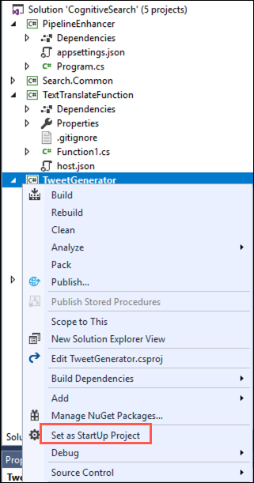
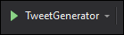

# Data & AI Tech Immersion Workshop – Product Review Guide and Lab Instructions


## Day 2, Experience 2 - Yield quick insights from unstructured data with Knowledge Mining and Cognitive Search

- [Data & AI Tech Immersion Workshop – Product Review Guide and Lab Instructions](#data--ai-tech-immersion-workshop-%E2%80%93-product-review-guide-and-lab-instructions)
  - [Day 2, Experience 2 - Yield quick insights from unstructured data with Knowledge Mining and Cognitive Search](#day-2-experience-2---yield-quick-insights-from-unstructured-data-with-knowledge-mining-and-cognitive-search)
  - [Technology overview](#technology-overview)
  - [Scenario overview](#scenario-overview)
  - [Task 1: Populate Cosmos DB with tweets from a generator](#task-1-populate-cosmos-db-with-tweets-from-a-generator)
  - [Task 2: Create a basic Cognitive Search pipeline using the Azure portal](#task-2-create-a-basic-cognitive-search-pipeline-using-the-azure-portal)
  - [Task 3: Enhance the Cognitive Search pipeline](#task-3-enhance-the-cognitive-search-pipeline)
  - [Task 4: Deploy a custom skill](#task-4-deploy-a-custom-skill)
  - [Task 5: Integrate custom skill into pipeline](#task-5-integrate-custom-skill-into-pipeline)
  - [Task 6: Run indexer and query data](#task-6-run-indexer-and-query-data)
  - [Wrap-up](#wrap-up)
  - [Additional resources and more information](#additional-resources-and-more-information)

## Technology overview

Cognitive search is an AI feature in Azure Search, used to extract text from images, blobs, and other unstructured data sources - enriching the content to make it more searchable in an Azure Search index. Extraction and enrichment are implemented through cognitive skills attached to an indexing pipeline. AI enrichments are supported in the following ways:

- **Natural language processing** skills include [entity recognition](https://docs.microsoft.com/en-us/azure/search/cognitive-search-skill-entity-recognition), [language detection](https://docs.microsoft.com/en-us/azure/search/cognitive-search-skill-language-detection), [key phrase extraction](https://docs.microsoft.com/en-us/azure/search/cognitive-search-skill-keyphrases), text manipulation, and [sentiment detection](https://docs.microsoft.com/en-us/azure/search/cognitive-search-skill-sentiment). With these skills, unstructured text can assume new forms, mapped as searchable and filterable fields in an index.
- **Image processing** skills include [Optical Character Recognition (OCR)](https://docs.microsoft.com/en-us/azure/search/cognitive-search-skill-ocr) and identification of [visual features](https://docs.microsoft.com/en-us/azure/search/cognitive-search-skill-image-analysis), such as facial detection, image interpretation, image recognition (famous people and landmarks) or attributes like colors or image orientation. You can create text-representations of image content, searchable using all the query capabilities of Azure Search.


Cognitive skills in Azure Search are based on machine learning models in Cognitive Services APIs: [Computer Vision](https://docs.microsoft.com/azure/cognitive-services/computer-vision/) and [Text Analysis](https://docs.microsoft.com/azure/cognitive-services/text-analytics/overview).

Natural language and image processing is applied during the data ingestion phase, with results becoming part of a document's composition in a searchable index in Azure Search. Data is sourced as an Azure data set and then pushed through an indexing pipeline using whichever built-in skills you need. The architecture is extensible so if the [built-in skills](https://docs.microsoft.com/en-us/azure/search/cognitive-search-predefined-skills) are not sufficient, you can create and attach [custom skills](https://docs.microsoft.com/en-us/azure/search/cognitive-search-create-custom-skill-example) to integrate custom processing. Examples might be a custom entity module or document classifier targeting a specific domain such as finance, scientific publications, or medicine.

## Scenario overview

ContosoAuto is interested in using their unstructured data to gain further insights into how customers perceive their business, and the key things their customers are talking about. They are looking for a pilot that would use tweets streamed from Twitter into a `tweets` collection in their Cosmos DB instance to better understand what customers are saying about their organization on the platform. They are also looking to get a better understanding of whether the trend of messages is positive, negative, or neutral by performing sentiment analysis on the tweets.

In this experience, you will learn the mechanics of using Cognitive Search and Knowledge Mining to yield rapid insights into unstructured data. Using a combination of preconfigured and custom cognitive skills in Azure Search, you will create a Cognitive Search indexing pipeline that enriches source data in route to an index. Cognitive skills are natural language processing (NLP) and image analysis operations that extract text and text representations of an image, detect language, entities, key phrases, and more. The end result is rich additional content in an Azure Search index, created by a cognitive search indexing pipeline. The output is a full-text searchable index on Azure Search.

## Task 1: Populate Cosmos DB with tweets from a generator

For this experience, you will be using the `tweets` collection in ContosoAuto's Cosmos DB as the data source for your Cognitive Search pipeline. In order to use Cosmos DB as a data source, documents must exist in the target collection prior to creating the Data Source in Azure Search. In this task, you will populate the `tweets` collection in your Cosmos DB `ContosoAuto` database using a tweet generator application running in Visual Studio.

1. Open File Explorer and navigate to `C:\lab-files\ai\2`. Double-click on **`CognitiveSearch.sln`** to open the solution in Visual Studio. If you are prompted about how to open the file, choose **Visual Studio 2017**. If you are prompted by Visual Studio to log in, use the Azure credentials you are using for this workshop.

   

   The Visual Studio solution contains the following projects:

   - **PipelineEnhancer**: Console app that interacts with Azure Search Service REST APIs to enhance the Cognitive Search pipeline.
   - **Search.Common**: Common library containing models and structs used by the `PipelineEnhancer` to communicate with the Azure Search Service APIs.
   - **TextTranslateFunction**: Azure Function with an HTTP Trigger that will be used translate non-English tweets to English.
   - **TweetGenerator**: Console app that generates simulated tweets and sends them to Cosmos DB.
   - **Twitter.Common**: Common library containing models and structs used by the other projects within the solution.

2. In the Solution Explorer on the left-hand side of Visual Studio, expand the **TweetGenerator** project, and then locate and open the `appsettings.json` file.

   

3. Next, you need to retrieve your Cosmos DB connection string. This will be used to enable the TweetGenerator to write data into your `tweets` collection. In the [Azure portal](https://portal.azure.com), select **Resource groups** from the left-hand menu, and then select the **tech-immersion-XXXXX** resource group (where XXXXX is the unique identifier assigned to you for this workshop).

   

4. Select the **tech-immersionXXXXX** Azure Cosmos DB account from the list of resources (where XXXXX is the unique identifier assigned to you for this workshop).

   

   > **IMPORTANT**: There may be two Cosmos DB accounts in your resource group. Select the Cosmos DB account named **tech-immersionXXXXX**, with no hyphen between immersion and XXXXX.

5. On your Cosmos DB blade, select **Keys** from the left-hand menu.

   

6. Copy the **Primary Connection String** value by selecting the copy button to the right of the field.

   

7. Return to the `appsettings.json` file in Visual Studio and paste the Primary Connection String into the value for the `COSMOS_DB_CONNECTION_STRING` setting. Your `appsettings.json` file should look similar to the following:

   

8. Save `appsettings.json`.

9. Right-click on the `TweetGenerator` project, and select **Set as StartUp Project** from the context menu.

   

10. Run the console app by selecting the button in the toolbar with the green arrow and text of **TweetGenerator**.

   

> Leave the `TweetGenerator` console app running in the background while you move on to the remaining tasks in this experience. The app will run for 10 minutes, sending random tweets into your Cosmos DB `tweets` collection, so you have data to work with in the remaining tasks of this experience. In the next task, you will set up an Azure Search Index which points to the `tweets` collection in Cosmos DB, so as new tweets are added, they will be indexed.

## Task 2: Create a basic Cognitive Search pipeline using the Azure portal

With data now streaming into your Cosmos DB `tweets` collection, you are ready to set up a basic Cognitive Search pipeline using the Azure portal. In this task, you will create an Azure Search Index and configure an Azure Search Indexer to read tweets from your Cosmos DB collection. You will also include several pre-configured skills linked to your Cognitive Services account to extract more information out of the tweets being indexed.

1. Return to your Azure Cosmos DB account blade in the [Azure portal](https://portal.azure.com), and select **Data Explorer** from the toolbar on the overview blade.

   

2. Under the `ContosoAuto` database, expand the **tweets** collection and then select **Documents**.

   

3. In the documents pane, select any of the documents listed and inspect a tweet document. Documents are stored in JSON (JavaScript Object Notation) format in Cosmos.

   

   > The `text` field, which contains the content of the tweet, and is what you will be using as you begin building your Cognitive Search pipeline. You will be using other fields later, such as the `user` entity, so take time to review these structures in the document as well.

4. With a better understanding of the structure of the tweet documents stored in Cosmos DB, let's move on to creating a basic Cognitive Search pipeline. From your Cosmos DB blade in the Azure portal, select **Add Azure Search** from the left-hand menu, select your **tech-immersion** search service, and then select **Next: Connect to your data**.

   

5. On the **Connect to your data** tab, enter the following:

   - **Data source**: This should be pre-populated with **Cosmos DB**. The data source object tells Azure Search how to retrieve external source data.
   - **Name**: Enter **tweets-cosmosdb**.
   - **Cosmos DB account**: This should be pre-populated with the connection string for your Cosmos DB account.
   - **Database**: Select the **ContosoAuto** database.
   - **Collection**: Select the **tweets** collection.
   - **Query**: Paste the SQL statement below into the field.

     ```sql
     SELECT * FROM c WHERE c._ts > @HighWaterMark ORDER BY c._ts
     ```

   - **Query results ordered by \_ts**: Check this box.

   

6. Select **Next: Add cognitive search (Optional)**.

   > In this step, you will add a set of enrichment steps to the data being ingested from Cosmos DB. In a Cognitive Search pipeline, individual enrichment steps are called _skills_, and the collection of enrichment steps is a _skillset_. The predefined skills available at this step through the UI use pre-trained models to extract additional information from the documents. The [EntityRecognitionSkill](https://docs.microsoft.com/en-us/azure/search/cognitive-search-skill-entity-recognition) extracts entities (people, location, organization, emails, URLs, DateTime fields) from the document. The [LanguageDetectionSkill](https://docs.microsoft.com/en-us/azure/search/cognitive-search-skill-language-detection) is used to detect the primary language used in the document, and the [KeyPhraseExtractionSkill](https://docs.microsoft.com/en-us/azure/search/cognitive-search-skill-keyphrases) detects important phrases based on term placement, linguistic rules, proximity to other terms, and how unusual the term is within the source data. Read about all of the available [predefined cognitive skills](https://docs.microsoft.com/en-us/azure/search/cognitive-search-predefined-skills) to learn more.

7. On the **Add cognitive search (Optional)** tab:

   - Expand **Attached Cognitive Services** and select your **tech-immersion-cogserv** instance. This will associate your Cognitive Services account with the Skillset you are creating.
   - Expand **Add Enrichments**, enter **tweet-skillset** as the name, and select **text** as the source data field. Check the box next to Cognitive Skills to select all of the options.

   

   > Cognitive search is an AI feature in Azure Search, used to extract text from images, blobs, and other unstructured data sources - enriching the content to make it more searchable in an Azure Search index. Extraction and enrichment are implemented through cognitive skills attached to an indexing pipeline. Cognitive skills in Azure Search are based on machine learning models in Cognitive Services APIs: [Computer Vision](https://docs.microsoft.com/azure/cognitive-services/computer-vision/) and [Text Analysis](https://docs.microsoft.com/azure/cognitive-services/text-analytics/overview). To learn more, read [What is "cognitive search" in Azure Search](https://docs.microsoft.com/en-us/azure/search/cognitive-search-concept-intro).

8. Select **Next: Customize target index**.

9. On the **Customize target index** tab, do the following:

    - **Name**: Enter **tweet-index**.
    - **Key**: Leave this set to **rid**.
    - **Suggester name**: Leave this blank.
    - **Search mode**: Leave this blank.
    - Use the image below to set the checkboxes and settings for each field.

    

    > On the Index page, you are presented with a list of fields with a data type and a series of checkboxes for setting index attributes. You can bulk-select attributes by clicking the checkbox at the top of an attribute column. Choose Retrievable and Searchable for every field that should be returned to a client app and subject to full text search processing. You'll notice that integers are not full text or fuzzy searchable (numbers are evaluated verbatim and are often useful in filters). Read the description of [index attributes](https://docs.microsoft.com/en-us/rest/api/searchservice/create-index#bkmk_indexAttrib) for more information.

10. Select **Next: Create an indexer**.

11. On the **Create an indexer** tab, set the following:

    - **Name**: Enter **tweet-indexer**.
    - **Schedule**: Select **Custom**, and enter **5** into the **Interval (minutes)** field.

    

    > An indexer in Azure Search is a crawler that extracts searchable data and metadata from an external Azure data source and populates an index based on field-to-field mappings between the index and your data source. This approach is sometimes referred to as a 'pull model' because the service pulls data in without you having to write any code that adds data to an index.

12. Select **Submit**.

13. Next, navigate to the **techimmersionXXXXX** Azure Search Service (where XXXXX is the unique identifier assigned to you for this workshop) in the Azure portal by selecting it from the list of resources in the **tech-immersion-XXXXX** resource group.

    

14. On the Azure Search service blade, select **Indexers**.

    

15. Your indexer was scheduled to run every 5 minutes, which is the minimum allowable time. If your indexer has a status of **No history**, you can bypass the scheduled time, and force the indexer to run, by selecting the indexer, and then selecting **Run** on the Indexer blade.

    

16. Once your Indexer has run, select **Search explorer** on the Search Service toolbar.

    

17. On the Search explorer tab, select **Search** and observe the results.

    

18. Looking at the items in the search results, you will see that they are resemble the following:

    ```json
    {
      "@search.score": 1,
      "created_at": "3/7/2019 6:11:28 PM",
      "id_str": "707132469",
      "text": "@ContosoAuto Thank you for the amazing service at the Phoenix, AZ service center #Tesla #Model3",
      "id": "d9f80431-a1da-4cb8-84d8-093e9bdf9a8b",
      "rid": "YmpnZEFKMUhibTAtQUFBQUFBQUFBQT090",
      "people": [],
      "organizations": [],
      "locations": ["Phoenix", "AZ"],
      "keyphrases": [
        "amazing service",
        "AZ service center",
        "Phoenix",
        "Tesla"
      ],
      "language": "en"
    }
    ```

    > You may notice that several of the fields available in the `tweet` documents stored in Cosmos DB are not in the search result JSON object. For example, the `user` entity, which is a child object of a `tweet`, is not available to add to your search index when using the UI. To leverage the full capabilities of Cognitive Search in Azure, you will need to use the REST APIs. To learn more about using the REST API and how to use them for building a more robust Cognitive Search pipeline, you can review the [Azure Search Service REST API documentation](https://docs.microsoft.com/en-us/rest/api/searchservice/).

## Task 3: Enhance the Cognitive Search pipeline

In the previous task, you created the beginnings of your Cognitive Search pipeline when you added Cognitive Skills for extracting people, organization and location names, key phrases and for detecting the primary language. In this task, you will enhance your Cognitive Search pipeline using functionality available only through the [Azure Search Service REST APIs](https://docs.microsoft.com/en-us/rest/api/searchservice/).

1. First, you will run a simple Visual Studio console application, `PipelineEnhancer`, which will make calls to the Azure Search Service REST APIs to update your Skillset, Index, and Indexer to accommodate the a new field named `sentiment`.

2. To prepare the console application, you need to update the `appsettings.json` file for the project in information about your search service. Return to Visual Studio, and open the `appsettings.json` file located under the `PipelineEnhanceer` project.

   

   The `appsettings.json` file will look like the following, and here you can see the values that you need to retrieve before moving on.

   

3. To retrieve values for the required settings for your Azure Search Service, navigate to your Azure Search Service in the Azure portal by selecting it from the list of resources in the **tech-immersion-XXXXX** resource group (where XXXXX is the unique identifier assigned to you for this workshop).

   

4. On the overview blade of your search service, copy the **Url** field.

   

5. Return to Visual Studio, and in the `appsettings.json` file, locate the line that looks like the following:

   ```json
   "AZURE_SEARCH_SERVICE_URL": "<enter your Azure Search Service URL here>"
   ```

6. Replace the value of the `AZURE_SEARCH_SERVICE_URL` setting by pasting the copied URL within double-quotes. The line should now look similar to this:

   ```json
   "AZURE_SEARCH_SERVICE_URL": "https://tech-immersion.search.windows.net"
   ```

7. Return to your Search Service blade in the Azure portal, select **Keys** from the left-hand menu, and the select the **Copy** button for the **PRIMARY ADMIN KEY**.

   

8. Return to Visual Studio and the `appsettings.json` file, and locate the `AZURE_SEARCH_SERVICE_KEY` setting. Paste the key you copied into the value for this setting. It should look similar to:

   ```json
   "AZURE_SEARCH_SERVICE_KEY": "B54E21DC49EB3B5A322190851F22BA8E"
   ```

9. Return to the Azure portal, and select the **Cognitive Services** account named **tech-immersion-cogserv** from the list of resources under the **tech-immersion-XXXXX** resource group (where XXXXX is the unique identifier assigned to you for this workshop).

   

   > **NOTE**: There are three different Cognitive Services accounts in the resource group. You will want the one named **tech-immersion-cogserv** for this experience.

10. On the Cognitive Services blade, select **Properties** from the left-hand menu, and then copy the value for the **Resource ID** field by selecting the copy button to the right of the field.

    

11. Return to Visual Studio and in the `appsettings.json` file, paste the **Resource ID** value into the `COGNITIVE_SERVICES_RESOURCE_ID` field value. It should look like the following:

    ```json
    "COGNITIVE_SERVICES_RESOURCE_ID": "/subscriptions/30fc406c-c745-44f0-be2d-63b1c860cde0/resourceGroups/tech-immersion/providers/Microsoft.CognitiveServices/accounts/tech-immersion-cog-services"
    ```

12. Return to your Cognitive Services account in the Azure portal, and select **Keys** from the left-hand menu. On the Keys blade, copy the **Key 1** value by selecting the copy button to the right of the field.

    

13. Return to Visual Studio and in the `appsettings.json` file, paste the Cognitive Services Key 1 value into the value for the `COGNITIVE_SERVICES_KEY` field. It will looks similar to the following.

    ```json
    "COGNITIVE_SERVICES_KEY": "872353ecac8d43a7bf5a60c3ece9ff4a"
    ```

14. The final settings you need to retrieve are those for your Azure Function App. In the Azure portal, navigate to your **ti-function-day2-XXXXX** Function App (where XXXXX is the unique identifier assigned to you for this workshop), and copy the **URL** on the Overview blade.

    

15. Return to the `appsettings.json` file for the `PipelineEnhancer` project in Visual Studio, and paste the value into the `AZURE_FUNCTION_APP_URL` setting. It should look similar to:

    ```json
    "AZURE_FUNCTION_APP_URL": "https://tech-immersion-functions.azurewebsites.net"
    ```

16. Back in the Azure portal, select **Function app settings** on the Overview blade.

    

17. On the Function app settings tab, select the **Copy** button next to the **default** Host Key.

    

18. Return to Visual Studio and the `appsettings.json` file for the `PipelineEnhancer` project, and paste default host key value into the `AZURE_FUNCTION_APP_DEFAULT_HOST_KEY` setting. It will look similar to the following:

    ```json
    "AZURE_FUNCTION_APP_DEFAULT_HOST_KEY": "IMsboDWGI9brkZHFpL8aFCVxuPVLnVAr6l6f2D6eqlLZ511MK50JbQ=="
    ```

19. Save `appsettings.json`. The file should now look like the following.

    

20. You are now ready to move on to adding the enhancements to your pipeline. The [create skillset API](https://docs.microsoft.com/en-us/rest/api/searchservice/create-skillset) uses the following endpoint:

    ```http
    PUT https://[servicename].search.windows.net/skillsets/[skillset name]?api-version=2017-11-11-Preview
    api-key: [admin key]
    Content-Type: application/json
    ```

21. To add the [sentiment analysis pre-built skill](https://docs.microsoft.com/en-us/azure/search/cognitive-search-skill-sentiment) to your search pipeline, the `PipelineEnhancer` app will append the following JSON to the body of the Skillset you created through the Azure portal UI.

    ```json
    {
      "@odata.type": "#Microsoft.Skills.Text.SentimentSkill",
      "inputs": [
        {
          "name": "text",
          "source": "/document/text"
        }
      ],
      "outputs": [
        {
          "name": "score",
          "targetName": "sentiment"
        }
      ]
    }
    ```

    > In the above JSON, the `inputs` specify the field in the source data document to send for analysis. The `outputs` section dictates that the `score` value returned by the Text Analytics in Cognitive Services should be output into a field named `sentiment` in the search results. This is sent into the REST API, along with the JSON from the previously built skillset to update or create the skillset.

22. To add sentiment analysis to your pipeline you will run the `PipelineEnhancer` project within the **CognitiveSearch** solution in Visual Studio. To run the project, right-click the `PipelineEnhancer` project in Visual Studio and select **Set as StartUp Project**.

    

23. Now, select the run button on the Visual Studio toolbar, which is the one with a green arrow followed by the text "PipelineEnhancer."

    

24. At the command prompt for the console app, enter **1** to incorporate the Sentiment cognitive skill to your pipeline.

    

25. When the console app completes you will receive a message stating that the sentiment analysis skill was successfully added.

    

    > In addition to updating the Skillset JSON, the Indexer and Index were also be updated to include a new field named `sentiment`.

26. The process above deleted and recreated your Index, Indexer and Skillset, so you may need to select **Indexers** and the **tweet-indexer** on your Azure Search Service blade, and then select **Run** to force the Indexer to run against your tweet data again before attempting to run a search against the index in the next step.

    > The Indexer **Run** screen does not refresh when the indexer has finished, so you can return to the overview blade of the Search service, and then select **Indexers**. Then, you can use the **Refresh** button on the Search service tool bar, next to Search explorer, to refresh the status. The **tweet-indexer** will display a status of **Success** when it finishes.

27. Return to your Azure Search service in the Azure portal and select **Search explorer** on the Search Service toolbar.

    

28. On the Search explorer tab, select **Search** and inspect one of the records in the search results.

    ```json
    {
      "@search.score": 1,
      "text": "@ContosoAuto Thank you for the amazing service at the Phoenix, AZ service center #Tesla #Model3",
      "rid": "YmpnZEFKMUhibTAtQUFBQUFBQUFBQT090",
      "people": [],
      "organizations": [],
      "locations": ["Phoenix", "AZ"],
      "keyphrases": [
        "amazing service",
        "AZ service center",
        "Phoenix",
        "Tesla"
      ],
      "language": "en",
      "sentiment": 0.994744300842285
    }
    ```

    > Notice the addition of the `sentiment` field to the bottom of the record. The value contained in this field is a numeric prediction made by a machine learning model about the sentiment of the contents of the `text` field in the tweet. Scores range from 0 to 1. Scores close to 1 indicate positive sentiment, and scores close to 0 indicate negative sentiment. Scores in the middle are considered to be neutral in the expression of sentiment. In the record above, the sentiment was determined to be very positive by the ML model.

29. Next, let's move on to adding user information from tweets to our search results. To accomplish this, you will use the [delete index](https://docs.microsoft.com/en-us/rest/api/searchservice/delete-index) and [delete indexer](https://docs.microsoft.com/en-us/rest/api/searchservice/delete-indexer) APIs to drop the index and indexer, and then use the [create index](https://docs.microsoft.com/en-us/rest/api/searchservice/create-index) and [create indexer](https://docs.microsoft.com/en-us/rest/api/searchservice/create-indexer) APIs to recreate them with a few fields added which point to the `user` object in the JSON tweet documents in Cosmos DB.

    > For this workshop, we are going to add the user's `location` and `name` fields to our search index.

    For the Index, the following JSON will be added to what was generated using the Azure portal UI:

    ```json
    {
      "name": "userLocation",
      "type": "Edm.String",
      "searchable": true,
      "filterable": true,
      "retrievable": true,
      "sortable": true,
      "facetable": false,
      "key": false,
      "indexAnalyzer": null,
      "searchAnalyzer": null,
      "analyzer": "standard.lucene",
      "synonymMaps": []
    },
    {
      "name": "userName",
      "type": "Edm.String",
      "searchable": true,
      "filterable": true,
      "retrievable": true,
      "sortable": true,
      "facetable": false,
      "key": false,
      "indexAnalyzer": null,
      "searchAnalyzer": null,
      "analyzer": "standard.lucene",
      "synonymMaps": []
    }
    ```

    > For each new field, `userLocation` and `userName`, the index properties are indicated by the additional fields.

    For the Indexer, this JSON code will be added:

    ```json
    {
      "sourceFieldName": "/document/user/location",
      "targetFieldName": "userLocation",
      "mappingFunction": null
    },
    {
      "sourceFieldName": "/document/user/name",
      "targetFieldName": "userName",
      "mappingFunction": null
    }
    ```

    > For each new field, `userLocation` and `userName`, an entry is added which maps the source field in the `tweet` document to an output field name.

30. Return to the `PipelineEnhancer` console app and enter **2** at the prompt to add the new user-related fields to your pipeline.

    

31. When the console app completes you will receive a success message. Navigate to your Azure Search service in the Azure portal and select **Search explorer**.

    > As before, the console app deleted and recreated your Index and Indexer. You may need to select **Indexers** and the **tweet-indexer**, and then select **Run** to force the Indexer to run against your tweet data again before attempting to run a search against the index.

32. On the Search explorer blade, select **Search** and inspect one of the records in the search results.

    ```json
    {
      "@search.score": 1,
      "text": "@ContosoAuto Thank you for the amazing service at the Phoenix, AZ service center #Tesla #Model3",
      "rid": "YmpnZEFKMUhibTAtQUFBQUFBQUFBQT090",
      "people": [],
      "organizations": [],
      "locations": ["the Phoenix", "AZ", "Tesla"],
      "keyphrases": [
        "amazing service",
        "AZ service center",
        "Phoenix",
        "Tesla"
      ],
      "language": "en",
      "sentiment": 0.994744300842285,
      "userLocation": "Sacramento, CA",
      "userName": "Ellis Maginnis"
    }
    ```

    > Note the addition of the `userLocation` and `userName` fields to the bottom of the record. The values in these fields are pulled directly from the `tweet` documents being indexed from Cosmos DB, but were not accessible using the Azure portal UI. Using the REST APIs, you are able to dig deeper into nested JSON documents, and index a richer set of the data stored in your documents.

33. Return to the `PipelineEnhancer` console app, and enter **X** at the command prompt to exit the console application.

## Task 4: Deploy a custom skill

In addition to predefined Cognitive skills, you can also integrate custom skills into your Cognitive Search pipeline. In this task, you will create a custom skill using the [Text Translate API](https://azure.microsoft.com/services/cognitive-services/translator-text-api/). The example uses an [Azure Function](https://azure.microsoft.com/services/functions/) to wrap the Translate Text API so that it implements the custom skill interface.

> While this example uses an Azure Function to host a web API, you can use any approach as long as it meets the [interface requirements for a cognitive skill](https://docs.microsoft.com/en-us/azure/search/cognitive-search-custom-skill-interface). Azure Functions, however, make it very easy to create custom skills.

1. Since you will be using the Translator Text API, you need retrieve your API key from the Azure portal, so it can be used by the Azure Function. As you've done with previous resources, select the **tech-immersion-translator** Cognitive Services resource from the **tech-immersion-XXXXX** resource group (where XXXXX is the unique identifier assigned to you for this workshop).

   

2. Once on your Cognitive Services blade, select **Keys** from the left-hand menu, and then select the Copy button next to the value for **Key 1**.

   

3. Return to Visual Studio, and in the Solution Explorer on the right-hand side, expand the `TextTranslateFunction` project and then double-click `Function1.cs` to open the file.

   

4. In the `Function1.cs` file, locate the line of code (line 22) that looks like the following:

   ```csharp
   // NOTE: Replace this example key with a valid subscription key.
   static string key = "<enter your api key here>";
   ```

5. Replace the value with double-quotes (`<enter your api key here>`) with the API key you copied for the Translator Cognitive Service. The line should now look similar to this:

   ```csharp
   static string key = "460a0dff9bb541ce81bc16956e119f37";
   ```

6. Save `Function1.cs`.

   > Take a few minutes to look over the code in `Function1.cs`. This file defines the Function that will be deployed to your Azure Function App. The function code receives the tweet text and the detected language from the custom skill. Only those tweets with a language determined to not be English will be translated by the Translator Text API. For all English tweets, the original text is returned unmodified.

7. You are now ready to deploy the function into your Azure Function App. Right-click the `TextTranslateFunction` project, and select **Publish** from the context menu.

   

8. On the **Pick a publish target** dialog, choose **Select Existing** and select **Publish**.

   

9. On the **App service** dialog, select your Subscription and locate the **tech-immersion-XXXXX** resource group (where XXXXX is the unique identifier assigned to you for this workshop) in the list. Select the Function App named **ti-function-day2-XXXXX** from the list of resources (where XXXXX is the unique identifier assigned to you for this workshop).

   

   > You may need to enter the credentials of the account you are using for this workshop before you can see any resources for your subscription.

10. Select **OK**. This will start the publish process. You will see an animated progress icon next to the Publish button while the deployment is in progress.

    

11. When the publish is complete, you can open the **Output** window at the bottom left-hand corner of the Visual Studio window to observe the results. You should see messages that the **Publish Succeeded** and **Publish completed**.

    

    > If the Output window is not visible, you can display it by selecting the **View** menu in Visual Studio, and then selecting **Output**.

## Task 5: Integrate custom skill into pipeline

With the Function App now in place to support your Text Translator custom skill, you are ready to integrate a new custom skill using the [custom skill interface](https://docs.microsoft.com/en-us/azure/search/cognitive-search-custom-skill-interface), which is accessed by adding a `WebApiSkill` to the skillset. In this task, you will add a custom skill into the Cognitive Search pipeline you created previously.

> Another change that will be made as the new custom skill is added is to update all the previously added predefined skills, except the language detection skill, to use the new `textTranslated` field as input. This will allow all the Cognitive Skills to run against the English language version of the text.

1. To add the custom skill to your search pipeline the following JSON will be appended to the body of the Skillset you built with the UI by the `PipelineEnhancer` app.

   ```json
   {
     "@odata.type": "#Microsoft.Skills.Custom.WebApiSkill",
     "description": "Custom translator skill",
     "uri": "http://<your-function-app-name>.azurewebsites.net/api/Translate?code=<default-host-key>",
     "batchSize": 1,
     "context": "/document",
     "inputs": [
       {
         "name": "text",
         "source": "/document/text"
       },
       {
         "name": "language",
         "source": "/document/language"
       }
     ],
     "outputs": [
       {
         "name": "text",
         "targetName": "textTranslated"
       }
     ]
   }
   ```

   > In the above JSON, the `inputs` specify the field in the source data document to send for analysis. The `outputs` section dictates that the `text` value returned by your Function App should output into a field named `textTranslated` in the search results. This is sent into the REST API, along with the JSON from the previously built skillset to update or create the skillset.

2. Note that there are two values within the `uri` field of your custom skill that will need to be supplied to your custom skill, so it can connect to your Function app: the Function App name and default host code. You already added these values to your `appsettings.json` file.

3. Relaunch the `PipelineEnhancer` console app by selecting the **Run** button on the Visual Studio toolbar.

   

4. In `PipelineEnhancer` console window and enter **3** at the prompt. This step will incorporate the custom cognitive skill into your pipeline.

   

   > In addition to updating the Skillset JSON, the Indexer and Index were also be updated to include a new field named `textTranslated`.

5. When the console app completes, enter **X** at the prompt to close the application.

   

## Task 6: Run indexer and query data

In this task, you will run your Search Indexer and then query data in the index.

1. In the Azure portal, navigate to your **Search service** resource and select **Search explorer** in the toolbar on the overview blade.

   

   > The last step of Task 5 deleted and recreated your Index, Indexer and Skillset. If you don't see any search results, you may need to select **Indexers** on the Overview blade and then **tweet-indexer**. Select **Run** to force the Indexer to run against your tweet data again before attempting to run a search against the index.

2. On the Search explorer tab, select **Search** and observe the results.

   

3. You can now play around with the search functionality. Below, you will enter a few queries that simulate what an application user may enter. These queries tend to resemble natural language, so we will start there. In the Query string field, enter "language is es", and observe the results. This will return one of the records in the search results where the language was detected as Spanish.

   ```json
   {
     "@search.score": 0.94444835,
     "text": "@ContosoAuto Mi 2019 #Ford #Mustang es el mejor auto de todos!",
     "rid": "YmpnZEFKMUhibTN2QkFBQUFBQUFBQT090",
     "userLocation": "Boston, MA",
     "userName": "Brian Navedo",
     "people": [],
     "organizations": ["Ford"],
     "locations": [],
     "keyphrases": ["Mustang", "Ford", "the best"],
     "language": "es",
     "sentiment": 0.986368536949158,
     "textTranslated": "@ContosoAuto My 2019 #Ford #Mustang is the best car of all!"
   }
   ```

   > Notice the addition of the `textTranslated` field to the bottom of the record. This contains the English translation of the contents of the `text` field in the tweet. You will also notice that the `keyphrases` field contains only English words and phrases. This is because the `KeyPhraseExtractionSkill` was pointed to the new `textTranslated` field with the latest updates to the search pipeline.

   

   > In addition, notice that each record returned contains a `@search.score` field with a numeric value. This value indicates the confidence of the match with the search query. The higher the value, the more likely it is to be a match for the query. If you scroll down past the records where `"language"="es"`, you will see the search score values drop, as those records don't match the query.

4. Try another search, such as "cold battery" and observe the results.

   

5. Now, let's try a slightly more advanced search. We want to look for only records that mention a "corvette", and we only want to retrieve the `text`, `userLocation`, and `sentiment` fields in our results. Paste the following into the Query string box, and select **Search**:

   ```http
   search=corvette&$select=text,userLocation,sentiment&$count=true
   ```

   

   > Add `$select` limits results to the explicitly named fields for more readable output in Search explorer.

6. You can take that query even further by adding in the `$filter` parameter. Use the `$filter` parameter when you want to specify precise criteria rather than free text search. This example searches for sentiment less than 0.25, so we can target tweets with negative sentiment in the search results.

   ```http
   search=corvette&$select=text,userLocation,sentiment&$filter=sentiment lt 0.25&$count=true
   ```

   

7. The final query we will run adds the `$orderBy` parameter, which allow you to specify the sort order of your results. In this case, let's search for records where the sentiment is the highest, filtering for records where the sentiment is greater than 0.9, and ordering the results in descending order.

   ```http
   search=*&$select=text,userLocation,sentiment&$filter=sentiment gt 0.9&$count=true&$orderby=sentiment desc
   ```

   

   > In the search results, observe that the sentiment values slowly decrease as you scroll down through the returned documents.

## Wrap-up

In this experience, you learned how to leverage Azure Search and Cognitive Services to perform knowledge mining on unstructured data stored in Cosmos DB. Using a combination of preconfigured and custom cognitive skills, you built a Cognitive Search pipeline to enrich the source data in route to an Azure Search Index.

Using preconfigured cognitive skills, you were able to add language detection, sentiment analysis, and key phrase and entity extraction to your search pipeline. These skills enriched your search index with additional metadata about the tweets being indexed.

You then used an Azure Function App to create a custom cognitive skill, which used the Translator Text Cognitive Service to translate tweets into English. Using the Custom Web API skill, you integrated the custom skill to your cognitive search pipeline.

The end result is rich additional content in an Azure Search index, created by a cognitive search indexing pipeline. The output is a full-text searchable index on Azure Search.

## Additional resources and more information

To continue learning and expand your understanding of Knowledge Mining with Cognitive Search, use the links below.

- [Introduction to Azure Search](https://docs.microsoft.com/azure/search/search-what-is-azure-search)
- [Introduction to Cognitive Services](https://docs.microsoft.com/azure/cognitive-services/welcome)
- [Introduction to Cognitive Search](https://docs.microsoft.com/azure/search/cognitive-search-concept-intro)
- [Attach a Cognitive Services resource with a skillset in Azure Search](https://docs.microsoft.com/azure/search/cognitive-search-attach-cognitive-services)
- [Azure Search Service REST API](https://docs.microsoft.com/azure/search/search-api-preview)
- [Predefined Cognitive Search skills](https://docs.microsoft.com/azure/search/cognitive-search-predefined-skills)
  - [Key Phrase Extraction](https://docs.microsoft.com/azure/search/cognitive-search-skill-keyphrases)
  - [Language Detection](https://docs.microsoft.com/azure/search/cognitive-search-skill-language-detection)
  - [Entity Recognition](https://docs.microsoft.com/azure/search/cognitive-search-skill-entity-recognition)
  - [Text Merger](https://docs.microsoft.com/azure/search/cognitive-search-skill-textmerger)
  - [Text Split](https://docs.microsoft.com/azure/search/cognitive-search-skill-textsplit)
  - [Sentiment](https://docs.microsoft.com/azure/search/cognitive-search-skill-sentiment)
  - [Image Analysis](https://docs.microsoft.com/azure/search/cognitive-search-skill-image-analysis)
  - [Optical Character Recognition (OCR)](https://docs.microsoft.com/azure/search/cognitive-search-skill-ocr)
  - [Shaper](https://docs.microsoft.com/azure/search/cognitive-search-skill-shaper)
- [Custom Web API skill](https://docs.microsoft.com/azure/search/cognitive-search-custom-skill-web-api)
- [How to add a custom skill to a cognitive search pipeline](https://docs.microsoft.com/azure/search/cognitive-search-custom-skill-interface)
- [Learn how to call cognitive search APIs](https://docs.microsoft.com/azure/search/cognitive-search-tutorial-blob)
- [Learn Cognitive Search](https://azure.github.io/LearnAI-Cognitive-Search/)
- [Enterprise Knowledge Mining Bootcamp](https://azure.github.io/LearnAI-KnowledgeMiningBootcamp/)
- [Azure Search pricing](https://azure.microsoft.com/pricing/details/search/)
