# Data & AI Tech Immersion Workshop – Product Review Guide and Lab Instructions

## Day 2, Experience 2 - Yield quick insights from unstructured data with Knowledge Mining and Cognitive Search

- [Data & AI Tech Immersion Workshop – Product Review Guide and Lab Instructions](#data--ai-tech-immersion-workshop-%E2%80%93-product-review-guide-and-lab-instructions)
  - [Day 2, Experience 2 - Yield quick insights from unstructured data with Knowledge Mining and Cognitive Search](#day-2-experience-2---yield-quick-insights-from-unstructured-data-with-knowledge-mining-and-cognitive-search)
  - [Technology overview](#technology-overview)
  - [Scenario overview](#scenario-overview)
  - [Task 1: Populate Cosmos DB with tweets from a generator](#task-1-populate-cosmos-db-with-tweets-from-a-generator)
  - [Task 2: Create a basic Cognitive Search pipeline using the Azure portal](#task-2-create-a-basic-cognitive-search-pipeline-using-the-azure-portal)
  - [Task 3: Enhance the Cognitive Search pipeline](#task-3-enhance-the-cognitive-search-pipeline)
  - [Task 4: Publish Function App for custom skills](#task-4-publish-function-app-for-custom-skills)
  - [Task 5: Integrate Text Translate custom skill into pipeline](#task-5-integrate-text-translate-custom-skill-into-pipeline)
  - [Task 6: Run indexer and query translation data](#task-6-run-indexer-and-query-translation-data)
  - [Task 7: Create Forms Recognizer Pipeline](#task-7-create-forms-recognizer-pipeline)
  - [Task 8: Create an Anomaly Detection pipeline](#task-8-create-an-anomaly-detection-pipeline)
  - [Wrap-up](#wrap-up)
  - [Additional resources and more information](#additional-resources-and-more-information)

## Technology overview

Cognitive search is an AI feature in Azure Search, used to extract text from images, blobs, and other unstructured data sources - enriching the content to make it more searchable in an Azure Search index. Extraction and enrichment are implemented through cognitive skills attached to an indexing pipeline. AI enrichments are supported in the following ways:

- **Natural language processing** skills include [entity recognition](https://docs.microsoft.com/azure/search/cognitive-search-skill-entity-recognition), [language detection](https://docs.microsoft.com/azure/search/cognitive-search-skill-language-detection), [key phrase extraction](https://docs.microsoft.com/azure/search/cognitive-search-skill-keyphrases), text manipulation, and [sentiment detection](https://docs.microsoft.com/azure/search/cognitive-search-skill-sentiment). With these skills, unstructured text can assume new forms, mapped as searchable and filterable fields in an index.
- **Image processing** skills include [Optical Character Recognition (OCR)](https://docs.microsoft.com/azure/search/cognitive-search-skill-ocr) and identification of [visual features](https://docs.microsoft.com/azure/search/cognitive-search-skill-image-analysis), such as facial detection, image interpretation, image recognition (famous people and landmarks) or attributes like colors or image orientation. You can create text-representations of image content, searchable using all the query capabilities of Azure Search.

In addition to the built-in cognitive skills, it is also possible to use custom skills to include additional capabilities in your search pipeline.

> TODO: Figure out how these should be introduced here...

- **Form processing** skills use the [Form Recognizer](https://docs.microsoft.com/azure/cognitive-services/form-recognizer/overview) cognitive service to extract key-value pairs and table data from form documents.
- **Anomaly detection** skills leverage the [Anomaly Detector API](https://docs.microsoft.com/azure/cognitive-services/anomaly-detector/overview), which enables you to monitor and detect abnormalities in your time series data with machine learning. Using your time series data, the API determines boundaries for anomaly detection, expected values, and which data points are anomalies.
- **Personalization** skills make use of the [Personalizer API](https://docs.microsoft.com/en-us/azure/cognitive-services/personalizer/what-is-personalizer). The Personalizer allows you to choose the best experience to show your users, learning from their real-time behavior.


Cognitive skills in Azure Search are based on machine learning models in Cognitive Services APIs: [Computer Vision](https://docs.microsoft.com/azure/cognitive-services/computer-vision/) and [Text Analysis](https://docs.microsoft.com/azure/cognitive-services/text-analytics/overview).

Natural language and image processing is applied during the data ingestion phase, with results becoming part of a document's composition in a searchable index in Azure Search. Data is sourced as an Azure data set and then pushed through an indexing pipeline using whichever built-in skills you need. The architecture is extensible so if the [built-in skills](https://docs.microsoft.com/en-us/azure/search/cognitive-search-predefined-skills) are not sufficient, you can create and attach [custom skills](https://docs.microsoft.com/en-us/azure/search/cognitive-search-create-custom-skill-example) to integrate custom processing. Examples might be a custom entity module or document classifier targeting a specific domain such as finance, scientific publications, or medicine.

## Scenario overview

ContosoAuto is interested in leveraging their unstructured data to gain further insights into multiple business areas. First, they are interested in improving their understanding of how customers perceive their business, and the key things their customers are talking about. To accomplish this, they are looking for a pilot that would use tweets streamed from Twitter into a `tweets` container in their Cosmos DB instance to better understand what customers are saying about their organization on the platform. They are also looking to get a better understanding of whether the trend of messages is positive, negative, or neutral by performing sentiment analysis on the tweets. In addition, they are look for options for using the information gain through this process to better target content and experiences to those users.

> TODO: Add something in here about Personalizer. Maybe something about ad campaign on Twitter, and looking to use information gleaned from tweets to personalize advertisements to individuals?

> TODO: Add new technologies to the scenario. Form Recognizer and Anomaly detection. Might make sense to split each of these into slightly separate experiences.

> Anomaly detector: Use auto telemetry generator from D1-E1 exercise to pull in data, and detect anomalies in that...

> Form Recognizer: Pull invoices from Blob Storage and use Blob Storage as a data store for search index

In this experience, you will learn the mechanics of using Cognitive Search and Knowledge Mining to yield rapid insights into unstructured data. Using a combination of pre-configured and custom cognitive skills in Azure Search, you will create a series of Cognitive Search indexing pipelines that enriches source data in route to an index. Cognitive skills are natural language processing (NLP) and image analysis operations that extract text and text representations of an image, detect language, entities, key phrases, and more. The end result is rich additional content in an Azure Search index, created by a cognitive search indexing pipeline. The output is a full-text searchable index on Azure Search.

## Task 1: Populate Cosmos DB with tweets from a generator

For this experience, you will be using the `tweets` container in ContosoAuto's Cosmos DB as a data source for your Cognitive Search pipeline. In order to use Cosmos DB as a data source, documents must exist in the target container prior to creating the Data Source in Azure Search. In this task, you will populate the `tweets` container in your Cosmos DB `ContosoAuto` database using a tweet generator application running in Visual Studio.

1. Open File Explorer and navigate to `C:\lab-files\ai\2`. Double-click on **`CognitiveSearch.sln`** to open the solution in Visual Studio. If you are prompted about how to open the file, choose **Visual Studio 2017**. If you are prompted by Visual Studio to log in, use the Azure credentials you are using for this workshop.

    

    The Visual Studio solution contains the following projects:

   - **CosmosDb.Common**: Common library containing models and classes used by other projects within the solution to communicate with Azure Cosmos DB.
   - **CustomSkillFunctions**: Contains Azure Functions that are used to perform the action behind custom cognitive skills, such as translating non-English tweets to English and recognizing form fields.
   - **DataGenerator**: Console app that generates simulated tweets and vehicle telemetry data and sends it to Cosmos DB.
   - **PipelineEnhancer**: Console app that interacts with Azure Search Service REST APIs to enhance the Cognitive Search pipeline.

2. In the Solution Explorer on the left-hand side of Visual Studio, expand the **DataGenerator** project, and then locate and open the `appsettings.json` file.

    

3. Next, you need to retrieve your Cosmos DB connection string. This will be used to enable the `DataGenerator` to write data into your `tweets` container. In the [Azure portal](https://portal.azure.com), select **Resource groups** from the left-hand menu, and then select the **tech-immersion-XXXXX** resource group (where XXXXX is the unique identifier assigned to you for this workshop).

    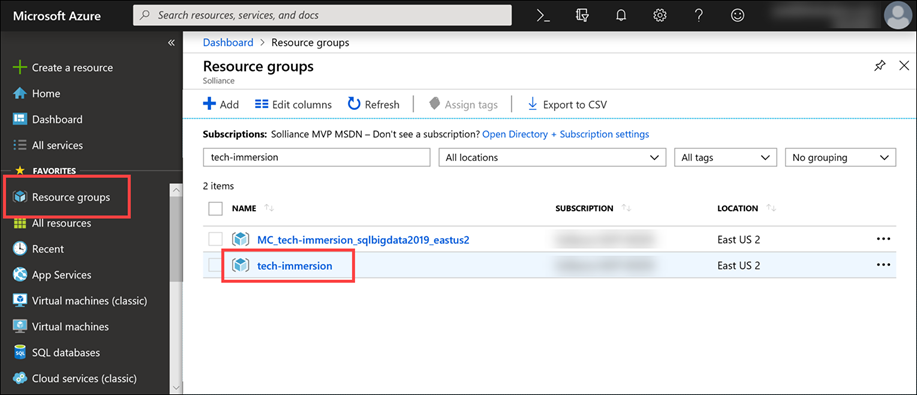

4. Select the **tech-immersionXXXXX** Azure Cosmos DB account from the list of resources (where XXXXX is the unique identifier assigned to you for this workshop).

    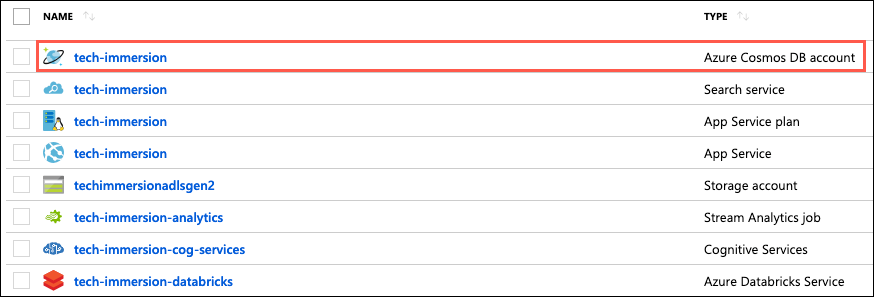

    > **IMPORTANT**: There may be two Cosmos DB accounts in your resource group. Select the Cosmos DB account named **tech-immersionXXXXX**, with no hyphen between immersion and XXXXX.

5. On your Cosmos DB blade, select **Keys** from the left-hand menu.

    

6. Copy the **Primary Connection String** value by selecting the copy button to the right of the field.

    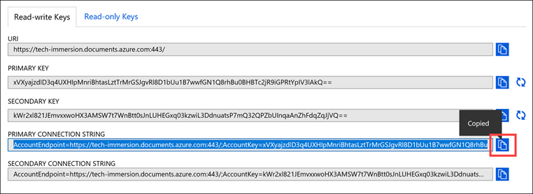

7. Return to the `appsettings.json` file in Visual Studio and paste the Primary Connection String into the value for the `ConnectionString` setting within the `CosmosDb` section. Your `appsettings.json` file should look similar to the following:

    

8. Save `appsettings.json`.

9. Right-click on the `DataGenerator` project, and select **Set as StartUp Project** from the context menu.

    

10. Run the console app by selecting the button in the toolbar with the green arrow and text of **DataGenerator**.

    

11. In the console window, enter "1" at the prompt to start generating tweets. You will see statistics about tweets being streamed into Cosmos DB.

    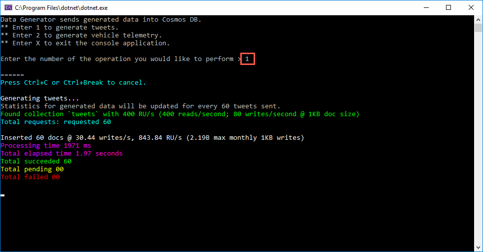

> Leave the `DataGenerator` console app running in the background while you move on to the following tasks in this experience. The app will run for 10 minutes, sending random tweets into your Cosmos DB `tweets` container, so you have data to work with in the following tasks of this experience. In the next task, you will set up an Azure Search Index which points to the `tweets` container in Cosmos DB, so as new tweets are added, they will be indexed.

## Task 2: Create a basic Cognitive Search pipeline using the Azure portal

With data now streaming into your Cosmos DB `tweets` container, you are ready to set up a basic Cognitive Search pipeline using the Azure portal. In this task, you will create an Azure Search Index and configure an Azure Search Indexer to read tweets from your Cosmos DB container. You will also include several pre-configured skills linked to your Cognitive Services account to extract more information out of the tweets being indexed.

1. Return to your Azure Cosmos DB account blade in the [Azure portal](https://portal.azure.com), and select **Data Explorer** from the toolbar on the overview blade.

    

2. Under the `ContosoAuto` database, expand the **tweets** container and then select **Items**.

    

3. In the Items pane, select any of the documents listed and inspect a tweet document. Documents are stored in JSON (JavaScript Object Notation) format in Cosmos DB.

    

    > The `text` field, which contains the content of the tweet, and is what you will be using as you begin building your Cognitive Search pipeline.

4. With a better understanding of the structure of the tweet documents stored in Cosmos DB, let's move on to creating a basic Cognitive Search pipeline. From your Cosmos DB blade in the Azure portal, select **Add Azure Search** from the left-hand menu, select your **tech-immersion** search service, and then select **Next: Connect to your data**.

    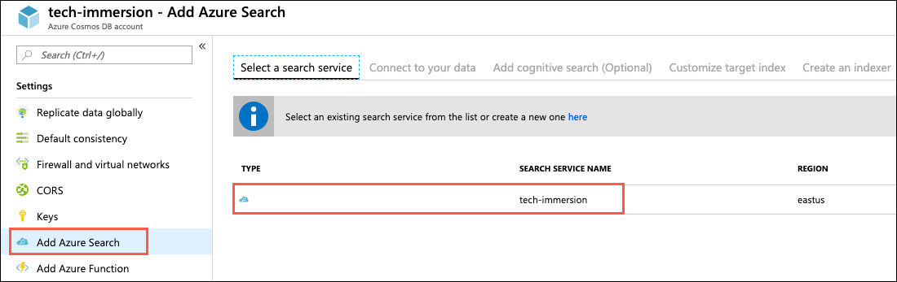

5. On the **Connect to your data** tab, enter the following:

   - **Data source**: This should be pre-populated with **Cosmos DB**. The data source object tells Azure Search how to retrieve external source data.
   - **Name**: Enter **tweets-cosmosdb**.
   - **Cosmos DB account**: This should be pre-populated with the connection string for your Cosmos DB account.
   - **Database**: Select the **ContosoAuto** database.
   - **Collection**: Select the **tweets** container.
   - **Query**: Paste the SQL statement below into the field.

    ```sql
    SELECT * FROM c WHERE c._ts > @HighWaterMark ORDER BY c._ts
    ```

   - **Query results ordered by \_ts**: Check this box.

    

6. Select **Next: Add cognitive search (Optional)**.

    > In this step, you will add a set of enrichment steps to the data being ingested from Cosmos DB. In a Cognitive Search pipeline, individual enrichment steps are called _skills_, and the collection of enrichment steps is a _skillset_. The predefined skills available at this step through the UI use pre-trained models to extract additional information from the documents. The [EntityRecognitionSkill](https://docs.microsoft.com/en-us/azure/search/cognitive-search-skill-entity-recognition) extracts entities (people, location, organization, emails, URLs, DateTime fields) from the document. The [LanguageDetectionSkill](https://docs.microsoft.com/en-us/azure/search/cognitive-search-skill-language-detection) is used to detect the primary language used in the document, and the [KeyPhraseExtractionSkill](https://docs.microsoft.com/en-us/azure/search/cognitive-search-skill-keyphrases) detects important phrases based on term placement, linguistic rules, proximity to other terms, and how unusual the term is within the source data. Read about all of the available [predefined cognitive skills](https://docs.microsoft.com/en-us/azure/search/cognitive-search-predefined-skills) to learn more.

7. On the **Add cognitive search (Optional)** tab:

   - Expand **Attach Cognitive Services** and select your **tech-immersion-cog-services** instance. This will associate your Cognitive Services account with the Skillset you are creating.
   - Expand **Add Enrichments**, enter **tweet-skillset** as the name, and select **text** as the source data field.
   - Check the box next to the Text Cognitive Skills header to select all of the options.

   

   > Cognitive search is an AI feature in Azure Search, used to extract text from images, blobs, and other unstructured data sources - enriching the content to make it more searchable in an Azure Search index. Extraction and enrichment are implemented through cognitive skills attached to an indexing pipeline. Cognitive skills in Azure Search are based on machine learning models in the Cognitive Services APIs: [Computer Vision](https://docs.microsoft.com/azure/cognitive-services/computer-vision/) and [Text Analysis](https://docs.microsoft.com/azure/cognitive-services/text-analytics/overview). To learn more, read [What is "cognitive search" in Azure Search](https://docs.microsoft.com/en-us/azure/search/cognitive-search-concept-intro).

8. Select **Next: Customize target index**.

9. On the **Customize target index** tab, do the following:

    - **Name**: Enter **tweet-index**.
    - **Key**: Leave this set to **rid**.
    - **Suggester name**: Leave this blank.
    - **Search mode**: Leave this blank.
    - Before setting the check boxes for each field, expand **users** and **entities**, and any sub-properties within each.
      - Check the **Retrievable** and **Searchable** boxes at the top, to check all fields under each category, as shown in the image below.

    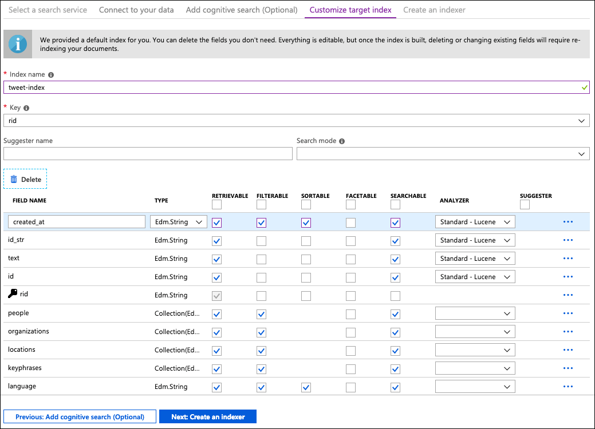

    > On the Index page, you are presented with a list of fields with a data type and a series of check boxes for setting index attributes. You can bulk-select attributes by clicking the checkbox at the top of an attribute column. Choose Retrievable and Searchable for every field that should be returned to a client app and subject to full text search processing. You'll notice that integers are not full text or fuzzy searchable (numbers are evaluated verbatim and are often useful in filters). Read the description of [index attributes](https://docs.microsoft.com/en-us/rest/api/searchservice/create-index#bkmk_indexAttrib) for more information.

10. Select **Next: Create an indexer**.

11. On the **Create an indexer** tab, set the following:

    - **Name**: Enter **tweet-indexer**.
    - **Schedule**: Select **Once**.

    

    > An indexer in Azure Search is a crawler that extracts searchable data and metadata from an external Azure data source and populates an index based on field-to-field mappings between the index and your data source. This approach is sometimes referred to as a 'pull model' because the service pulls data in without you having to write any code that adds data to an index. For this experience, we will be making multiple updates to the indexer, so we did not configure a schedule for the indexer. In production scenarios, you would want to select a schedule to allow new data entering your system to be indexed.

12. Select **Submit**. You will receive a notification in the portal when the Azure search pipeline as been successfully configured.

    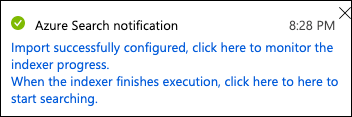

13. Next, navigate to the **techimmersionXXXXX** Azure Search Service (where XXXXX is the unique identifier assigned to you for this workshop) in the Azure portal by selecting it from the list of resources in the **tech-immersion-XXXXX** resource group.

    

14. On the Azure Search service blade, select **Indexers**.

    

15. You specified the indexer should run once, so it should have automatically started upon creation. If your indexer has a status of **No history**, you can force the indexer to run by selecting the indexer, and then selecting **Run** on the Indexer blade.

    

16. Once your Indexer has run, select **Search explorer** on the Search Service toolbar.

    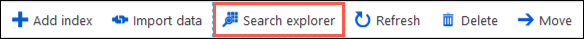

17. On the Search explorer tab, select **Search** and observe the results.

    

18. Looking at the items in the search results, you will see that each result "value" resembles the following:

    ```json
    {
      "@search.score": 1,
      "created_at": "2019-06-09T18:34:23.335Z",
      "id_str": "988777959",
      "text": "@ContosoAuto Mi 2019 #Toyota #Tundra es el mejor auto de todos!",
      "id": "dc26f05e-1c09-4da7-b705-65a9c20d8865",
      "rid": "ZTR0eEFKdXRIZklIQUFBQUFBQUFBQT090",
      "people": [],
      "organizations": [
        "Toyota"
      ],
      "locations": [
        "Tundra"
      ],
      "keyphrases": [
        "Tundra",
        "Toyota",
        "mejor auto",
        "ContosoAuto"
      ],
      "language": "es",
      "user": {
        "id": 962792147,
        "id_str": "991150723",
        "name": "Max Luikart",
        "screen_name": "MaxLuikart",
        "location": "San Diego, CA",
        "url": "",
        "description": ""
      },
      "entities": {
        "symbols": [],
        "urls": [],
        "hashtags": [
          {
            "indices": null,
            "text": "Toyota"
          },
          {
            "indices": null,
            "text": "Tundra"
          }
        ],
        "user_mentions": [
          {
            "id": 2244994945,
            "id_str": "2244994945",
            "indices": [
                0,
                12
            ],
            "name": "Contoso Auto",
            "screen_name": "ContosoAuto"
          }
        ]
      }
    }
    ```

    > As you inspect the result documents, take note of the various components that were added to enrich the tweet data using built-in cognitive skills. You can go back into Cosmos DB to see the base document structure, and compare that to the search result with the additional data. The cognitive search created fields are people, organizations, locations, key phrases, and language. These fields contain information extracted by the individual cognitive skills from the `text` field.

## Task 3: Enhance the Cognitive Search pipeline

In the previous task, you created the beginnings of your Cognitive Search pipeline when you added built-in Cognitive Skills for extracting people, organization and location names, key phrases and for detecting the primary language. In this task, you will enhance your Cognitive Search pipeline using functionality available only through the [Azure Search Service REST APIs](https://docs.microsoft.com/en-us/rest/api/searchservice/).

1. You will use a console application, `PipelineEnhancer`, running from Visual Studio to make calls to the Azure Search Service REST APIs to update your Skillset, Index, and Indexer with these enhancements.

2. To prepare the console application, you will need to add multiple values for various Azure services into the `appsettings.json` file. Return to Visual Studio, and open the `appsettings.json` file located under the `PipelineEnhancer` project.

   

   The `appsettings.json` file will look like the following, and here you can see the values that you need to retrieve before moving on.

   

3. To retrieve values for the required settings for your Azure Search Service, navigate to your Azure Search Service in the Azure portal by selecting it from the list of resources in the **tech-immersion-XXXXX** resource group (where XXXXX is the unique identifier assigned to you for this workshop).

   

4. On the overview blade of your search service, copy the name of your Search Service.

   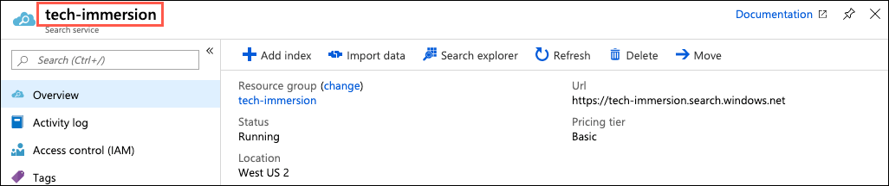

5. Return to Visual Studio, and in the `appsettings.json` file, locate the `Search` section, which contains the settings you need to update to connect to your Search Service.

   ```json
   "Search": {
      "ServiceName": "<enter your Azure Search Service name here>",
      "Key": "<enter your Azure Search Service Key here>",
      "DataSourceName": "tweets-cosmosdb",
      "IndexName": "tweet-index",
      "IndexerName": "tweet-indexer",
      "SkillsetName": "tweet-skillset",
      "ApiVersion": "2019-05-06"
    }
   ```

6. Within the `Search` section, locate the line that looks like the following:

   ```json
   "ServiceName": "<enter your Azure Search Service name here>"
   ```

7. Replace the value of the `ServiceName` setting by pasting the copied name within double-quotes. The line should now look similar to this:

   ```json
   "ServiceName": "tech-immersion"
   ```

8. Return to your Search Service blade in the Azure portal, select **Keys** from the left-hand menu, and then select the **Copy** button for the **Primary admin key** value.

   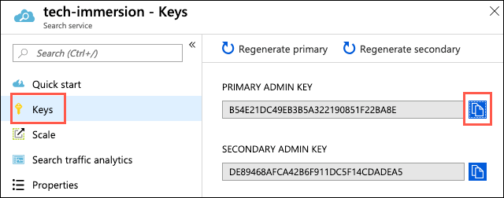

9. Return to Visual Studio and the `appsettings.json` file, and update the `Key` setting within the `Search` section. Paste the key you copied into the value for this setting. It should look similar to:

   ```json
   "Key": "4DB94C2CC80B42ACA459C839A0863A8A"
   ```

10. Next you will retrieve the values for your Cognitive Services account. Return to the Azure portal, and select the **Cognitive Services** account named **tech-immersion-cogserv** from the list of resources under the **tech-immersion-XXXXX** resource group (where XXXXX is the unique identifier assigned to you for this workshop).

    

    > **NOTE**: There are multiple Cognitive Services accounts in the resource group. You will want the one named **tech-immersion-cogserv** for this step.

11. On the Cognitive Services blade, select **Properties** from the left-hand menu, and then copy the value for the **Resource ID** field by selecting the copy button to the right of the field.

    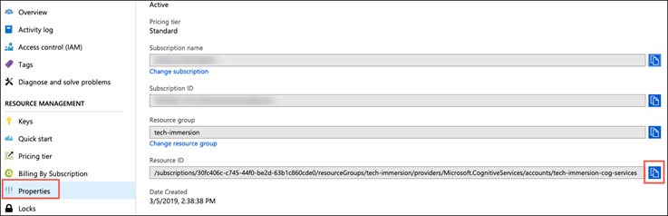

12. Return to Visual Studio and in the `appsettings.json` file, paste the **Resource ID** value into the `ResourceId` field value within the `CognitiveServices` section. It should look similar to the following:

    ```json
    "ResourceId": "/subscriptions/30fc406c-c745-44f0-be2d-63b1c860cde0/resourceGroups/tech-immersion/providers/Microsoft.CognitiveServices/accounts/tech-immersion-cogserv"
    ```

13. Return to your Cognitive Services account in the Azure portal, and select **Keys** from the left-hand menu. On the Keys blade, copy the **Key 1** value by selecting the copy button to the right of the field.

    

14. Return to Visual Studio and in the `appsettings.json` file, paste the Cognitive Services Key 1 value into the value for the `Key` field. It will looks similar to the following.

    ```json
    "Key": "872353ecac8d43a7bf5a60c3ece9ff4a"
    ```

15. Next, you will retrieve the endpoint and key for your Form Recognizer Cognitive Service. In the Azure portal, select the **Cognitive Services** account named **tech-immersion-form-recog** from the list of resources under the **tech-immersion-XXXXX** resource group (where XXXXX is the unique identifier assigned to you for this workshop).

    

16. Select **Overview** from the left-hand menu of the Form Recognizer Cognitive Services blade, and copy the **Endpoint** value.

    

17. Return to Visual Studio and in the `appsettings.json` file, paste the **Endpoint** value into the `Endpoint` field value within the `FormRecognizer` section. It should look similar to the following:

    ```json
    "Endpoint": "https://westus2.api.cognitive.microsoft.com/"
    ```

18. Return to your Form Recognizer Cognitive Services account in the Azure portal, and select **Keys** from the left-hand menu. On the Keys blade, copy the **Key 1** value by selecting the copy button to the right of the field.

19. Return to Visual Studio and in the `appsettings.json` file, paste the Key 1 value into the value for the `Key` field within the `FormRecognizer` section. It will look similar to the following.

    ```json
    "Key": "9d1079dd70494ac3b366a8a91e363b5b"
    ```

20. To retrieve the required values for your Azure Blob Storage account, select the **techimmersionstorageXXXXX** Storage account resource from your resource group (where XXXXX is the unique identifier assigned to you for this workshop).

    

21. On the Storage account blade, select **Access keys** from the left-hand menu, and then copy the Storage account name.

    

22. Return to Visual Studio and in the `appsettings.json` file, paste the Name value into the value for the `AccountName` field within the `BlobStorage` section. It will look similar to the following.

    ```json
    "AccountName": "techimmersionstorage"
    ```

23. Return to the Access keys blade of your storage account in the Azure portal, and copy the key1 **Connection string**.

24. Return to Visual Studio and in the `appsettings.json` file, paste the Connection string value into the value for the `ConnectionString` field within the `BlobStorage` section. It will look similar to the following.

    ```json
    "ConnectionString": "DefaultEndpointsProtocol=https;AccountName=techimmersionstorage;AccountKey=4JBkkA1ot5bDZoLs4DvlH+7e5UXwrFxxrYb4taYMgkkrSdB8fan7E0coGlzvtzrlqPBzJg+DKpAFPoCHBIxlag==;EndpointSuffix=core.windows.net"
    ```

25. The final setting you need for your Blob storage account is a shared access signature, or SAS token. Return to your Blob storage account in the Azure portal and select **Shared access signature** from the left-hand menu. On the Shared access signature blade, enter an **End** date for a week or two in the future, select **Generate SAS and connection string** and then copy the **SAS token** value.

    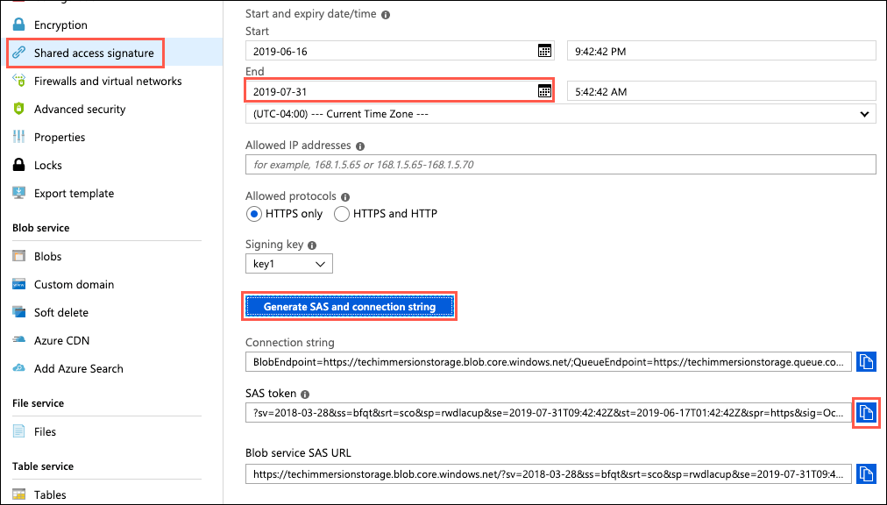

26. Return to Visual Studio and in the `appsettings.json` file, paste the SAS token string value into the value for the `SasToken` field within the `BlobStorage` section. It will look similar to the following.

    ```json
    "SasToken": "?sv=2018-03-28&ss=bfqt&srt=sco&sp=rwdlacup&se=2019-07-02T01:20:49Z&st=2019-06-15T17:20:49Z&spr=https&sig=8LBK6113sDnaqp1X7A3nyXQL5l%2F5VgBsa5Ma6%2BYawuY%3D"
    ```

27. Next, you need to retrieve your Cosmos DB connection string. In the [Azure portal](https://portal.azure.com), select the **tech-immersion-XXXXX** resource group (where XXXXX is the unique identifier assigned to you for this workshop), and then select the **tech-immersionXXXXX** Azure Cosmos DB account from the list of resources (where XXXXX is the unique identifier assigned to you for this workshop) within the resource group.

    

    > **IMPORTANT**: There may be two Cosmos DB accounts in your resource group. Select the Cosmos DB account named **tech-immersionXXXXX**, with no hyphen between immersion and XXXXX.

28. On your Cosmos DB blade, select **Keys** from the left-hand menu.

    

29. Copy the **Primary Connection String** value by selecting the copy button to the right of the field.

    

30. Return to the `appsettings.json` file in Visual Studio and paste the Primary Connection String into the value for the `ConnectionString` setting within the `CosmosDb` section. The settings should look similar to the following:

    ```json
    "ConnectionString": "AccountEndpoint=https://tech-immersion.documents.azure.com:443/;AccountKey=p9avU3FcaeffHI50SeenA6zfvUcoZEk3rYwg4FdrsRfqrj3AfobcKdacfBkHlGZ1eiBnMafwhjxdoEUSai8LLA==;"
    ```

31. The final settings you need to retrieve are those for your Azure Function App. In the Azure portal, navigate to your **ti-function-day2-XXXXX** Function App (where XXXXX is the unique identifier assigned to you for this workshop), and copy the **URL** on the Overview blade.

    

32. Return to the `appsettings.json` file for the `PipelineEnhancer` project in Visual Studio, and paste the value into the `Url` setting within the `FunctionApp` section. It should look similar to:

    ```json
    "Url": "https://tech-immersion-functions.azurewebsites.net"
    ```

33. Back in the Azure portal, select **Function app settings** on the Overview blade.

    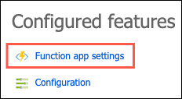

34. On the Function app settings tab, select the **Copy** button next to the **default** Host Key.

    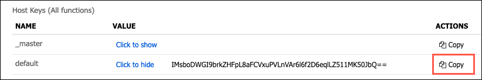

35. Return to Visual Studio and the `appsettings.json` file for the `PipelineEnhancer` project, and paste default host key value into the `DefaultHostKey` setting within the `FunctionApp` section. It will look similar to the following:

    ```json
    "DefaultHostKey": "h3CqiI4JFKMGaN2BHwtYwxmgfwtqW0kaWbpaEQkyAcR3Lle5fKs9rg=="
    ```

36. Save `appsettings.json`. The file should now look like the following.

    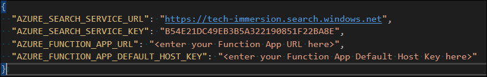

37. You are now ready to move on to adding the enhancements to your pipeline. The [create skillset API](https://docs.microsoft.com/en-us/rest/api/searchservice/create-skillset) uses the following endpoint:

    ```http
    PUT https://[servicename].search.windows.net/skillsets/[skillset name]?api-version=2017-11-11-Preview
    api-key: [admin key]
    Content-Type: application/json
    ```

38. To add the [sentiment analysis pre-built skill](https://docs.microsoft.com/en-us/azure/search/cognitive-search-skill-sentiment) to your search pipeline, the `PipelineEnhancer` app will append the following JSON to the body of the Skillset you created through the Azure portal UI.

    ```json
    {
      "@odata.type": "#Microsoft.Skills.Text.SentimentSkill",
      "inputs": [
        {
          "name": "text",
          "source": "/document/text"
        }
      ],
      "outputs": [
        {
          "name": "score",
          "targetName": "sentiment"
        }
      ]
    }
    ```

    > In the above JSON, the `inputs` specify the field in the source data document to send for analysis. The `outputs` section dictates that the `score` value returned by the Text Analytics in Cognitive Services should be output into a field named `sentiment` in the search results. This is sent into the REST API, along with the JSON from the previously built skillset to update or create the skillset.

39. To add sentiment analysis to your pipeline you will run the `PipelineEnhancer` project within the **CognitiveSearch** solution in Visual Studio. To run the project, right-click the `PipelineEnhancer` project in Visual Studio and select **Set as StartUp Project**.

    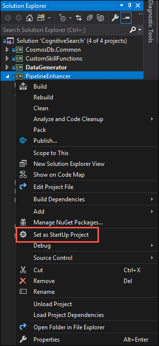

40. Now, select the run button on the Visual Studio toolbar, which is the one with a green arrow followed by the text "PipelineEnhancer."

    

41. At the command prompt for the console app, enter **1** to incorporate the Sentiment cognitive skill to your pipeline.

    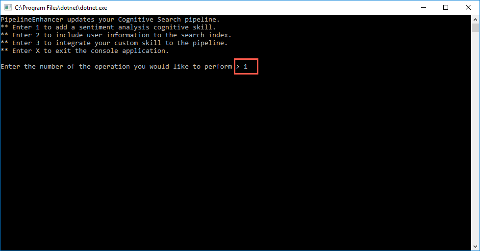

42. When the console app completes you will receive a message stating that the sentiment analysis skill was successfully added.

    

    > In addition to updating the Skillset JSON, the Indexer and Index were also be updated to include a new field named `sentiment`.

43. The process above deleted and recreated your Index, Indexer and Skillset, so you may need to select **Indexers** and the **tweet-indexer** on your Azure Search Service blade, and then select **Run** to force the Indexer to run against your tweet data again before attempting to run a search against the index in the next step.

    > The Indexer **Run** screen does not refresh when the indexer has finished, so you can return to the overview blade of the Search service, and then select **Indexers**. Then, you can use the **Refresh** button on the Search service tool bar, next to Search explorer, to refresh the status. The **tweet-indexer** will display a status of **Success** when it finishes.

44. Return to your Azure Search service in the Azure portal and select **Search explorer** on the Search Service toolbar.

    

45. On the Search explorer tab, select **Search** and inspect one of the records in the search results.

    ```json
    {
      "@search.score": 1,
      "created_at": "2019-06-09T18:34:23.335Z",
      "id_str": "988777959",
      "id": "dc26f05e-1c09-4da7-b705-65a9c20d8865",
      "text": "@ContosoAuto Mi 2019 #Toyota #Tundra es el mejor auto de todos!",
      "rid": "ZTR0eEFKdXRIZklIQUFBQUFBQUFBQT090",
      "people": [],
      "organizations": [
        "Toyota"
      ],
      "locations": [
        "Mi"
      ],
      "keyphrases": [
        "Tundra es",
        "Toyota",
        "mejor",
        "ContosoAuto Mi",
        "todos"
      ],
      "language": "es",
      "sentiment": 0.5,
      "user": {
        "id": 962792147,
        "id_str": "991150723",
        "name": "Max Luikart",
        "screen_name": "MaxLuikart",
        "location": "San Diego, CA",
        "url": "",
        "description": ""
      },
      "entities": {
        "symbols": [],
        "urls": [],
        "hashtags": [
          {
            "indices": null,
            "text": "Toyota"
          },
          {
            "indices": null,
            "text": "Tundra"
          }
        ],
        "user_mentions": [
          {
            "id": 2244994945,
            "id_str": "2244994945",
            "indices": [
              0,
              12
            ],
            "name": "Contoso Auto",
            "screen_name": "ContosoAuto"
          }
        ]
      }
    }
    ```

    > Notice the addition of the `sentiment` field in the results. The value contained in this field is a numeric prediction made by a machine learning model about the sentiment of the contents of the `text` field in the tweet. Scores range from 0 to 1. Scores close to 1 indicate positive sentiment, and scores close to 0 indicate negative sentiment. Scores in the middle are considered to be neutral in the expression of sentiment. In the record above, the sentiment was determined to be neutral, 0.5, by the ML model.

46. Return to the `PipelineEnhancer` console app, and enter **X** at the command prompt to exit the console application.

## Task 4: Publish Function App for custom skills

In addition to predefined Cognitive skills, you can also integrate custom skills into your Cognitive Search pipeline. In this task, you will update a few values in the Function code inside the `CustomSkillsFunctions` project in Visual Studio, and then deploy the Function App to Azure. For this experience we are using an [Azure Function App](https://azure.microsoft.com/services/functions/) to wrap the custom cognitive skills, so that they implements the required custom skill interface. You will be implementing three different custom skills in the following tasks, so you will configure the Functions now, so you don't have to publish them within each exercise.

> While this example uses an Azure Function to host a web API, you can use any approach as long as it meets the [interface requirements for a cognitive skill](https://docs.microsoft.com/en-us/azure/search/cognitive-search-custom-skill-interface). Azure Functions, however, make it very easy to create custom skills.

1. The first custom skill you add to the pipeline will use the [Text Translate API](https://azure.microsoft.com/services/cognitive-services/translator-text-api/), so let's start by adding the API key to the Translate Function. As you've done with previous resources, select your **tech-immersion-translator** Cognitive Services resource from the **tech-immersion-XXXXX** resource group (where XXXXX is the unique identifier assigned to you for this workshop) in the Azure portal.

   

2. Once on your Translator Text Cognitive Services blade, select **Keys** from the left-hand menu, and then select the Copy button next to the value for **Key 1**.

   

3. Return to Visual Studio, and in the Solution Explorer on the right-hand side, expand the `CustomSkillFunctions` project and then double-click `TranslateTextFunction.cs` to open the file.

   

4. In the `TranslateTextFunction.cs` file, locate the line of code (line 23) that looks like the following:

   ```csharp
   // NOTE: Replace this example key with a valid subscription key.
   static readonly string _subscriptionKey = "<enter your api key here>";
   ```

5. Replace the value within double-quotes (`<enter your api key here>`) with the API key you copied for the Translator Cognitive Service. The line should now look similar to this:

   ```csharp
   static readonly string _subscriptionKey = "460a0dff9bb541ce81bc16956e119f37";
   ```

6. Save `TranslateTextFunction.cs`.

   > Take a few minutes to look over the code in `TranslateTextFunction.cs`. This file defines the Function that will be deployed to your Azure Function App. The function code receives the tweet text and the detected language from the custom skill. Only those tweets with a language determined to not be English will be translated by the Translator Text API. For all English tweets, the original text is returned unmodified.

7. Return to the Azure portal, and select the **tech-immersion-form-recog** resource from the list of resources in the **tech-immersion-XXXXX** resource group (where XXXXX is the unique identifier assigned to you for this workshop).

8. On the Form Recognizer Cognitive Services blade, select **Keys** from the left-hand menu, and then select the Copy button next to the value for **Key 1**.

   

9. Return to `CustomSkillFunctions` project in Visual Studio, and in the Solution Explorer on the right-hand side, open `AnalyzeFormFunction.cs`.

   

10. In the `AnalyzeFormFunction.cs` file, locate the line of code (line 21) that looks like the following:

    ```csharp
    // NOTE: Replace this example key with a valid subscription key.
    private static readonly string key = "<enter your api key here>";
    ```

11. Replace the value within double-quotes (`<enter your api key here>`) with the API key you copied for the Translator Cognitive Service. The line should now look similar to this:

    ```csharp
    private static readonly string key = "9d1079dd70494ac3b366a8a91e363b5b";
    ```

12. Save `AnalyzeFormFunction.cs`.

13. Return to the Azure portal, and select the **tech-immersion-anomaly-detector** resource from the list of resources in the **tech-immersion-XXXXX** resource group (where XXXXX is the unique identifier assigned to you for this workshop).

14. On the Anomaly Detector Cognitive Services blade, select **Keys** from the left-hand menu, and then select the Copy button next to the value for **Key 1**.

    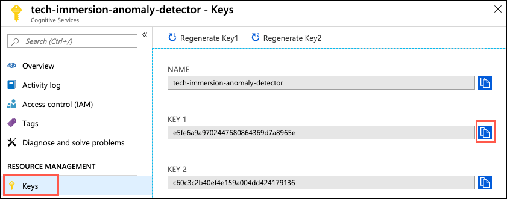

15. Return to `CustomSkillFunctions` project in Visual Studio, and in the Solution Explorer on the right-hand side, open `DetectAnomaliesFunction.cs`.

    

16. In the `DetectAnomaliesFunction.cs` file, locate the line of code (line 21) that looks like the following:

    ```csharp
    // NOTE: Replace this example key with a valid subscription key.
    private static readonly string key = "<enter your api key here>";
    ```

17. Replace the value within double-quotes (`<enter your api key here>`) with the API key you copied for the Translator Cognitive Service. The line should now look similar to this:

    ```csharp
    private static readonly string key = "e5fe6a9a9702447680864369d7a8965e";
    ```

18. Save `DetectAnomaliesFunction.cs`.

19. You are now ready to deploy the function into your Azure Function App. Right-click the `CustomSkillFunctions` project, and select **Publish** from the context menu.

    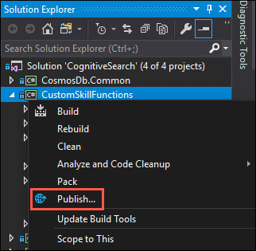

20. On the **Pick a publish target** dialog, choose **Select Existing** and select **Publish**.

    

21. On the **App service** dialog, select your Subscription and locate the **tech-immersion-XXXXX** resource group (where XXXXX is the unique identifier assigned to you for this workshop) in the list. Select the Function App named **ti-function-day2-XXXXX** from the list of resources (where XXXXX is the unique identifier assigned to you for this workshop).

    

    > You may need to enter the credentials of the account you are using for this workshop before you can see any resources for your subscription.

22. Select **OK**. This will start the publish process. You will see an animated progress icon next to the Publish button while the deployment is in progress.

    

23. When the publish is complete, you can open the **Output** window at the bottom left-hand corner of the Visual Studio window to observe the results. You should see messages that the **Publish Succeeded** and **Publish completed**.

    

    > If the Output window is not visible, you can display it by selecting the **View** menu in Visual Studio, and then selecting **Output**.

## Task 5: Integrate Text Translate custom skill into pipeline

With the Function App now in place to support your Text Translator custom skill, you are ready to integrate a new custom skill using the [custom skill interface](https://docs.microsoft.com/en-us/azure/search/cognitive-search-custom-skill-interface), which is accessed by adding a `WebApiSkill` to the skillset. In this task, you will add a custom skill into the Tweets Cognitive Search pipeline you created previously.

> Another change that will be made as the new custom skill is added is to update all the previously added predefined skills, except the language detection skill, to use the new `textTranslated` field as input. This will allow all the Cognitive Skills to run against the English language version of the text.

1. To add the custom skill to your search pipeline the following JSON will be appended to the body of the Skillset you built with the UI by the `PipelineEnhancer` app.

   ```json
   {
     "@odata.type": "#Microsoft.Skills.Custom.WebApiSkill",
     "description": "Custom translator skill",
     "uri": "http://<your-function-app-name>.azurewebsites.net/api/Translate?code=<default-host-key>",
     "batchSize": 1,
     "context": "/document",
     "inputs": [
       {
         "name": "text",
         "source": "/document/text"
       },
       {
         "name": "language",
         "source": "/document/language"
       }
     ],
     "outputs": [
       {
         "name": "text",
         "targetName": "textTranslated"
       }
     ]
   }
   ```

   > In the above JSON, the `inputs` specify the field in the source data document to send for analysis. The `outputs` section dictates that the `text` value returned by your Function App should output into a field named `textTranslated` in the search results. This is sent into the REST API, along with the JSON from the previously built skillset to update or create the skillset.

2. Note that there are two values within the `uri` field of your custom skill that will need to be supplied to your custom skill, so it can connect to your Function app: the Function App name and default host code. You already added these values to your `appsettings.json` file.

3. Relaunch the `PipelineEnhancer` console app by selecting the **Run** button on the Visual Studio toolbar.

   

4. In `PipelineEnhancer` console window and enter **2** at the prompt. This step will incorporate the custom text translator cognitive skill into your tweets pipeline.

   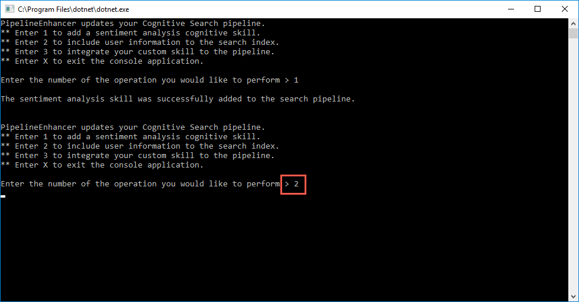

   > In addition to updating the Skillset JSON, the Indexer and Index were also be updated to include a new field named `textTranslated`.

## Task 6: Run indexer and query translation data

In this task, you will run your Search Indexer and then query data in the index.

1. In the Azure portal, navigate to your **Search service** resource and select **Search explorer** in the toolbar on the overview blade.

   

   > The last step of Task 5 deleted and recreated your Index, Indexer and Skillset. If you don't see any search results, you may need to select **Indexers** on the Overview blade and then **tweet-indexer**. Select **Run** to force the Indexer to run against your tweet data again before attempting to run a search against the index. If the status is **In progress**, select **Refresh** in the toolbar, and wait for the status to change to **Success**.

2. On the Search explorer tab, select **Search** and observe the results.

   

3. You can now play around with the search functionality. Below, you will enter a few queries that simulate what an application user may enter. These queries tend to resemble natural language, so we will start there. In the Query string field, enter "language is es", and observe the results. This will return one of the records in the search results where the language was detected as Spanish.

   ```json
   {
     "@search.score": 0.94444835,
     "text": "@ContosoAuto Mi 2019 #Ford #Mustang es el mejor auto de todos!",
     "rid": "YmpnZEFKMUhibTN2QkFBQUFBQUFBQT090",
     "userLocation": "Boston, MA",
     "userName": "Brian Navedo",
     "people": [],
     "organizations": ["Ford"],
     "locations": [],
     "keyphrases": ["Mustang", "Ford", "the best"],
     "language": "es",
     "sentiment": 0.986368536949158,
     "textTranslated": "@ContosoAuto My 2019 #Ford #Mustang is the best car of all!"
   }
   ```

   > Notice the addition of the `textTranslated` field to the bottom of the record. This contains the English translation of the contents of the `text` field in the tweet. You will also notice that the `keyphrases` field contains only English words and phrases. This is because the `KeyPhraseExtractionSkill` was pointed to the new `textTranslated` field with the latest updates to the search pipeline.

   

   > In addition, notice that each record returned contains a `@search.score` field with a numeric value. This value indicates the confidence of the match with the search query. The higher the value, the more likely it is to be a match for the query. If you scroll down past the records where `"language"="es"`, you will see the search score values drop, as those records don't match the query.

4. Try another search, such as "cold battery" and observe the results.

   

5. Now, let's try a slightly more advanced search. We want to look for only records that mention a "corvette", and we only want to retrieve the `text`, `userLocation`, and `sentiment` fields in our results. Paste the following into the Query string box, and select **Search**:

   ```http
   search=corvette&$select=text,userLocation,sentiment&$count=true
   ```

   

   > Add `$select` limits results to the explicitly named fields for more readable output in Search explorer.

6. You can take that query even further by adding in the `$filter` parameter. Use the `$filter` parameter when you want to specify precise criteria rather than free text search. This example searches for sentiment less than 0.25, so we can target tweets with negative sentiment in the search results.

   ```http
   search=corvette&$select=text,userLocation,sentiment&$filter=sentiment lt 0.25&$count=true
   ```

   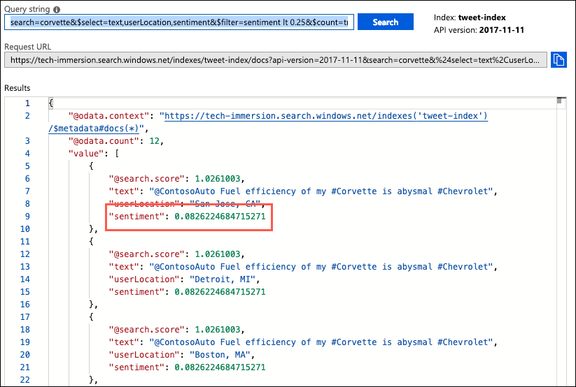

7. The final query we will run adds the `$orderBy` parameter, which allow you to specify the sort order of your results. In this case, let's search for records where the sentiment is the highest, filtering for records where the sentiment is greater than 0.9, and ordering the results in descending order.

   ```http
   search=*&$select=text,userLocation,sentiment&$filter=sentiment gt 0.9&$count=true&$orderby=sentiment desc
   ```

   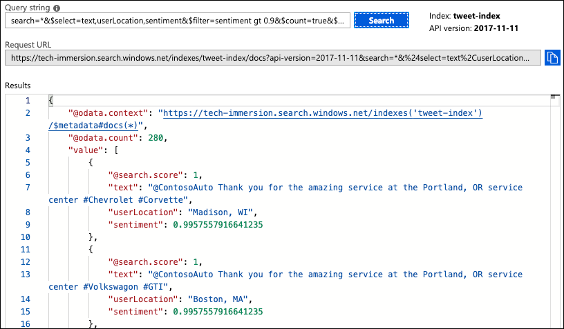

   > In the search results, observe that the sentiment values slowly decrease as you scroll down through the returned documents.

## Task 7: Create Forms Recognizer Pipeline

Now that you've had a chance to explore some of the cognitive search capabilities of Azure Search, let's dive into some more advanced Cognitive Services that can be integrated within the cognitive search pipeline through the use of custom skills. The Function App you deployed into Azure contained three functions. In addition to the Translate function, it also included a function to leverage the [Form Recognizer](https://azure.microsoft.com/en-us/services/cognitive-services/form-recognizer/) service, which you will implement in this task.

The Forms Recognizer is an AI-powered document extraction service, currently in preview, designed specifically to recognize and extract information from forms. Form Recognizer applies advanced machine learning to accurately extract text, key/value pairs, and tables from documents. With just a few samples, Form Recognizer tailors its understanding to your documents, both on-premises and in the cloud. It enables you to turn forms into usable data at a fraction of the time and cost, so you can focus more time acting on the information rather than compiling it.

To use the Form Recognizer, you will first call the [Train Model API](https://westus2.dev.cognitive.microsoft.com/docs/services/form-recognizer-api/operations/TrainCustomModel), passing in as little as 5 example forms to train the model to recognize forms of that type. To use the Train API, you will pass in a source Azure Storage blob container Uri where the training forms are located. Once the model is trained, you can create a custom cognitive skill, which will then be able to extract form fields, key-value pairs, and tables while indexing the forms storage location.

ContosoAuto has provided you access to an Azure Blob storage account where they keep invoice forms. They have requested a demo of how those forms can be indexed, and how information about the structure, key-value pairs, and tables within those forms can be made searchable. To implement this functionality, we will create a new search index, which uses Azure Blob storage as the data source. Your storage account has been preloaded with forms that will be used train the Form Recognizer model. The forms are invoices resembling the following:

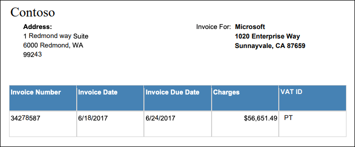

1. To get started, return to the PipelineEnhancer console application.

2. At the prompt, enter **3** and press enter.

   

3. In the first task of this experience, you saw how to create an Azure Search index through the Azure portal UI. In this task, will not need to go through those steps, as the new search pipeline is being created via code, accessing the [Azure Search Service REST API](https://docs.microsoft.com/azure/search/search-api-preview) and the [Azure Search .NET SDK](https://docs.microsoft.com/en-us/azure/search/search-howto-dotnet-sdk). Using the SDK and API, it is possible to quickly and easily create new pipelines, as well as update and manage existing pipelines.

4. Observe the output of the previous command in PipelineEnhancer console app. In addition to creating a new search pipeline using a Blob Storage data source, which includes a Form Recognizer custom skill, the application also passed in your Blob Storage account info to allow the Form Recognizer model to be trained with the sample forms.

   

5. Now, let's take a look at the results of our new search index. Navigate to your Search Service in the Azure portal, and select **Indexers**. Under Indexers, notice the new **forms-indexer**. The indexer should have run upon creation, so very you see a status of **Success**, and then select **Search explorer** from the toolbar.

   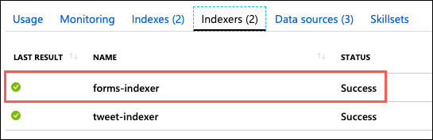

   > NOTE: If the status is **No history**, you will need to select the forms-indexer and select Run on the indexer blade.

6. On the Search explorer blade, select **Change index**, and select **forms-index** from the list.

   

7. Select **Search** and observe the results. In addition to the built-in cognitive skills fields you reviewed previously in the **tweet-index**, the Form Recognizer custom skill has added fields details information extracted from the indexed forms. Specifically, the fields below were added to the index:

   ```json
   "formHeight": 792,
   "formWidth": 612,
   "formKeyValuePairs": [
      "Microsoft: ",
      "Address:: 1111 8th st. Bellevue, WA 99501",
      "Invoice For:: Alpine Ski House 1025 Enterprise Way Sunnyvale, CA 94024",
      "Page: 1 of",
      "__Tokens__: Microsoft Page 1 of 1"
   ],
   "formColumns": [
      "Invoice Number: 458176",
      "Invoice Date: 3/28/2018",
      "Invoice Due Date: 4/16/2018",
      "Charges: $89,024.34",
      "VAT ID: ET"
   ]
   ```

8. The format of the output was specified in the custom skill, and can be updated or changed depending on how you would like to be able to search and use the extracted information.

Azure Form Recognizer is a cognitive service that uses machine learning technology to identify and extract key-value pairs and table data from form documents. It then outputs structured data that includes the relationships in the original file. Unsupervised learning allows the model to understand the layout and relationships between fields and entries without manual data labeling or intensive coding and maintenance. This capability allows you to easily extract information about the structure and fields within your forms, making that information searchable with minimal development effort.

## Task 8: Create an Anomaly Detection pipeline

ContosoAuto has also asked if it would be possible to add incoming vehicle telemetry to a search index. They store this data in Cosmos DB, in a container named `vehicle-telemetry`. They have also asked it would be possible use a custom cognitive skill to inspect some of this data for anomalies, and add that information to the search index, so they can easily find anomalous data.

To accomplish this, we will use the the final function you deployed to your Function App. This was set up to use the [Anomaly Detector API](https://docs.microsoft.com/en-us/azure/cognitive-services/anomaly-detector/overview). With the Anomaly Detector API, you can monitor and detect abnormalities in your time series data, using machine learning. The Anomaly Detector API adapts by automatically identifying and applying the best-fitting models to your data, regardless of industry, scenario, or data volume. Using your time series data, the API determines boundaries for anomaly detection, expected values, and which data points are anomalies.

1. As with the Tweet data generated for the first task, to begin this task we need to send generated vehicle telemetry data into a Cosmos DB container. To get started, return to Visual Studio.

2. In the Visual Studio solution explorer, right-click on the `DataGenerator` project, and select **Debug > Start new instance** from the context menu.

    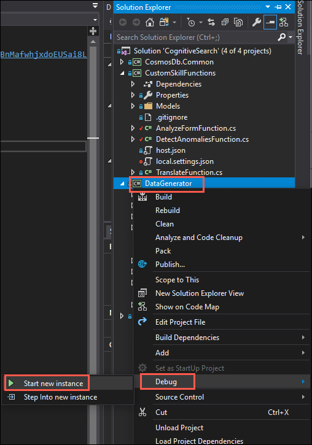

3. Debugging will launch the console app. In the `DataGenerator` console window, enter "2" at the prompt to start sending generated vehicle telemetry data into Cosmos DB. You will see statistics about telemetry data being streamed into Cosmos DB.

    

    > Leave the `DataGenerator` console app running in the background while you move on to the following tasks in this experience. The app will run for 10 minutes, sending vehicle telemetry into your Cosmos DB `vehicle-telemetry` container, so you have data to work with in this task. In this task, you will use the `PipelineEnhancer` console app to set up an Azure Search Index which points to the `vehicle-telemetry` container in Cosmos DB.

4. Return to your Azure Cosmos DB account blade in the [Azure portal](https://portal.azure.com), and select **Data Explorer** from the toolbar on the overview blade.

    

    > **IMPORTANT**: There may be two Cosmos DB accounts in your resource group. Select the Cosmos DB account named **tech-immersionXXXXX**, with no hyphen between immersion and XXXXX.

5. Under the `ContosoAuto` database, expand the **vehicle-telemetry** container and then select **Items**.

    

6. In the Items pane, select any of the documents listed and inspect a vehicle-telemetry document. Each document should look similar to the JSON below.

    ```json
    {
        "vin": "O62T8AMDH0XS7LW96",
        "city": "Madison",
        "region": null,
        "outsideTemperature": 42,
        "engineTemperature": 318,
        "speed": 69,
        "fuel": 6,
        "engineoil": 39,
        "tirepressure": 10,
        "odometer": 164256,
        "accelerator_pedal_position": 93,
        "parking_brake_status": true,
        "brake_pedal_status": true,
        "headlamp_status": true,
        "transmission_gear_position": "first",
        "ignition_status": true,
        "windshield_wiper_status": false,
        "abs": true,
        "timestamp": "2019-06-16T15:53:59.5555928Z",
        "collectionType": "Telemetry",
        "id": "0cdaa1f1-e46f-4a3b-9ce1-bb52e51039a4",
        "_rid": "e4txAIjuuI2BhB4AAAAAAA==",
        "_self": "dbs/e4txAA==/colls/e4txAIjuuI0=/docs/e4txAIjuuI2BhB4AAAAAAA==/",
        "_etag": "\"04006220-0000-0800-0000-5d0666180000\"",
        "_attachments": "attachments/",
        "_ts": 1560700440
    }
    ```

    > The `engineTemperature` field will be used to demonstrate the capabilities of the Anomaly Detector API. The `engineTemperature` value for each document will be compared against time series data of engine temperatures to determine if the value is outside of the normal range.

7. To create the new anomaly detector search index, return to the open `PipelineEnhancer` console app, and enter **4** at the prompt.

   

8. When you see the output that the anomaly detection pipeline was successfully created, navigate to your Search Service in the Azure portal, select **Indexers**, and observe the new **telemetry-indexer**.

   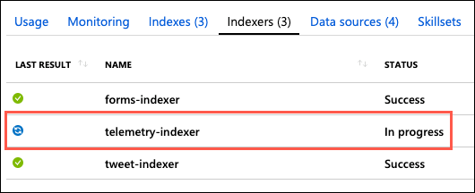

   > NOTE: The vehicle-telemetry collection will contain a significant number of records, so you may not want to wait until you see a status of Success. You will be able to search the index for some of the documents that have already been indexed, while the status is still In progress.

9. Select **Search explorer** from the toolbar.

10. On the Search explorer blade, select **Change index**, select the **telemetry-index**, and then select **Search**.

11. In each result, you can see the data pulled in from the Cosmos DB documents. In addition, you will see an `engineTemperatureAnalysis` section, which contains the results of the Anomaly Detector analysis.

    ```json
    {
      "@search.score": 1,
      "vin": "G5SWN08OAKCRZ0TWX",
      "city": "San Diego",
      "outsideTemperature": 91,
      "engineTemperature": 99,
      "speed": 7,
      "fuel": 14,
      "engineoil": 50,
      "tirepressure": 34,
      "odometer": 103943,
      "accelerator_pedal_position": 93,
      "parking_brake_status": false,
      "brake_pedal_status": false,
      "headlamp_status": false,
      "transmission_gear_position": "first",
      "ignition_status": false,
      "windshield_wiper_status": true,
      "abs": true,
      "timestamp": "2019-06-16T15:53:59.405Z",
      "collectionType": "Telemetry",
      "id": "f930fb63-3b0d-44ae-b3a1-49338f6c73cb",
      "rid": "ZTR0eEFJanV1STJCaEI0QUFBQUFCQT090",
      "engineTemperatureAnalysis": {
          "isAnomaly": true,
          "isPositiveAnomaly": false,
          "isNegativeAnomaly": true,
          "expectedValue": 318.1797,
          "upperMargin": 15.9089851,
          "lowerMargin": 15.9089851
      }
    }
    ```

12. Enter **X** at the `PipelineEnhancer` prompt to close the application.

    

13. If the `DataGenerator` is still running, press CTRL+C to stop generating telemetry data, and then close the application.

Using the Anomaly Detector API, we were able to get information about anomalous data without needing to have any prior experience with machine learning. The Anomaly Detector API provides two methods of anomaly detection. You can either detect anomalies as a batch throughout your times series, or as your data is generated by detecting the anomaly status of the latest data point. The detection model returns anomaly results along with each data point's expected value, and the upper and lower anomaly detection boundaries. You can use these values to visualize the range of normal values, and anomalies in the data.

## Wrap-up

In this experience, you learned how to leverage Azure Search and Cognitive Services to perform knowledge mining on unstructured data stored in Cosmos DB. Using a combination of pre-configured and custom cognitive skills, you built a Cognitive Search pipeline to enrich the source data in route to an Azure Search Index.

Using pre-built cognitive skills, you were able to add language detection, sentiment analysis, and key phrase and entity extraction to your search pipeline. These skills enriched your search index with additional metadata about the tweets being indexed.

You then used an Azure Function App to create a custom cognitive skill, which used the Translator Text Cognitive Service to translate tweets into English. Using the Custom Web API skill, you integrated the custom skill to your cognitive search pipeline.

The end result is rich additional content in an Azure Search index, created by a cognitive search indexing pipeline. The output is a full-text searchable index on Azure Search.

## Additional resources and more information

To continue learning and expand your understanding of Knowledge Mining with Cognitive Search, use the links below.

- [Introduction to Azure Search](https://docs.microsoft.com/azure/search/search-what-is-azure-search)
- [Introduction to Cognitive Services](https://docs.microsoft.com/azure/cognitive-services/welcome)
- [Introduction to Cognitive Search](https://docs.microsoft.com/azure/search/cognitive-search-concept-intro)
- [Attach a Cognitive Services resource with a skillset in Azure Search](https://docs.microsoft.com/azure/search/cognitive-search-attach-cognitive-services)
- [Azure Search Service REST API](https://docs.microsoft.com/azure/search/search-api-preview)
- [Predefined Cognitive Search skills](https://docs.microsoft.com/azure/search/cognitive-search-predefined-skills)
  - [Key Phrase Extraction](https://docs.microsoft.com/azure/search/cognitive-search-skill-keyphrases)
  - [Language Detection](https://docs.microsoft.com/azure/search/cognitive-search-skill-language-detection)
  - [Entity Recognition](https://docs.microsoft.com/azure/search/cognitive-search-skill-entity-recognition)
  - [Text Merger](https://docs.microsoft.com/azure/search/cognitive-search-skill-textmerger)
  - [Text Split](https://docs.microsoft.com/azure/search/cognitive-search-skill-textsplit)
  - [Sentiment](https://docs.microsoft.com/azure/search/cognitive-search-skill-sentiment)
  - [Image Analysis](https://docs.microsoft.com/azure/search/cognitive-search-skill-image-analysis)
  - [Optical Character Recognition (OCR)](https://docs.microsoft.com/azure/search/cognitive-search-skill-ocr)
  - [Shaper](https://docs.microsoft.com/azure/search/cognitive-search-skill-shaper)
- [Custom Web API skill](https://docs.microsoft.com/azure/search/cognitive-search-custom-skill-web-api)
- [How to add a custom skill to a cognitive search pipeline](https://docs.microsoft.com/azure/search/cognitive-search-custom-skill-interface)
- [Learn how to call cognitive search APIs](https://docs.microsoft.com/azure/search/cognitive-search-tutorial-blob)
- [Learn Cognitive Search](https://azure.github.io/LearnAI-Cognitive-Search/)
- [Enterprise Knowledge Mining Bootcamp](https://azure.github.io/LearnAI-KnowledgeMiningBootcamp/)
- [Azure Search pricing](https://azure.microsoft.com/pricing/details/search/)
- [Anomaly Detector API](https://docs.microsoft.com/en-us/azure/cognitive-services/anomaly-detector/overview)
- [Form Recognizer](https://azure.microsoft.com/en-us/services/cognitive-services/form-recognizer/)
- [Text Translate API](https://azure.microsoft.com/services/cognitive-services/translator-text-api/)
