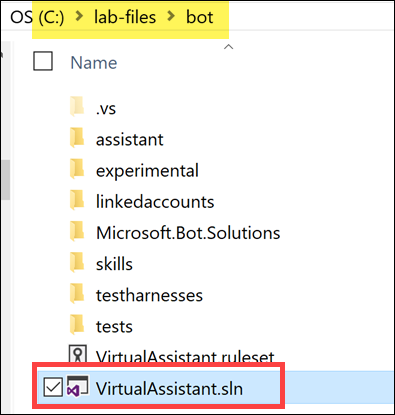
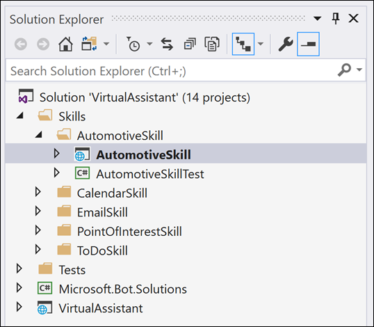
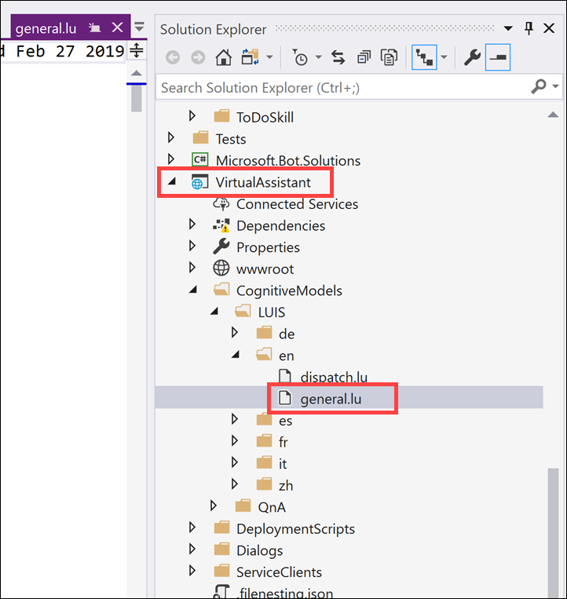
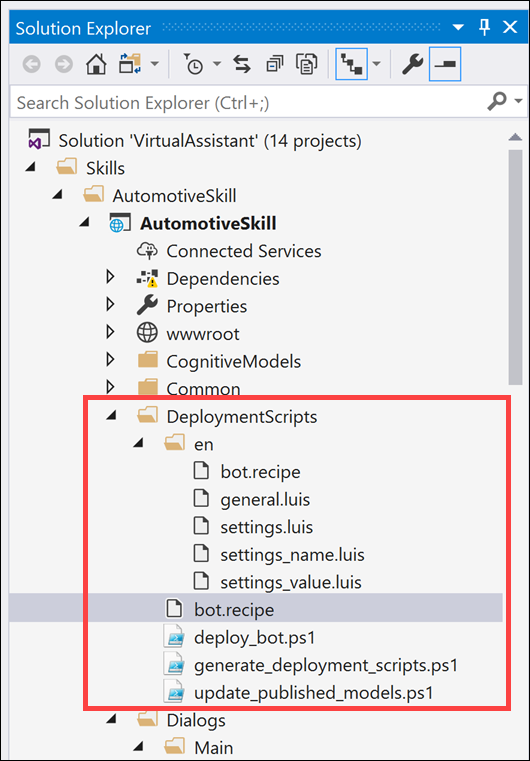
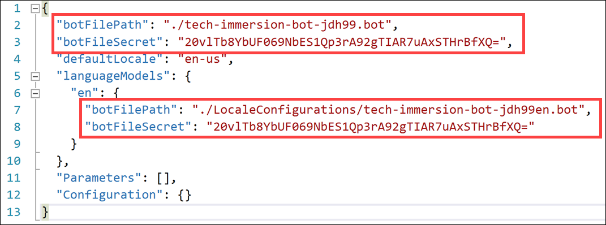
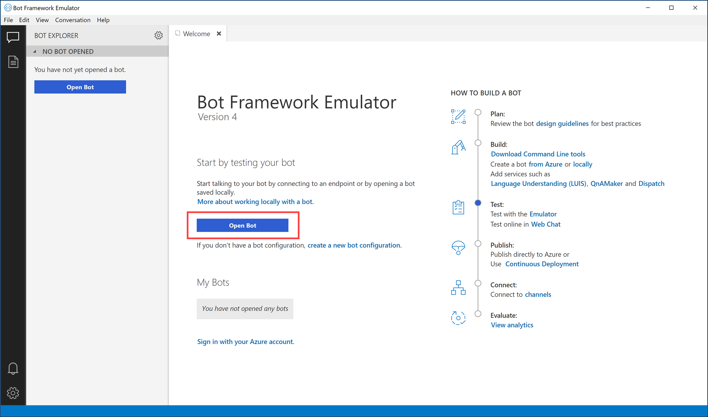

# Day 2, Experience 3 - Quickly build comprehensive Bot solutions with the Virtual Assistant Solution Accelerator

Contoso Auto is interested in building bots to help automate certain tasks in a way that feels similar to dealing with a real person. The motivation for this is to add self-service capabilities in their automobiles that will help drivers and passengers interact with their vehicles in a more natural way, through voice-driven commands and simple visual feedback and prompts, without needing to involve a live person. They would like to build a proof of concept that will support their users through speech actions, such as controlling the vehicle's climate settings and radio. As a stretch goal, they would like to take this capability further by automatically monitoring car sensor data and alerting the driver when there is a potential problem with the vehicle, offering an incentive such as a gift card when the driver selects a recommended service and makes an appointment with a service center.

In this experience, you will use Microsoft's [Virtual Assistant Solution](https://docs.microsoft.com/azure/bot-service/bot-builder-virtual-assistant-introduction?view=azure-bot-service-4.0) accelerator to quickly develop this capability on top of foundational capabilities. By following the tasks below, you will explore and run the Automotive skill bot locally to experience the natural language-driven conversations with the bot, powered by the LUIS Cognitive Service, with the conversation control flow managed by the bot. You will end off by evaluating how LUIS is trained to understand a user's intent based on what they typed in, and read some ideas of how this project can be expanded to meet Contoso Auto's stretch goals.

- [Day 2, Experience 3 - Quickly build comprehensive Bot solutions with the Virtual Assistant Solution Accelerator](#day-2-experience-3---quickly-build-comprehensive-bot-solutions-with-the-virtual-assistant-solution-accelerator)
  - [Experience requirements](#experience-requirements)
  - [Task 1: Sign in to LUIS to retrieve the Authoring Key](#task-1-sign-in-to-luis-to-retrieve-the-authoring-key)
  - [Task 2: Register a new Azure App](#task-2-register-a-new-azure-app)
  - [Task 3: Deployment](#task-3-deployment)
  - [Task 4: Load and explore the automotive Virtual Assistant starter solution](#task-4-load-and-explore-the-automotive-virtual-assistant-starter-solution)
  - [Task 5: Open the generated bot file in the Bot Framework Emulator](#task-5-open-the-generated-bot-file-in-the-bot-framework-emulator)
  - [Task 6: Open LUIS to view the generated apps](#task-6-open-luis-to-view-the-generated-apps)
  - [Next steps](#next-steps)

## Experience requirements

- Azure subscription
- Visual Studio 2017 Community (or better)
- Latest version of [.NET Core](https://www.microsoft.com/net/download)
- [Node.js](https://nodejs.org/) version 8.5 or higher
- [Bot Framework Emulator](https://github.com/Microsoft/BotFramework-Emulator/releases/latest)
- Azure Bot Service command line (CLI) tools
- [Azure Command Line Tools (CLI)](https://docs.microsoft.com/en-us/cli/azure/install-azure-cli-windows?view=azure-cli-latest) version **2.0.59** or later
- AZ Extension for Bot Service
- Retrieve your LUIS Authoring Key

## Task 1: Sign in to LUIS to retrieve the Authoring Key

The bot you will be creating uses [Microsoft's LUIS](https://azure.microsoft.com/services/cognitive-services/language-understanding-intelligent-service/), which is a natural language understanding service, to process and interpret user language to a set of actions or goals. One of the goals of building a bot is to have it interact with users in as human a way as possible. Understanding casual text or voice commands is an increasingly natural way to interact with bots and other virtual assistants. Before we can begin, we must first sign in to the LUIS website and obtain an authoring key that allows the service to be called by your bot.

1. If you will be running your bot services in the United States, navigate to [https://www.luis.ai/](www.luis.ai) and sign in with the Azure account you are using for this experience. If you are outside of the US, sign in to the LUIS site for your [region](https://docs.microsoft.com/en-us/azure/cognitive-services/luis/luis-reference-regions).

2. If it is your first time signing in, you may see a "Permission requested" dialog. If so, select **Accept**.

   

3. Again, if this is your first time signing in, you will be prompted to select your **Country/Region**. Select the appropriate option from the list, check the service agreement checkbox, then select **Continue**.

   

4. If you do not currently have any LUIS apps, you will see a page explaining what LUIS is and how it works. Within this page, select **Create a LUIS app now**.

   

5. At this point, you will see a page called "My Apps". You do not need to create a new app. The Bot Framework SDK will do this for you. Click on your name in the top right-hand corner, then select **Settings**.

   

6. Copy the **Authoring Key** and save it to Notepad or a similar text application for later steps.

   

## Task 2: Register a new Azure App

The Bot Framework SDK uses what's called an Azure application for authentication and authorization between the published bot and its required Azure services. In this task, you will create a new app and retrieve its application Id that you will use when you run the bot creation script.

1. Navigate to <https://apps.dev.microsoft.com/> and sign in with your same Azure account you are using for this experience.

2. After signing in, you will see a page named "My applications". Select **Add an app**.

   

3. In the New Application Registration dialog, enter `tech-immersion-vehicle` into the **Name** field, then select **Create application**.

   

4. After a moment, your application will be created and its properties will be displayed. Select **Generate New Password** underneath the Application Secrets section.

   

5. When the "New password generated" dialog appears, **copy and paste** your password to Notepad or similar text application for future reference. This will be the only time you see this password. Select **OK**.

   

6. **Copy and paste** the **Application Id** value to Notepad or a similar text application for later steps.

## Task 3: Deployment

The Virtual Assistant automotive bot requires the following Azure dependencies for end to end operation:

- Azure Web App (hosts the bot when published)
- Azure Storage Account (stores all chat transcripts)
- Azure Application Insights (captures bot and related services telemetry)
- Azure Cosmos DB (maintains the state of all conversations)
- Azure Cognitive Services - Language Understanding (LUIS)

In this task, you will deploy all of these Azure dependencies as well as configure and train [LUIS](https://docs.microsoft.com/en-us/azure/cognitive-services/luis/what-is-luis) with thousands of text entries. Fortunately, we supply a script to do this for you.

1. On the bottom-left corner of your Windows desktop, locate the search box next to the Start Menu. Type **cmd**, then either press Enter or select the Command Prompt desktop app in the search results.

   

2. Within the command prompt, type in the following, then hit `Enter`:

   `cd\`

3. Copy and paste the command below into the command prompt, then hit `Enter`. This will change directories to the Virtual Assistant automotive bot project folder:

   `cd C:\lab-files\bot\skills\automotiveskill\automotiveskill`

4. This next command requires two of your custom values you saved in the previous task when you registered your Azure App. **Copy** the command below and paste it into Notepad or other text editor. Replace `YOUR-APP-ID` with the Azure App's Application Id value, and replace `YOUR-APP-SECRET` with the App secret you copied. Make certain that your app secret value is surrounded by double quotes (").

   `PowerShell.exe -ExecutionPolicy Bypass -File DeploymentScripts\deploy_bot.ps1 --appId YOUR-APP-ID --% --appSecret "YOUR-APP-SECRET"`

5. Copy and paste your _edited_ command into the command prompt, then hit `Enter`. Supply the following values when prompted:

   - **name:** Enter a unique name that starts with `tech-immersion-bot-` and ends with your initials followed by a random 2-3 digit number. Example: `tech-immersion-bot-jdh77`. This value must be all lower case, contain no spaces and no special characters except for dashes (-) and underscores (\_).
   - **location:** Enter `westus`.
   - **luisAuthoringKey:** Paste the LUIS Authoring Key you copied at the end of Task 1 above.

   

6. This script will take around 10 minutes to run. **Important:** Keep the window open. There is a value you will need to copy once it is complete. For now, please move on to the next task.

## Task 4: Load and explore the automotive Virtual Assistant starter solution

To accelerate Contoso Auto's development efforts, they have decided to use Microsoft's [Virtual Assistant Solution](https://docs.microsoft.com/azure/bot-service/bot-builder-virtual-assistant-introduction?view=azure-bot-service-4.0) accelerator. One of the projects included in the Visual Studio solution is the Automotive Skill. This skill demonstrates a set of capabilities to help enable Automotive scenarios. At the moment, this skill focuses on vehicle settings, specifically climate Control, safety, and basic audio controls.

Vehicle Control is a complicated problem. Although there are only a limited set of car inputs for climate control there are a large number of ways that a human can describe a given setting. For example, "I'm feeling chilly", "My feet are cold", and "It's cold here in the back" all relate to a decrease in temperature but to different parts of the car and perhaps even different fan settings. If you were to program the bot to try and account for all of these variations in user requests, you would have a very long set if conditional logic in your code, and likely miss some common phrases in the process.

This is where having a trained natural language machine learning model comes in handy. Microsoft's [Language Understanding (LUIS)](https://docs.microsoft.com/en-us/azure/cognitive-services/luis/what-is-luis) API service allows you to train this type of machine learning model (LUIS models) through configuration, with **no programming or data scientists** required. This results in allowing end users to use conversational, natural language text to issue commands whose overall meaning are predicted by LUIS and whose relevant and detailed information is used by the bot to perform actions related to the requests.

The LUIS model begins with categories of user intentions called [intents](https://docs.microsoft.com/en-us/azure/cognitive-services/luis/luis-concept-intent). Each intent needs examples of user [utterances](https://docs.microsoft.com/en-us/azure/cognitive-services/luis/luis-concept-utterance) (something a user sould say). Each utterance can provide a variety of data that needs to be extracted with [entities](https://docs.microsoft.com/en-us/azure/cognitive-services/luis/luis-concept-entity-types).

Here are some examples of user utterances the LUIS models for the Automotive skill are trained to understand:

| Example user utterance                      | Intent                       | Entities              |
| ------------------------------------------- | ---------------------------- | --------------------- |
| "Why is it so **hot** in here?"             | VEHICLE_SETTINGS_DECLARATIVE | VALUE                 |
| "Set **temperature** to **67** **degrees**" | VEHICLE_SETTINGS_CHANGE      | SETTING, AMOUNT, UNIT |
| "It's way too **loud** in here."            | VEHICLE_SETTINGS_DECLARATIVE | VALUE                 |

LUIS models help understand the intent and entities, then matches potential settings and actions to the available vehicle settings to then suggest a course of action. At this time, changes to vehicle settings are supported through the VEHICLE_SETTINGS_CHANGE and VEHICLE_SETTINGS_DECLARATIVE intents. The former enables questions such as "change the temperature to 27 degrees" whereas the latter intent enables scenarios such as "I'm feeling cold" which require additional processing steps.

As you will see, most of this work is already done for you! Additional work that would need to be done to integrate this bot into a vehicle includes customizing the bot's activities to integrate with the telematics solution of an OEM for a given vehicle.

For now, let's explore how this bot is created and how LUIS is trained with the sets of utterances, intents, and entities as described.

1.  Open Windows Explorer and navigate to `C:\lab-files\bot`. Double-click on **VirtualAssistant.sln** to open the solution in Visual Studio. If you are prompted by Visual Studio to log in, log in with your Azure credentials you are using for this lab.

    

    The Visual Studio solution contains the following:

    - **Skills** solution folder containing various skills projects that work with the Virtual Assistant.
      - **AutomativeSkill** folder contains the Automotive skill you are deploying, as well as its test project.
      - **CalendarSkill** folder contains the Calendar skill that enables the Virtual Assistant to help users manage their connected O365 calendar.
      - **EmailSkill** folder contains the Email skill that enables the Virtual Assistant to help users manage their connected email account.
      - **PointsOfInterestSkill** folder contains the Points of Interest skill that provides point of interest and navigation-related capabilities to the Virtual Assistant. It does this through integrations with [Azure Maps](https://azure.microsoft.com/en-us/services/azure-maps/) and [Foursquare](https://developer.foursquare.com/docs/api).
      - **ToDoSkill** folder contains the ToDo skill, adding these capabilities to the Virtual Assistant.
    - **Test** solution folder containing test projects for the Microsoft.Bot.Solutions common library and the VirtualAssistant project.
    - **Microsoft.Bot.Solutions** project produces a common library that all skill projects use as a basis for creating new skills, and various activities such as authentication, creating bot dialogs, showing user prompts, sending telemetry, and running tests.
    - **VirtualAssistant** project is used to develop and deploy the Virtual Assistant bot. It is configured with the Calendar, Email, ToDO, and Points of Interest skills by default. It is possible to integrate the Automotive skill as well, but that skill was meant to be standalone.

    

2.  You will see the projects listed within the Solution Explorer in Visual Studio. Scroll to the bottom of the projects list and expand the **VirtualAssistant** project. Next, expand **CognitiveModels**, then expand **LUIS**. Underneath the LUIS subfolder are additional subfolders for each language. Expand **en**. Next, double-click on **general.lu**.

    

    Here is just a small snippet of the **general.lu** file:

    ```lua
    ## SelectItem
    - choose last
    - choose last one
    - choose no.2
    - choose the {DirectionalReference=bottom left}
    - choose the first choice
    - choose the fourth one
    - choose the {DirectionalReference=upper left} choice
    - choose the {DirectionalReference=upper right} one
    - choose {DirectionalReference=top right}
    - choose {DirectionalReference=top right} one
    - i like {DirectionalReference=left} one
    - i like second
    - i like second one
    - i like the {DirectionalReference=bottom} one
    ```

    This file contains general commands used to train LUIS. These commands are common across all skills, like the Automotive skill. Therefore, when you publish a skill, not only will the skills load LUIS models that are unique to that skill, they will also load the general ones.

    [.lu files](https://github.com/Microsoft/botbuilder-tools/blob/master/packages/Ludown/docs/lu-file-format.md) contain simple text-based definitions for LUIS, broken down by Intents (the action the user wants to perform) and Entities (detailed information that is relevant in the utterance). In the code snippet above, **SelectItem** is the intent, and each item below it are example utterances that capture ways users can express this intent. Entities in .lu files are denoted using `{<entityName>=<labeled value>}` notation. Taking from our sample code once again, you can find the `bottom left` entity within the following utterance: `choose the {DirectionalReference=bottom left}`.

    When you ran the script earlier, one of the actions it took was to convert all of the .lu files into JSON files by using the [LUDown](https://github.com/Microsoft/botbuilder-tools/tree/master/packages/Ludown) tool. The converted JSON files were then uploaded to LUIS to train the natural language model. You can find the generated JSON files within the `DeploymentScripts\en\` folder as `.luis` files. This is a faster and more repeatable alternative to [manually configuring LUIS](https://docs.microsoft.com/en-us/azure/cognitive-services/luis/luis-how-to-add-intents) through the web interface.

3.  Scroll up the list of projects in the Solution Explorer, then expand the **AutomotiveSkill** project located under the `Skills\AutomotiveSkill` solution folder. Next, expand the `CognitiveModels\LUIS\en` folders, then double-click on **settings_dispatch.lu**.

    

4.  This .lu file contains LUIS intents and entities specific to the Automotive skill. If you scroll through the list, you will see the `VEHICLE_SETTINGS_CHANGE` and `VEHICLE_SETTINGS_DECLARATIVE` intents that were illustrated above in the example user utterances table.

    ```lua
    ## VEHICLE_SETTINGS_CHANGE
    - {AMOUNT=4} {UNIT=degrees} {VALUE=higher} please
    - {VALUE=activate alert brake steer} for {SETTING=automatic brake} mechanisms
    - {VALUE=activate} {SETTING=back cross traffic alert}
    - {VALUE=activate} my {SETTING=defroster} mode
    - {VALUE=activate} my {SETTING=switch lane alert} mechanism
    - {VALUE=activate} the {SETTING=forward collision response}
    - {VALUE=activate} the {SETTING=side blind spot alert}
    - {VALUE=activate} the {SETTING=side blind spot warning}
    - adjust {SETTING=air blower} 2 the {AMOUNT=minimum}
    - adjust {SETTING=air fans} to {SETTING=speed} {AMOUNT=1}
    - adjust {SETTING=driver alerts} to {VALUE=impact warning seat}
    - adjust {SETTING=forward collision alert spacing} control to {VALUE=on}
    - adjust it to {VALUE=loud}
    - adjust {SETTING=media volume}
    - adjust my {SETTING=brake assist} back {VALUE=on} please
    ...
    ...
    ## VEHICLE_SETTINGS_DECLARATIVE
    - {SETTING=body} are a bit too {VALUE=toasty}
    - i am a little {VALUE=cool} in {SETTING=right side}
    - i am {VALUE=cold} in here
    - i am {VALUE=frozen} in {SETTING=left front}
    - i am too friggin {VALUE=frosty} in the {SETTING=driver side}
    - i am {VALUE=warm}
    - i am way too damn {VALUE=cool} in this {SETTING=passenger's side}
    - i are as {VALUE=shivering} as a willy
    - i feel a bit {VALUE=cold} on the {SETTING=right}
    - i feel a bit {VALUE=shivering}
    - i feel a little darn {VALUE=warm}
    - i feel a little friggin {VALUE=burning up} in here
    - i feel as {VALUE=frosty} as an oven in this {SETTING=right}
    - i feel {VALUE=balmy} in here
    - i feel like my {SETTING=co-driver} is gotten kind of {VALUE=cold}
    - i feel like my {SETTING=front left} s getting {VALUE=shivering}
    ...
    ...
    ```

    You will also find these top-level intents in the main `settings.lu` file. In addition, there are two supporting LUIS models, `settings_name` and `settings_value`. These are used for disambiguation scenarios to clarify setting names and values where the initial utterance doesn't provide clear information.

5.  Now expand the `DeploymentScripts` folder located within the **AutomotiveSkill** project.

    

    This folder contains the `deploy_bot.ps1` deployment script you executed in the previous task. It also contains scripts used to generate deployment scripts to publish your bot to Azure, and a script to update your published models if you add or update any of the .lu files. The `en` folder contains the generated JSON LUIS files (.luis). You may not see these yet, depending on whether the script is finished running.

    The `bot.recipe` files are used as a template for creating the .bot files that the script generates.

6.  Next, expand the `Dialogs` folder located within the **AutomotiveSkill** project.

    

    When you create bots using the Bot Framework, you can use dialogs to model a conversation and manage [conversation flow](https://docs.microsoft.com/en-us/azure/bot-service/bot-service-design-conversation-flow?view=azure-bot-service-3.0). A conversation can involve multiple dialogs. In the case of the Automotive skill, the conversation may start within the `Main` dialog, then use the `AutomotiveSkillDialog` to handle and display inputs and prompts relating to actions the user would like to take. When the user decides to change a vehicle setting, the `VehicleSettingsDialog` will be used. You may feel free to explore these dialogs to understand how the conversation flow is managed.

    Available vehicle settings are defined in a supporting metadata file located here  `automotiveskill\Dialogs\VehicleSettings\Resources\available_settings.json`.

    To add an new setting along with appropriate setting values, it's easily expressed in JSON. The example below shows a new Volume control setting with the ability to Set, Increase, Decrease and Mute the volume.

    ```javascript
    {
      "allowsAmount": true,
      "amounts": [ { "unit": "" } ],
      "canonicalName": "Set Volume",
      "values": [
        {
          "canonicalName": "Set",
          "requiresAmount": true
        },
        {
          "changesSignOfAmount": true,
          "canonicalName": "Decrease"
        },
        {
          "canonicalName": "Increase",
          "antonym": "Decrease"
        },
        {
          "canonicalName": "Mute"
        }
      ]
    }
    ```

    For key settings, you may wish to prompt for confirmation, such as safety settings. This can be specified through a `requiresConfirmation` property as shown below.

    ```javascript
    {
      "canonicalName": "Lane Change Alert",
      "values": [
        {
          "canonicalName": "Off",
          "requiresConfirmation": true
        },
        { "canonicalName": "On" }
      ]
    },
    ```

    Speech & Text responses are stored in the `VehicleSettingsResponses.json` file. Responses files offer the ability to provide a variety of responses and set the input hint on each Activity. Example:

    ```javascript
    "VehicleSettingsSettingValueSelection": {
      "replies": [
        {
          "text": "Here are the possible values for {settingName}. Which one?",
          "speak": "Here are the possible values for {settingName}. Which one?"
        }
      ],
      "inputHint": "expectingInput"
    },
    "VehicleSettingsSettingChangeConfirmation": {
      "replies": [
        {
          "text": "So, you want to change {settingName} to {value}. Is that correct?",
          // Do not add a comma to the speech output, so it sounds more continuous and natural.
          "speak": "So you want to change {settingName} to {value}. Is that correct?"
        }
      ],
      "inputHint": "expectingInput"
    },
    ```

## Task 5: Open the generated bot file in the Bot Framework Emulator

Bots developed using the Bot Framework can be tested locally, using the Bot Framework Emulator. This emulator can be used with local .bot files or be used to test remote, or hosted, bots. Being able to test in this way saves the time needed to deploy your bot and test it using other channels, such as through a web chat dialog, Facebook, Skype, Slack, etc.

Bots usually consume lots of different services, such as [LUIS.ai](https://luis.ai). When you are developing a bot, there is no uniform place to store the metadata about the services that are in use. This prevents us from building tooling that looks at a bot as a whole.

To address this problem, we have created a **.bot file** to act as the place to bring all service references together in one place to enable tooling. For example, the [Bot Framework Emulator](https://github.com/Microsoft/BotFramework-Emulator/releases) uses a the .bot file to create a unified view over the connected services your bot consumes.

.bot file is **not** a requirement to build bots with the [Bot Builder SDK](microsoft/botbuilder). You can instead continue to use appsettings/ web.config/ env, KeyVault, or any mechanism you see fit to keep track of service references and keys that your bot depend on.

The advantages of using .bot file are:

- [Bot Builder V4 SDK](microsoft/botbuilder) will be available in 4 platforms x languages – C#, JS, Python, Java. Each platform have their recommended way of keeping track of keys + env settings (appsettings.json, web.config, .env ...).  
- Elegant tooling solutions around services creation and management is harder without a well defined schema (.bot file).  
- Bot Framework Emulator and CLI tools rely on and work great with tracking connected services in a consistent format (in a .bot file)

In this task, you will open the generated .bot file in the Bot Framework Emulator and start testing out your bot! First, we need to make sure the script is finished running. This must be completed before continuing with this experience.

1.  Switch back to your Command Prompt (console) window to make sure the script has successfully finished. If it has, **scroll up** until you see where you input the **name**, **location**, and **luisAuthoringKey** values. A few lines below that section will be the bot file secret in purple, underneath a line that says `The secret used to decrypt <YOUR-BOT-NAME>.bot is:`. **Copy the bot file secret** and save it to Notepad or similar text application.

    > You **must** copy this secret now because it will not be displayed again!

    

2.  Now we are ready to test the bot. Before testing, you must update the **appsettings.json** file in the **AutomotiveSkills** project. To do this, switch back to the solution in Visual Studio and expand the **AutomotiveSkill** project in the Solution Explorer. **Double-click** on the **appsettings.json** file to open it.

3.  Update your `appsettings.json` file with the newly created .bot file name and .bot file secret. The .bot file is located in the root directory of the **AutomotiveSkill** project.

    ```
      {
        "botFilePath": "./YOURBOTFILE.bot",
        "botFileSecret": "YOUR_BOT_SECRET",
      }
    ```

    - Finally, add the .bot file paths for each of your language configurations (English only at this time). You can find the bot file under the **LocalseConfigurations** folder.

    ```
    "defaultLocale": "en-us",
    "languageModels": {
      "en": {
        "botFilePath": "./LocaleConfigurations/YOUR_EN_BOT_PATH.bot",
        "botFileSecret": "YOUR_BOT_SECRET"
      }
    }
    ```

    

4.  The last file change you need to do is to update the `development` endpoint setting within the .bot file located in the **AutomotiveSkill** root folder. There is a bug that currently exists which adds the `appId` and `appPassword` values of your Azure App to the `development` endpoint, which is meant to be run locally. If those values are present, the Bot Framework Emulator is not able to send messages to your bot when running it locally. To edit this file, **double-click** on the generated .bot file that is located in the root directory of the **AutomotiveSkill** project in the Visual Studio Solution Explorer.

    

    Find the JSON code block with the `type` set to **endpoint** and the `name` set to **development** and clear out the `appId` and `appPassword` values. The edited result should look like the following:

    ```javascript
    {
        "type": "endpoint",
        "id": "1",
        "name": "development",
        "appId": "",
        "appPassword": "",
        "endpoint": "http://localhost:3980/api/messages"
    },
    ```

5.  Next, you must **Debug** the **AutomotiveSkills** project. To do this, **right-click** the **AutomotiveSkills** project in the Solution Explorer, then select **Debug** in the context menu, then **Start new instance**.

    

6.  After a few moments, a new web browser window will open, displaying web page with the message, "Your Enterprise Bot is ready!". **Leave this window open** and continue to the next task.

    

7.  Oftentimes, the Bot Framework Emulator automatically launches after the bot file is created. If not, open it by clicking on the search box next to the Start Menu on the bottom-left corner of your Windows desktop. Type **Bot Framework Emulator**, then select the Bot Framework Emulator desktop app in the search results.

    

8.  Within the Bot Framework Emulator window, click on **Open Bot**.

    

9.  In the "Open a bot" dialog, click the **Browse** button to find the generated bot file.

    

10. Within the Open file browser, navigate to `C:\lab-files\bot\skills\automotiveskill\automotiveskill`, select your generated bot file, then click **Open**.

    

11. You should see a dialog prompting you for your bot file secret. **Paste** the bot file secret you copied in Step 1 above, then click **Submit**.

    

12. Now you should see a Live Chat window with the following features:

    1. **Development endpoint:** Make sure this endpoint is selected under endpoints to the left. You cannot use the production endpoint until you publish your bot.
    2. **Bot service path:** This should display the path to your locally running bot (http://localhost:3980/api/messages). If not, select the `development` endpoint on the left.
    3. **Welcome message:** The bot is configured to show a welcome message when the user first connects to it. This is controlled by the dialogs within the project that you explored. This area is where your chat history is displayed as well.
    4. **Send message box:** Use this textbox to type in and send all of your messages to the bot.

    

## Task 6: Open LUIS to view the generated apps

## Next steps

The Virtual Assistant solution accelerator is a great starting point for adding many new skills or updating existing ones to your bot. To address some of Contoso Auto's requirements, you may consider doing the following:

Contoso Auto wants to have the bot proactively alert the driver when there is a potential problem with the vehicle, which it detects by monitoring vehicle sensor data. Right now, the Automotive skill bot is exclusively reactive (user-initiated). However, you can proactively send messages that are triggered by external events by using a combination of the Bot Framework's `ContinueConversationAsync` function to patch into a previously started conversation, and the `ProactiveStateMiddleware` to store the previous conversation. Read more about [sending proactive messages](https://github.com/Microsoft/AI/blob/master/docs/virtual-assistant/proactivemessaging.md).

One of the experiences in this set of labs is to train a machine learning model to detect when a driver might have to change out the vehicle's battery, based on telemetry captured and stored for a given vehicle. Using [Azure Machine Learning](https://docs.microsoft.com/en-us/azure/machine-learning/service/overview-what-is-azure-ml), you can manage and deploy that trained model either as a service hosted online, or on an edge device, such as [IoT Edge](https://docs.microsoft.com/en-us/azure/iot-edge/about-iot-edge). An edge device would be the onboard computer that hosts the Automotive bot that interfaces with the vehicle's telematics solution to read sensor data and perform other vehicle functions. Your bot would need to be configured to either work with the machine learning model that's stored locally, or connect to the hosted machine learning model online. If you are going the online route, you would likely want to have an API layer between the onboard bot and the model. [Azure Functions](https://docs.microsoft.com/en-us/azure/azure-functions/functions-overview) may be ideal for acting as the API, with [API Management]() serving as the API layer, providing a set of endpoints for multiple APIs, authentication services, rate-limiting, etc. Your function would accept the scoring request from the bot to check for any concerns about the vehicle based on telemetry data, and call out to this and other trained machine learning models for a prediction. It would then send a [proactive message](https://github.com/Microsoft/AI/blob/master/docs/virtual-assistant/proactivemessaging.md) to the bot. The bot could then alert the user if needed, and ask the user for an action. Such an action would be to find the nearest service center to set up an appointment. At this point, you could use the Points of Interest skill to find the nearest service center and get directions or contact information. The possibilities are nearly limitless on how you can add new capabilities to the bot.